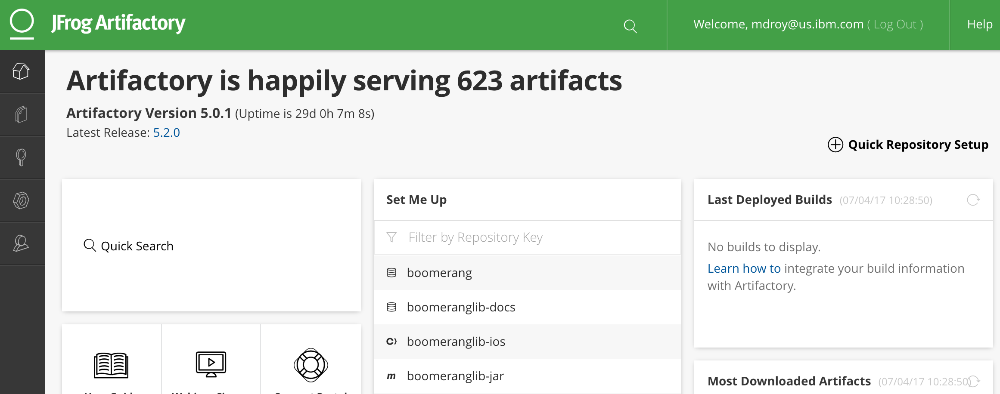
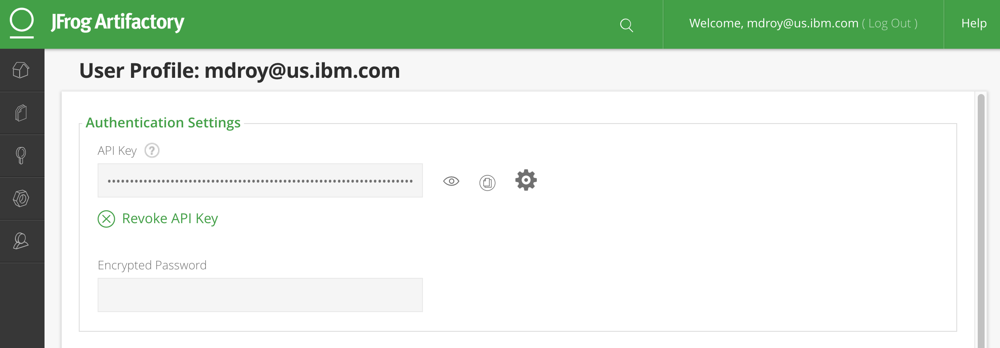

# Boomerang Lib

Boomerang Lib provides a platform to publish, discover and consume reusable components for a variety of platforms. Boomerang Lib currently supports:

- iOS Frameworks (Cocoapods)
- Java Frameworks (Maven & Gradle)
- Node Packages (NPM)
- Docker Images (Docker)

Boomerang Lib uses JFrog Artifactory to store reusable artifacts and acts as a dependcy management server.

## Authenticate with Artifactory

To authenticate with Artifactory on your local machine, you will need to generate an Artifactory API key from the Artifactory web page.

1. Logon to Artifactory portal at [https://tools.boomerangplatform.net/artifactory](https://tools.boomerangplatform.net/artifactory)

2. Click on your username in the top right-hand corner, then select select "Edit Profile" to bring up the profile.
   

3. Click Generate API key and retrieve it. This API will need be saved onto your local machine.
   

## Authorization to Libraries

One you have completed the authentication steps above, you still need access to the particular areas of Boomerang Lib.

After first login to Artifactory, please reach out to your DevOps admin so that they may connect you to the required roles and repositories.

## Boomerang Lib Versioning

All Boomerang Lib components the following versioning standards must be followed.

Versioning of your component can be automatically handled by Boomerang CI if neded. You can disable this using the `set.version.number=false` property. If this is setting is enabled, Boomerang CI will use the git tag version to override the version set in your framework.

The semantic versioning that needs to be followed for your application is **Major.Minor.Iteration** (i.e., 1.1.0). Versioning follows regular software versioning conventions. Only update one digit based on the changes incurred per release.

**Major versions**
Incrementing the major version will be adding significant features and API changes.

**Minor versions**
Minor versions should be incremented if adding minor features or significant amount of bug fixes. This would normally be the scope of a single release / sprint.

**Iterations versions**
Incrementing the iteration will be bug fixes on the features added to the current minor version.
