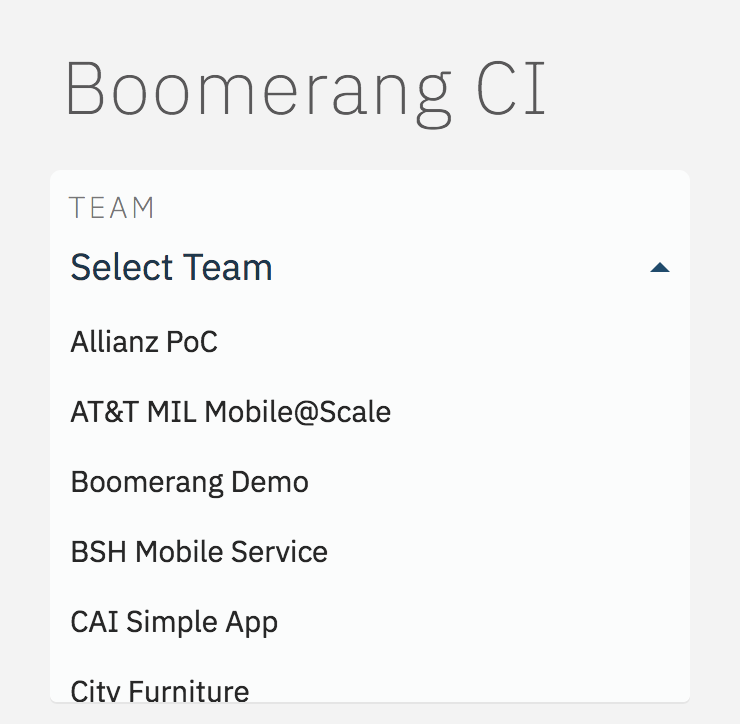
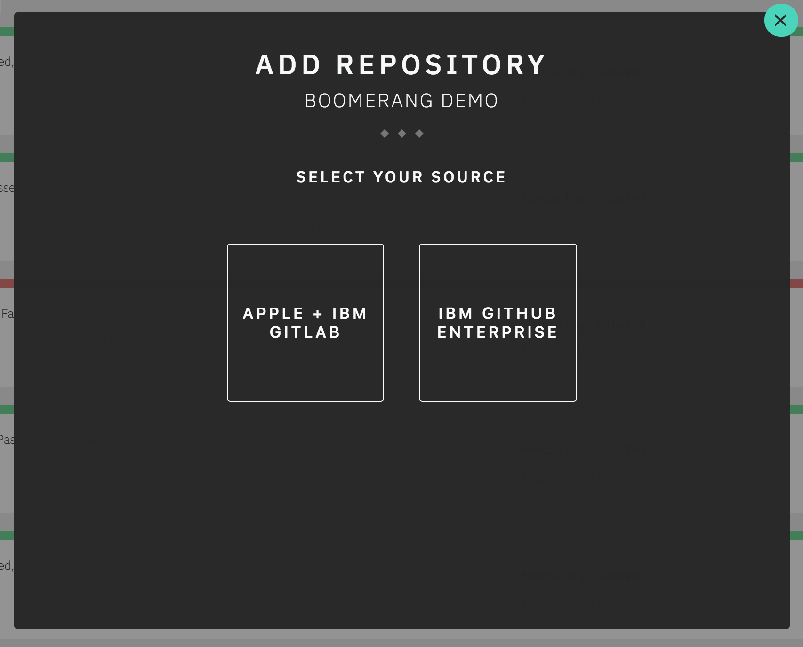
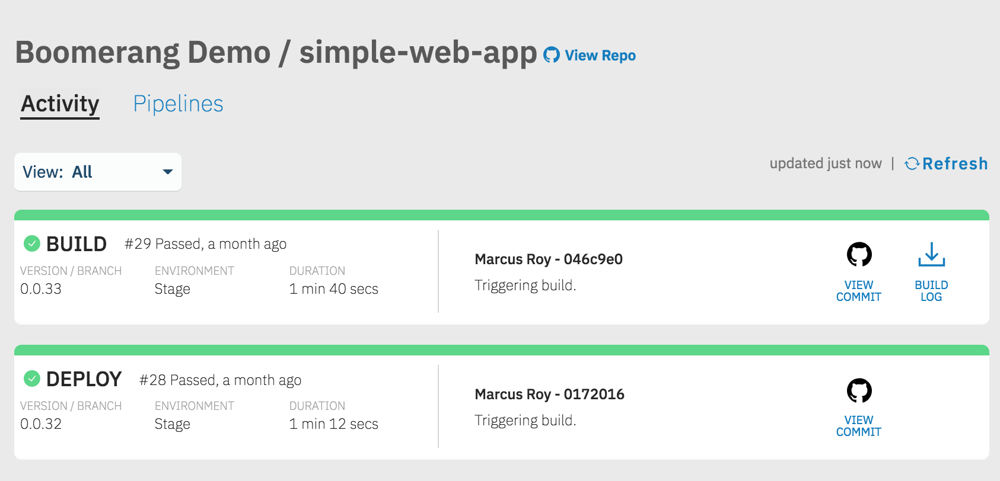
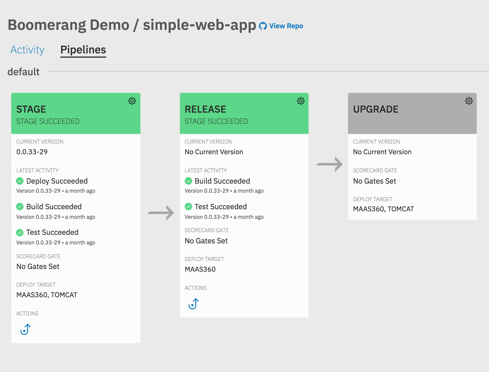
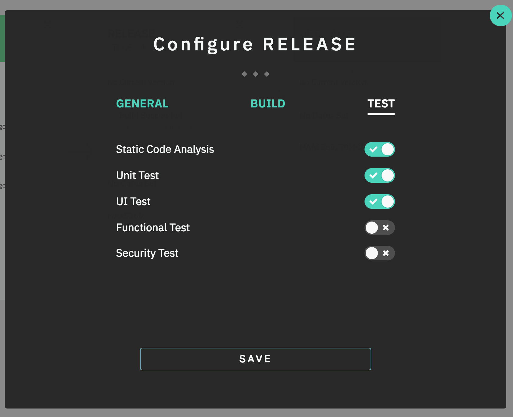

# Features

## Sidenav

Navigation is driven by your Boomerang teams. If you have a team on Launchpad that uses Boomerang CI, then you will see your team populated in the 'teams' dropdown in the top of the sidenav.

Upon selecting a team, the CI components for that team will be loaded. The latest activity for each component will be displayed.

## Add Repository

You are able to self-onboard repositories to Boomerang CI to create CI components. We currently support repositories hosted on IBM Github Enterprise and the Apple+IBM Gitlab instance.

Selecting the "Add Repo" button in the Sidenav will launch the modal to begin the onboarding. Please see more in our [getting started](/boomerang-ci/getting-started/) guide.

## Activity

The Activity view presents tiles for each activity that has been executed againt the selected repository. Each Activity can be identified by:

- _type_ - The type of activity, eg. Build, Test, Deploy, etc. Adjacent to the activity type is the build number. For completed activities the final state and duration since completion is also displayed.
- _version_ - The version of the branch or tag that triggered the execution of the activity.
- _environment_ - The target environment or stage the successfully built artifact will be deployed to. This target can range from MaaS360 and iTunes Connect to MobileFirst and Kubernetes.
- _duration_ - For activities in progress the time elapsed to date. For all completed activities the total time to execute.
- _commit details_ - Git Author and Id and Git Commit Message.

Each activity will also have links to the related git commit and links to appropriate logs, eg. build logs, deploy logs, etc.

## Pipelines and Stages

In the pipeline view, you can also perform actions on stages. These actions will be visible at the bottom of each stage card. Actions currently include:

- _promote_ - Promote artifacts from one stage to another. In the case of mobile applications, when promoting to the next stage, Boomerang CI will recompile the artifact using the configuration for that stage.

## Stage Configuration

You can configure the individual stages in your pipeline. Configurable settings include general settings like the name of the stage and the ability enable/disable build and test activity. This gives you control of what happens on what stage without having to go through a DevOps representative.

Selecting the ⚙ icon on the top right of the stage card will bring up the stage configuration modal.

## Color Designation

Each Repository, Activity, and Pipeline will have a colored trim on the top of each tile. Each color represents a different state in Boomerang CI. The colors are:

- _gray_ - No prior activity. All newly added repositories have this color trim after being added to Boomerang CI
- _blue_ - Activity currently being executed. The label on the tile denotes the type of activity, eg. BUILD, TEST, DEPLOY, etc.
- _green_ - Successful completion of activity. For an Activity tile you can access the build logs. For a Pipeline tile you may have a Promote link to deploy into next Stage.
- _red_ - Unsuccessful completion of activity. For an Activity tile you can access the build logs. The Promote link will be hidden on the failed Stage preventing deployment.

## Triggers

Triggers allow you to configure when a component should have activities run as part of a stage. There are currently three types of triggers;

- Manual: operators triggering a promotion or activity through the CI app
- Webhook: triggered automatically via webhook from the configured source code repository such as GitHub or GitLab
- After Stage: automatically after the previous stage has completed. This will run no matter the status returned from the activities on the previous stage.
