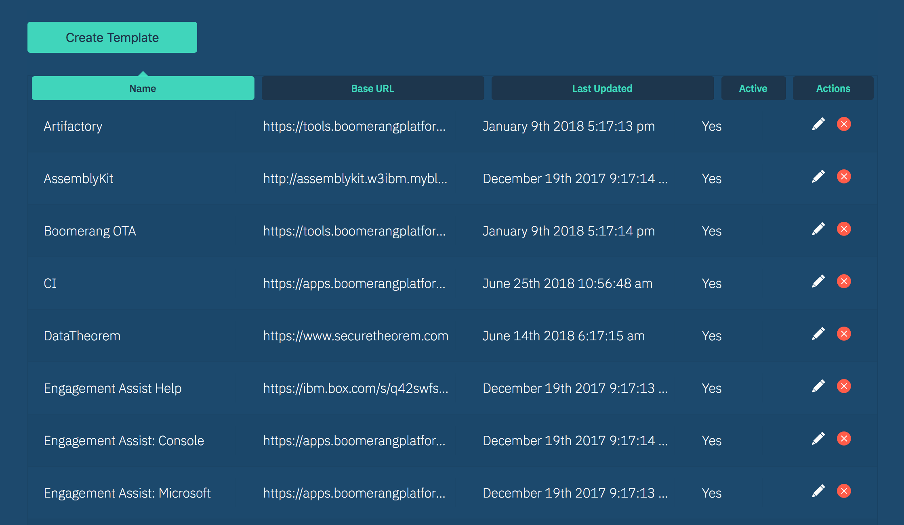
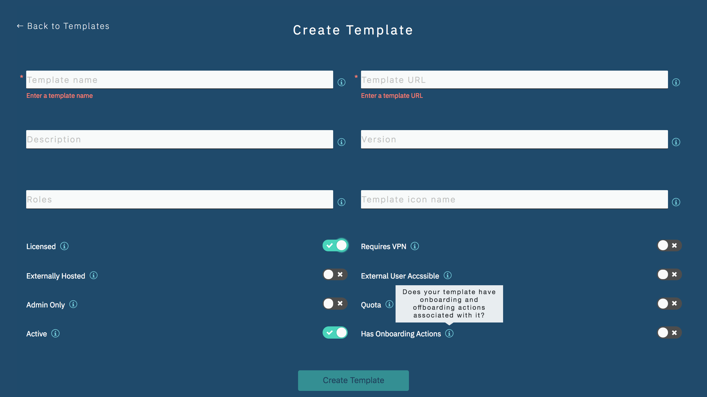

# Templates

Boomerang Admin provides functionality for admins to view, create, update and delete templates.

## View templates

The [templates](https://launch.boomerangplatform.net/admin/templates) overview provides a sorted view of the templates that have been created on the platform. It shows information about the template including:

- name
- base url
- last updated date
- active status

## Create and Edit Template

You can create a new template easily. Click the "Create Template" button above the overview table and you will be directed to a template creation screen. The template creation form includes two mandatory fields: `Template Name` and `Template URL`. The fields include tooltips that give your more information about what the template property is used for.

The overview table includes an action column that allows you to edit a template. The edit form is very similar to the create form and has the same mandatory fields.

## Delete Template

The overview table includes an action column that allows you to delete a template. It will prompt you to confirm that you do want to delete the the chosen template. Once deleted, the template will immediately be removed and any instances of the template that rely on data from the tool template will not longer work.
