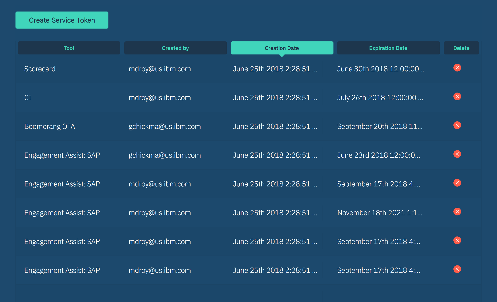
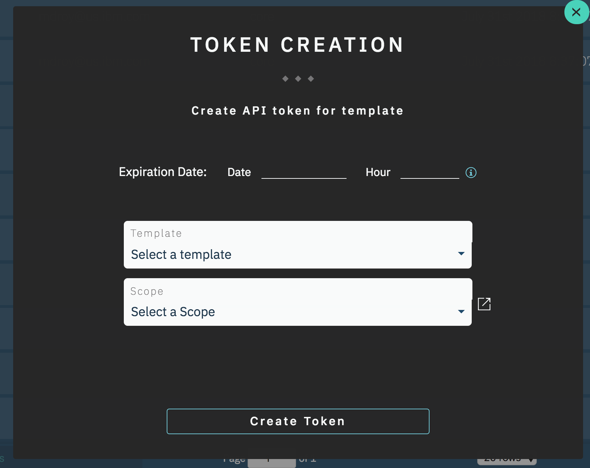

# Service Tokens

Boomerang Admin provides functionality for admins to view, create and delete service tokens.

## View tokens

The [tokens](https://launch-stage.boomerangplatform.net/admin/tokens) overview provides a table view of all of the tokens that have been created on Boomerang. It shows the following information about the token:

- associated tool
- creator
- creation date
- expiration date

## Create token

You can create a service token easily. Select the "Create Service Token" button above the overview table and a modal will open. You can select the expiration date for the token and the template for it to be associated with. Choosing an expiration date is _not_ mandatory. By default it will be set to expire 90 days from creation date.

Be sure to **save** the token. It will **only** be displayed after creation. Once you close the modal it will not be shown again.

## Delete token

The overview table includes a column that allows you to delete a token. It will prompt you to confirm that you do want to delete the the chosen token. Once deleted, the token will immediately become unusable and any services that use it for authentication will no longer work. You must create another token and update your services if you want them to continue to work on Boomerang.
