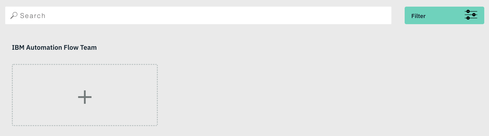
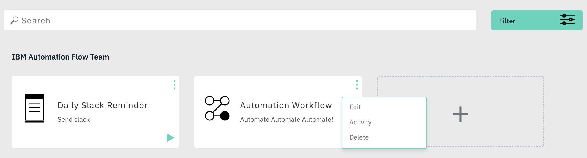
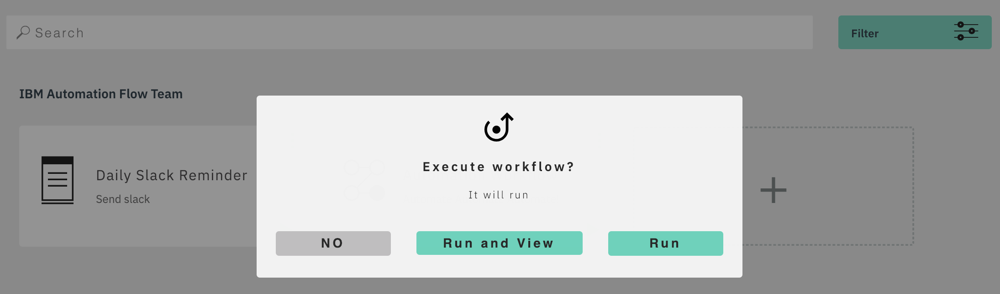
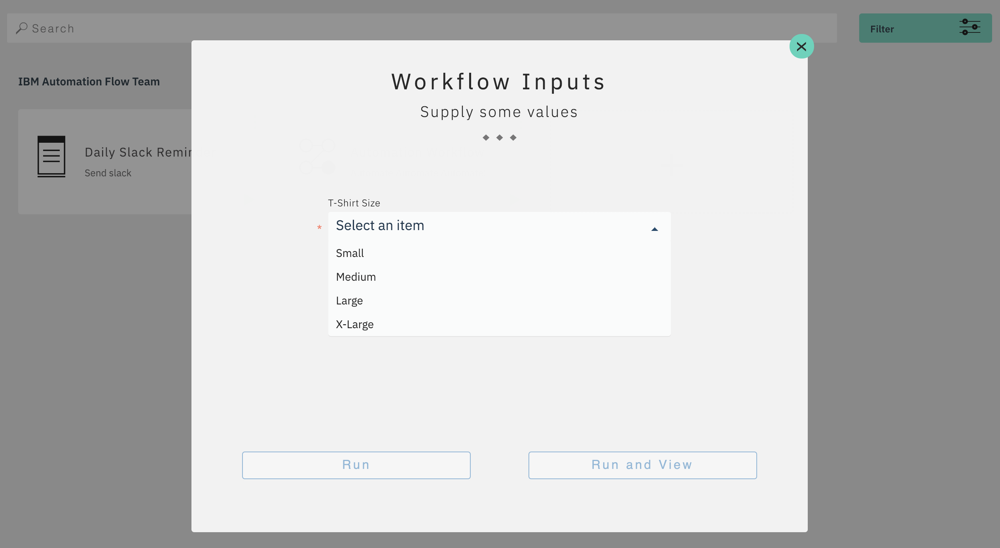

# Workflows

Workflows is the central area to perform actions on all your workflows by team.

## Create

Create a workflow by selecting the card outline and you will be taken to the Designer, or navigate directly to the Designer screen from the menu.

## Edit

To edit a workflow, select the name of the workflow on the card or Edit in the cards options.

## Execute

To manually execute a workflow from the workflows screen, select the play button in the bottom right of the card. There are two different ways this will be displayed to you.

**Execute**

**Excute with Input**

For when your workfow has workflow inputs

## Activity

To view a workflows activity, select Activity in the cards options, or navigate directly to the Activity screen from the menu.

## Delete

To delete a workflow, select Delete in the cards options. Once deleted it will be gone forever.
