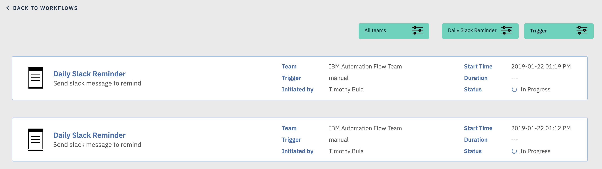

# Activity

Activity allows you to view each individual execution of a workflow. Each time you execute a workflow, an activity is associated with this execution and the system keeps information on workflow status, workflow duration, task status, task duration, output properties, and logs.

You can filter the activity screen by Team, Workflow, and Trigger type

An activity card will display a summary of information of the workflow and high level activity information such as end to end duration and status.

By clicking on an individual activity card you will be taken to the activity execution detail.

## Activity Execution Detail

The activity execution detail is a click only view representation of your workflow design.

At the top you will see a timeline bar broken down by the execution of each task in the workflow.

On the right you will see two informational cards. The top of the two is the workflow card and will detail overall status and duration. The bottom of the two is the task card and will detail over status and duration of the individual task.

Additionally on the task card you will be able to click for logs and output properties.

You can change the task card that is visible by click on the different tasks in the workflow.
