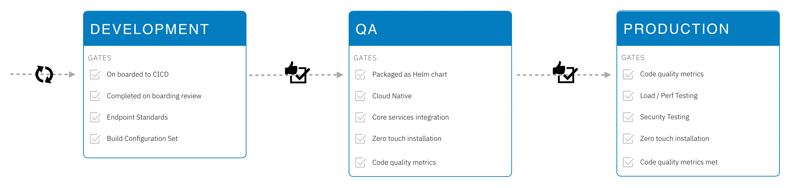

# IBM Services Engineering Deployments & Gates

The following information is a requirement for those solutions being built as part of the platform and a recommendation for external development teams.

When onboarding platform solutions there are a lot of requirements, with the main technical requirement to be cloud-native.

| Entry to    | Gate                                | Detail                                                                                                                                               |
| ----------- | ----------------------------------- | ---------------------------------------------------------------------------------------------------------------------------------------------------- |
| Development | On boarding review                  | Has gone through onboarding review and the architectural content generated to be used in setting up development environment                          |
| Development | On boarded to Boomerang CI          | The code repositories have been on boarded to Boomerang CI                                                                                           |
| QA          | Packaged as a Helm Chart            | See below for more detail.                                                                                                                           |
| QA          | Cloud Native                        | Including, but not limited to;<ul><li>Health and Liveness endpoints</li><li>Flexible ingress</li><li>Configurable</li></ul>                          |
| QA          | Implemented Core Services Libraries |                                                                                                                                                      |
| QA          | Zero touch installation             | Including, but not limited to;<ul><li>Data Loader</li><li>Scripts or Configuration for dependent middleware</li></ul>See below for more information. |
| QA          | Code Quality                        | Including, but not limited to;<ul><li>Static Code Analysis</li><li>Unit Test Pass Rate</li><li>Code Coverage</li></ul>                               |
| Production  | UI Testing _(post R1)_              |                                                                                                                                                      |
| Production  | Load Testing _(post R1)_            |                                                                                                                                                      |
| Production  | Security Testing _(post R1)_        |                                                                                                                                                      |

## Helm Charts

All solutions and services are to be packaged as helm charts. Refer to the documetation on the [helm chart standards](/ise-standards/helm-charts/)

All dependent middleware is to have a helm chart or, by exception, an alternate installation method.

## Zero Touch Installation

This is a follow on from being packaged as a helm chart. The installation should be treated as a product installer with zero touch required. This includes using a data loader to load collections into mongodb, or running scripts in a container as part of initial install to connect to the database and set up dependencies.

This is critical as in higher level environments there will be no access to do things manually.

These will implemented as `kubernetes jobs` that run via helm chart hooks for; pre-install, pre-upgrade, etc.

### Data Loader

It is critical that there is a versioned data loader system as part of the platform. This should include and handle running upgrades i.e. what are the differences between the currently installed version and the new version.

For the core services we run a job with profiles that keep a record of change logs to know which change sets to apply when.
