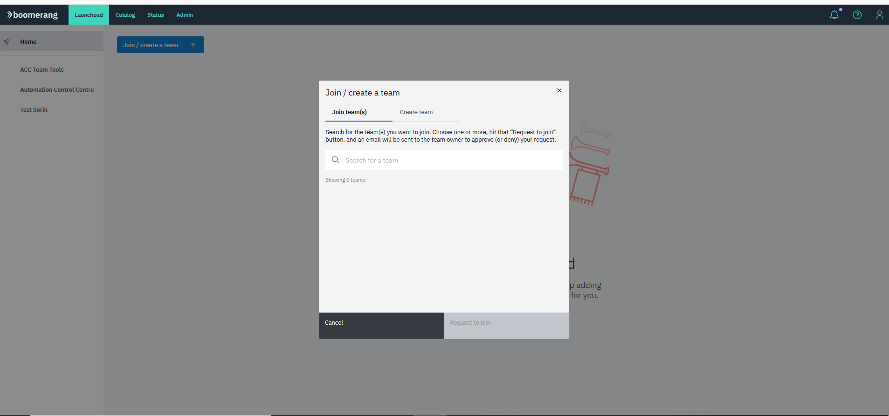
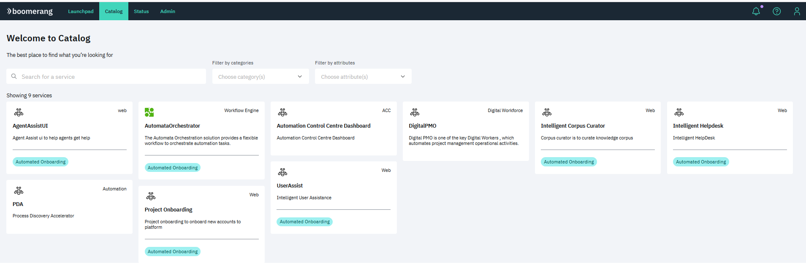
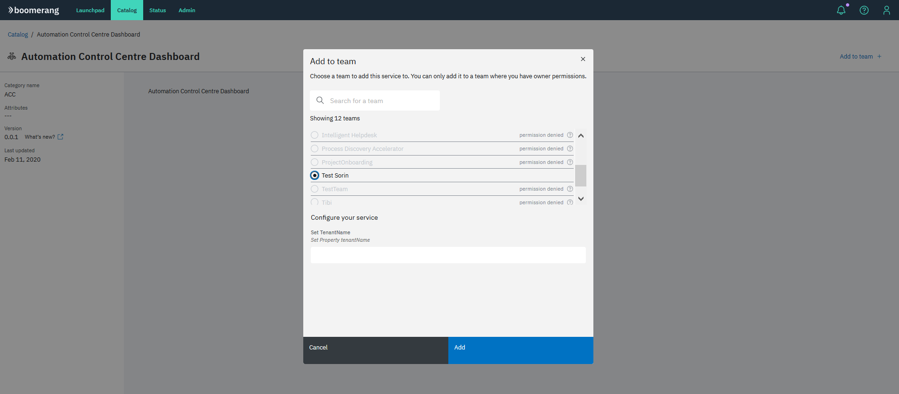
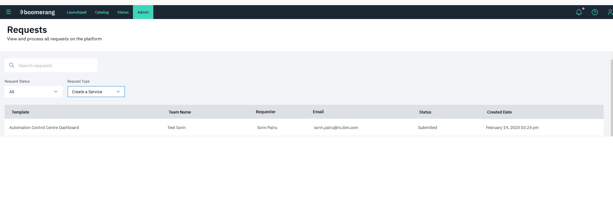
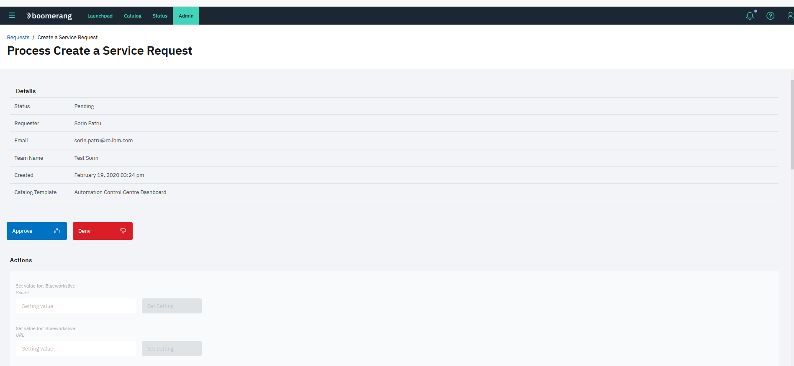
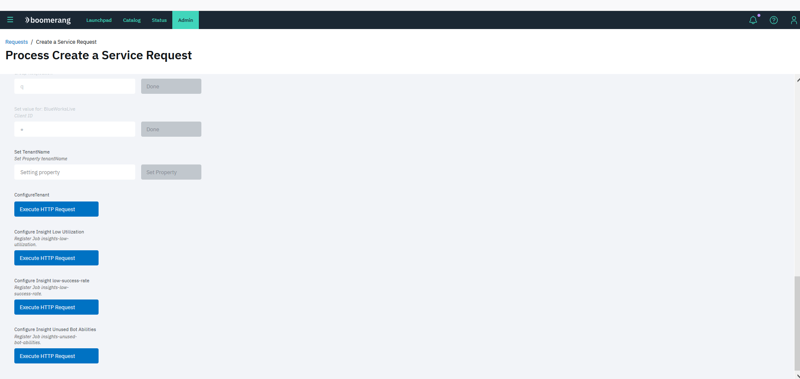
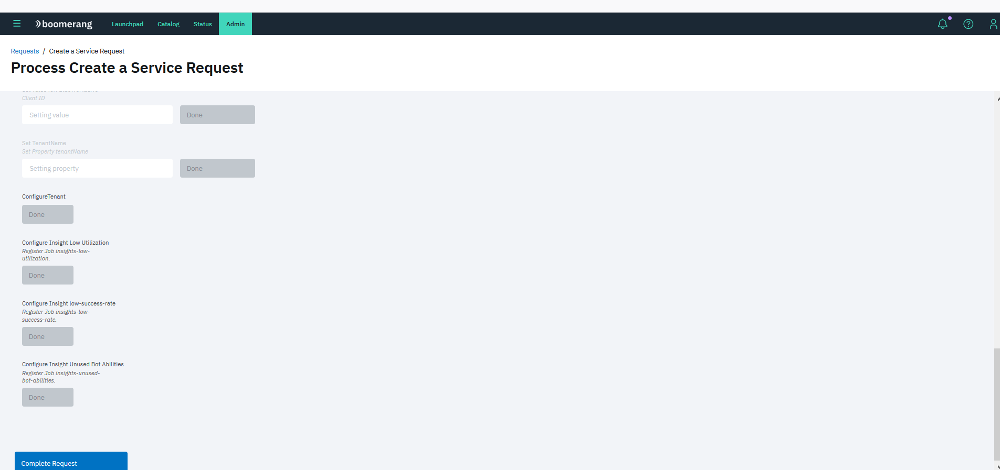
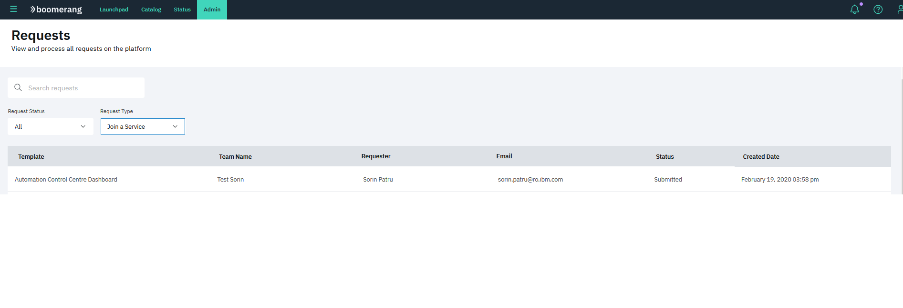
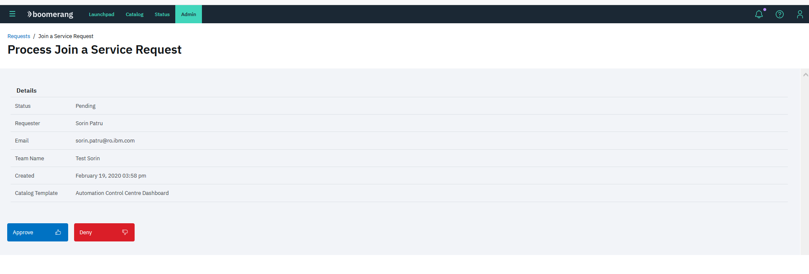
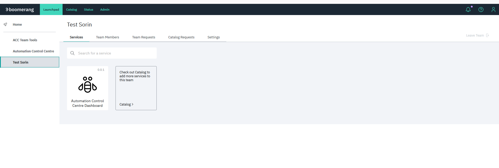

# Automation Control Center - Configure tenant
---

## Create a team  

## On the Catalog menu find the Automation Control Centre Dashboard service 

## Add the Automation Control Centre Dashboard to the new team 

## Approve the Create Tool request 
1. Find the Create Tool request:  

2. Approve and set all properties in order to config the application:  
 

3. Set “Configure tenantName” property:  
The "Configure tenantName" property should be unique because with this value a new schema will be created in the database.  

4. Execute “ConfigureTenant” and "Insights jobs" http requests:  
The “ConfigureTenant” http request will configure the database for tenant.

5. “Complete” configuration:   

## Approve the Join Service request 
1. Find the Join Service request:  

2. Approve request:  

## ACC available on launchpad 
 
