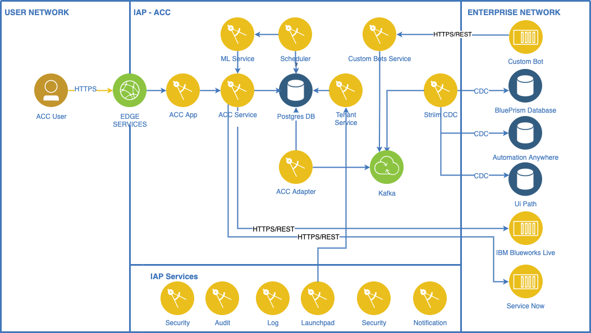
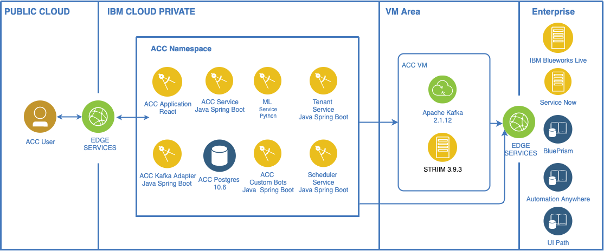

# ACC Architecture Overview
The following diagram presents an overview of the ACC architecture:
 

ACC is part of IBM IAP platform and as is deployed utilizing the IAP services as a multi-cloud cloud application on  Kubernetes with the components packaged as Helm charts. ACC uses IAP services in order to abstract the infrastructure and security protocols. The main IAP services used are:
- Security - Authentication and Authorization(RBAC)
- Audit
- Notifications 
- Support
- Docs

## ACC Components
The following table describes main ACC architectural components and their external dependencies:

| Component |  Description |
|---|---|
| ACC Service | Implements back-end services based on data stored  in Postgres. A Rest API is exposed by this component and is used by ACC Application GUI to obtain data for the user | 
| Kafka Adapter | The adapter parses the Kafka messages generated by Striim in Kafka in topics and stores the information in ACC database according with ACC data model. | 
| ACC Application | Microservice that implements ACC GUI | 
| Striim CDC  | Striim Flows are used to detect changes in BluePrism SQLServer database and to generate Kafka Messages based on this changes. Changes are detected by using SQLServer CDC implementation and Striim support to implement CDC. Once a change is detected messages are enriched with information from additional tables. | 
| Kafka | ACC uses Kafka as a main integration hub in order to receive data updates from target automation flows. |
| ACC Custom Bots Service | This service exposes the CustomBots REST API. A message call in REST API will generate a Kafka Message that will be processed by the Kafka Adapter. |
| ML Service | This service apply Machine Learning algorithms to data related to process and bots executions. |
| ACC Scheduler Service | This service is used to schedule the executions of periodic tasks that handle analytics activities based on ML service and also in order to generate insights. |
| ACC Tenant Service | This service is used to manage the  database when a new tenant is added or removed. |
| Kafka | ACC uses Kafka as a main integration hub in order to receive data updates from target automation flows. |
| PostgreSQL | ACC uses PostgreSQL to store metadata and automation flows execution information.|

## ACC External Dependencies
ACC is  integrated with RPA automation solutions in order to obtain information related to RPA processes execution. At present the following RPA are supported:
- BluePrism
- Automation Anywhere 
- UI Path

In order to obtain information about the business processes ACC is integrated with Blueworks Live.

The following table contains ACC external software dependencies and describes the integration between ACC and each component:

| Software Component |  Version | Description |
|---|---|--|
| BluePrism | 3.1.1 | ACC connects directly to the Blueprism database using CDC.   
| Automation Anywhere | 11 | ACC connects directly to the Automation Anywhere  database by using CDC.
| UI Path  | 2019 | ACC connects directly to  UI Path database by using CDC.
| Blueworks Live |  | ACC is using the Blueworks Live API in order to get the process description.  | 
 ServiceNow|  | ACC is using Service Now in  order to create Service now tickets that flag bots. | 

# ACC Deployment Architecture
The following diagram presents ACC deployment architecture:

 

## ACC Middleware 
The following middleware components must be available as a prerequisites in order to deploy ACC:

| Software Component |  Version | Description |
|---|---|--|
| IBM Cloud Private | 3.1.1 | Kubernetes cloud environment |
| IBM Automation Platform | R2 |  ACC is using IAP  approach, methods and implementation process in order to be abstracted from the underlying infrastructure and security while enabling a rapid development life cycle. At development level ACC uses IAP common services like authentication, authorization, notifications, audit and is also integrated in IAP Launchpad. |
| Kafka | 2.11.2.0.0 | ACC uses Kafka as a main integration hub in order to receive data updates from target automation flows. Kafka is deployed on a virtual machine. |
| Striim Platform & Striim platform CDC Adapter | 3.9.4 | Striim is deployed on a virtual machine. Striim connects to Automation Anywhere, UIPath, Blueprism using CDC |
| PostgresSQL | 10.6.0 | Postgres is deployed in IAP on Kubernets using a dedicated Helm Chart |

## Application Services
ACC micro-services are deployed in Kubernetes using a Helm Chart. ACC Chart definition is available at https://github.ibm.com/Boomerang-Delivery/acc.chart/

### Technology Components 
| Component | Type         | Technology               | Internal to Internal      | External Ingress | Internal Dependency | External Dependency | Optional Side Cars |
| --------- | ------------ | ------------------------ | ----------------------- | ---------------- | ------------------- | ------------------- | ------------------ |
| ACC Application     | Front End    | React + Node.js          | Launchpad MS, Admin MS  | true             |                     |                     |                        |
| ACC Service     | Microservice | Spring Boot (Java)       | Auth, Authentication, Audit               | false             | Postgres             |   BlueWorks Live,  ServiceNow                  |  |
| ACC Adapter | Microservice | Spring Boot (Java)       | Notification, Audit              | false             | Postgres, Kafka |
 Custom Bots API | Microservice | Spring Boot (Java)       | Audit              | true             |  Kafka |
  ML Service | Microservice | Spring Boot (Java) , Python      | Audit              | true             |  Postgres |
  Scheduler  | Microservice | Spring Boot (Java)       | Notification, Audit              | false             | Postgres, ML Service |
  Tenant Service | Microservice | Spring Boot (Java) , Python      | Audit              | false             |  Postgres |