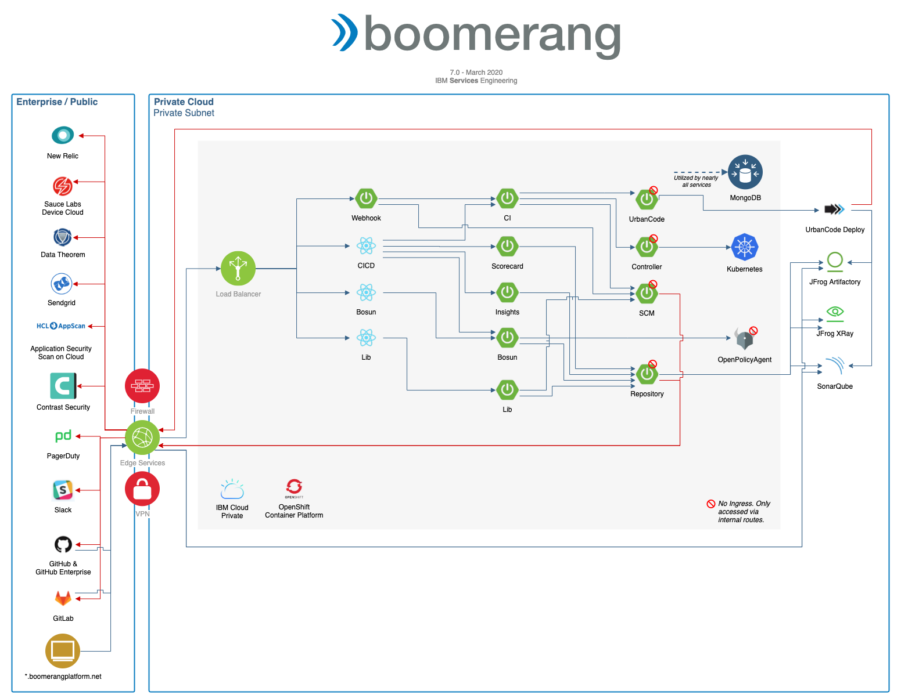

# Application Architecture

**Platform Dependencies**

The following platform wide dependencies are prior to, and in addition to, any dependencies for the additional components such as Core.

| Dependency | Implementation | Version | Notes |
| --- | --- | --- | --- |
| Core Services | Boomerang Core | 7.0.0+ | |
| Kubernetes | IBM Cloud Private (3.2.1+) or Red Hat OpenShift Container Platform (4.2+) | 1.13.9+ | | 
| Application Load Balancer | NGINX | 0.23.0 | |
| Certificate Manager | Jetstack Cert Manager | 0.7.0 | If using IBM ICP 3.1.1 or higher, we can use the provided IBM Cert Manager which is a forked implementation. |
| Logs | Elasticsearch | 5.5.1 |  |
| Monitoring | New Relic Infrastructure, New Relic Kubernetes, New Relic APM Agent | 4.10.0 | _if enabled_ |
| Tracing | Jaeger | | _if enabled_ |

## CICD

CICD is the continuous integration and continuous delivery solution for the platform.

| Component  | Type | Technology | Internal to Internal | External Ingress | Internal Dependency | External Dependency | Optional Side Cars |
| --- | --- | --- | --- | --- | --- | --- | --- |
| CICD | Front End | React + Node.js | Launchpad MS, CI MS, Scorecard MS, Insights MS, Bosun MS | true | | GitHub, GitLab | |
| Lib | Front End | React + Node.js | Launchpad MS, Lib MS | true | | | |
| Bosun | Front End | React + Node.js | Bosun MS | true | | | |
| CI | Microservice | Spring Boot (Java) | UrbanCode MS, SCM MS, Controller MS | true | MongoDB | | New Relic APM |
| Webhook | Microservice | Spring Boot (Java) | CI MS, SCM MS | true | MongoDB | | New Relic APM | 
| Scorecard | Microservice | Spring Boot (Java) | Repository MS | true | MongoDB | | New Relic APM |
| Insights | Microservice | Spring Boot (Java) | Repository MS | true | MongoDB | | New Relic APM |
| Lib | Microservice | Spring Boot (Java) + Embedded SOLR | | true             | MongoDB, JFrog Artifactory | Repository MS | New Relic APM |
| UrbanCode | Microservice | Spring Boot (Java) | | false | MongoDB, IBM UrbanCode Deploy | | New Relic APM |
| SCM | Microservice | Spring Boot (Java) | | false | MongoDB | GitHub, GitLab | New Relic APM |
| Repository | Microservice | Spring Boot (Java) | | false | MongoDB, JFrog Artifactory                       |                     | New Relic APM      |
| Bosun | Microservice | Spring Boot (Java) | | true | MongoDB, OpenPolicyAgent | | New Relic APM |
| OpenPolicyAgent | Middleware | Go | | false | | | |
| Worker    | Kubernetes Job | Node.js CLI | | false | Kubernetes          | | |

_Notes:_

1. Optional Side Cars are what is known at the application layer. This does not include any DaemonSets defined at the Infrastructure / Orchestrator layer.
2. Executors are a concept that allow CI to be extended to work with multiple different orchestration tools to executor the build, test, and deploy activities. There are now three such executors; IBM UrbanCode Deploy, Kubernetes native, and Boomerang Flow (_alpha integration_)
3. The workers have implemented, and are bound to, specific RBAC priviledges in Kubernetes.

**Dependencies:**

| Dependency       | Implementation                   | Version |
| ---------------- | -------------------------------- | ------- |
| Artifact Storage | JFrog Artifactory                | 6.5.9   |

**Dependencies for UrbanCode Executor**

| Dependency       | Implementation                   | Version |
| ---------------- | -------------------------------- | ------- |
| Automation       | IBM UrbanCode Deploy             | 7.0.1.2 |

**Dependencies for Mobile CI**

| Dependency       | Implementation                   | Version |
| ---------------- | -------------------------------- | ------- |
| Mac OSX Hardware | iMacs, Mac Mini's                |         |

**Integrations to enable functionality**

| Dependency         | Implementation                   | Version | Description |
| ------------------ | -------------------------------- | ------- | --- |
| Package Scanning   | JFrog Xray                       | 2.8.0   | For Scorecard, Citdal Package Whitelist and XRay Vulernabilities |
| Static Analysis    | Sonarqube                        | 7.6     | For Scorecard static code analysis results |
| Security Scanning  | ASoC, Contrast, Data Theorem     |         | For security testing results in Scorecard and Citadal Policy Validation |
| Functional Testing | Sauce Labs                       |         | For functional testing |