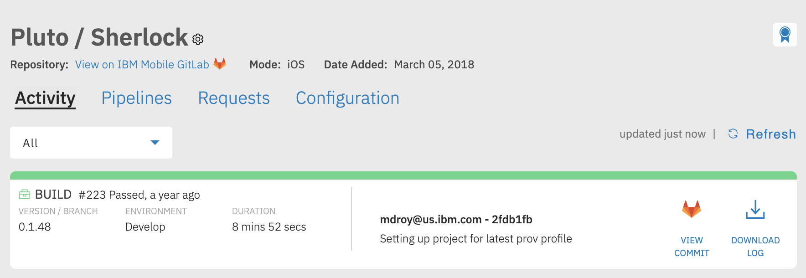

# iOS mode

The iOS mode will execute xcode based commands to build, test, and deploy mobile artifacts.

## Boomerang Properties

The following summarizes the properties that can be used in conjunction with `mode=iOS`. These are recommended to be set at the Stage or Version property scope.

The below is a sample file `.boomerang.properties` file.

```
#General
mode=iOS
build.tool=xcode

#Refer to supported version table below for supported configurations
build.tool.version=9.4.1

#Cocoapods
cocoapods.enable=true
cocoapods.version=1.5.3
cocoapods.repo.update=true

#Carthage
carthage.enable=true

#Scheme name and folder path of your xcworkspace or xcproj
scheme.name=
scheme.folder=

#Slack Notifications
notifications.type=slack
notifications.slack.channel=
notifications.slack.dm=

#Filtering
filter.target=tag
filter.expression=^(\d+\.)?(\d+\.)?(\*|\d+)$
```

### Required Properties

The following properties are required for `mode=iOS`

```
mode=iOS
build.tool=xcode
build.tool.version=9.4.1

cocoapods.enable=true
cocoapods.version=1.1.0

scheme.name=
scheme.folder=
```

### Optional Properties

| Property | Default Value  | Description |
| --- | --- | --- |
| `newrelic.applicationid` | - | The New Relic Application ID to upload the Mobile DSYM to |
| `set.version.number` | false | Automatically set the Version number of the iOS app to the Git tag |
| `set.build.number` | false | Automatically set the Build number of the iOS app to Boomerang CICD build number |

### build.tool

`build.tool=` allows Boomerang CI to determine what type of engine and worker pre-configuration to apply. The options are as follows.

| **Build Tool** | **Version** | **Support** | **Operating System** | **Date Created** | **Useful For**                           |
| :------------: | :---------: | :---------: | :------------------: | :---: | ------------------------------------------------- |
|     xcode      |    10.2.1    |   stable    |  10.14 Mojave   | 04/25/18 | The base worker for iOS and Cocoapods activities. |
|     xcode      |    11.0.0    |   stable    |  10.14 Mojave   | 10/05/19 | The base worker for iOS and Cocoapods activities. |
|     xcode      |    11.1.0    |   stable    |  10.14 Mojave   | 30/10/19 | The base worker for iOS and Cocoapods activities. |
|     xcode      |    11.2.1    |   stable    |  10.14 Mojave   | 02/12/19 | The base worker for iOS and Cocoapods activities. |

### cocoapods.enable

If `cocoapods.enable` is enabled in your properties file you can specify additional cocoapods parameters.

By default, the workers will *not* update the pod spec reference due to the poor performance of downloading the public specifications. The last update is based on the worker date created in the table above. If you wish to ensure the public spec reference is updated, add `cocoapods.repo.update=true` to your `.boomerang.properties` file.

### carthage.enable

If `carthage.enable` is enabled it will be installed and available for your build. This will allow you to run carthage copy-frameworks command as a post build phase step as recommended by offical carthage docs.  

```
/usr/local/bin/carthage copy-frameworks
```

## Prerequisites

### Xcode project setup

**Scheme Settings**

Xcode projects need to have their schemes shared to allow automated builds through BoomerangCI.

In Xcode navigate to `Product -> Scheme -> Manage Schemes`

And ensure the scheme you want to build has been shared as shown by the checked box next to each scheme.

**Xcode Signing and Provisioning**

Turn off Automatic Signing in Xcode for your target, and you will need to select the correct development profile and distribution profile for your application.

You can download your provisioning profiles from within Xcode itself by navigating to `Xcode -> Preferences -> Accounts`.

Under your team id for your enterprise team, click "view details" and click "Download all profiles.". This will download all the provisioning profiles for your team.

Set the correct provisioning profile for your Xcode configuration under the Signing section for your Xcode Target.

* Debug configuration will use a development profile.
* Release configuration will use a distribution profile.

If the required provisioning profiles cannot be found by your Xcode project, you can manually enter the names

1. In Xcode, on your project, go to Build Settings
2. Search for "Provisioning Profile"
3. Expand the Provisioning Profile section and find the appropriate configuration. Usually Debug, Release, or Production.
4. Select 'other' on the target and enter the string name for your provisioning profile.

**Supplying Custom provisiong profiles**

We recommend the use of an explicit profile over a wildcard profile. This ensures that we are reserving the namespace of the App ID for later use, and when we need to enable services the app id is guaranteed to be available.

For Mobile@Scale the bundle ID must match the following convention;

* com.ibm.gbs.mobilescale.\*

Request any new provisisong profiles for IBM ADEP here: [ADEP Request](https://w3-connections.ibm.com/wikis/home?lang=en-us#!/wiki/W4a398057b70b_448c_af67_7209960bc516/page/Request%20GBS%20Application%20Provisioning%20Artifacts)

You provide your own provisioning profiles by checking them in under the `_boomerang` folder in your git repository where you have placed your ".boomerang.properties" file.

**Team Certificate Signing**

Team certificates for both development and distribution signing can be uploaded securely through Boomerang CI when viewing the CI Component page by clicking on the type right corner "Ribbon" icon.



For iOS projects you can provide either/both the development and distribution signing certificate along with the associated certificate profile, when signing your iOS application in CI these will be imported and used to sign your application depending on the provisiong profile you have configured for your application targets.

## Constraints

None at this time.
