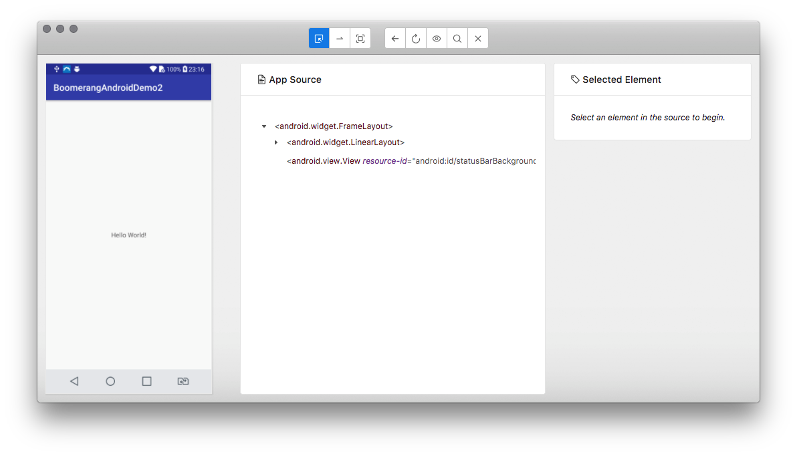
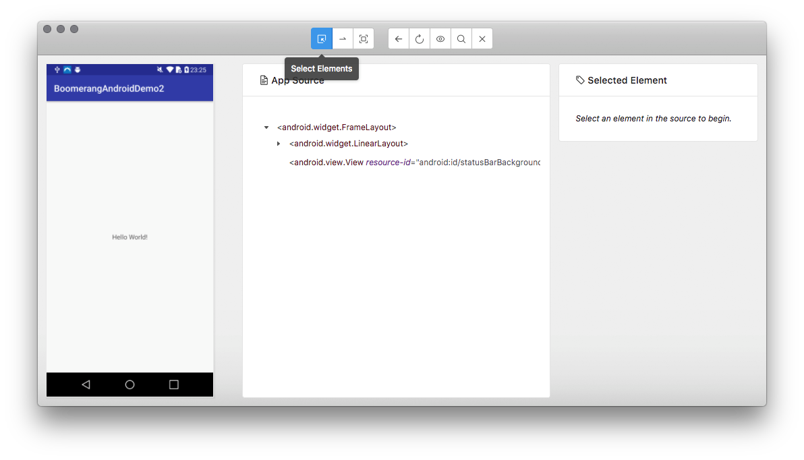
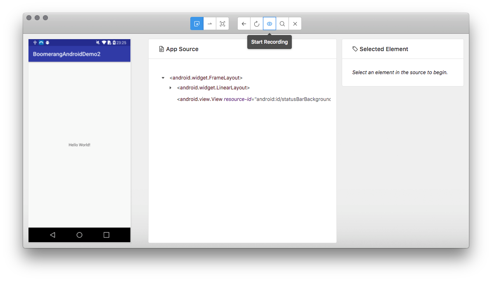
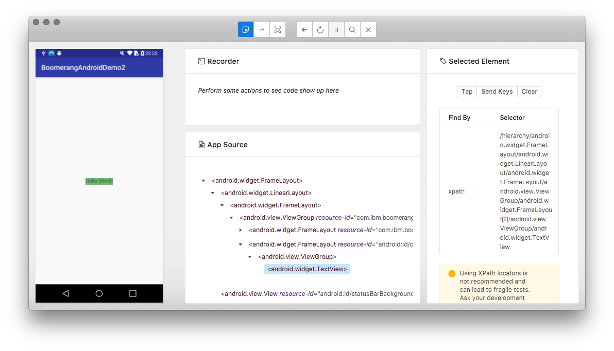
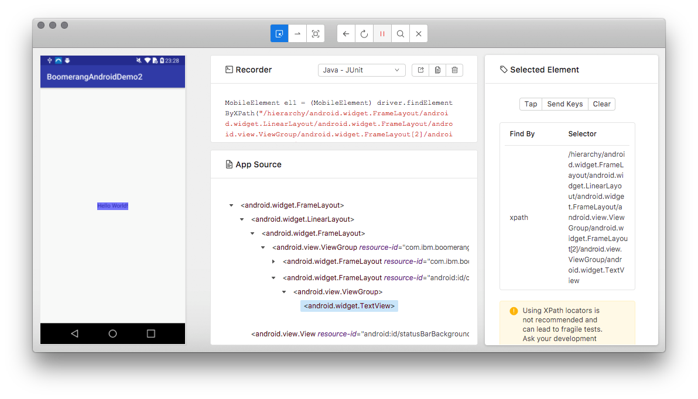
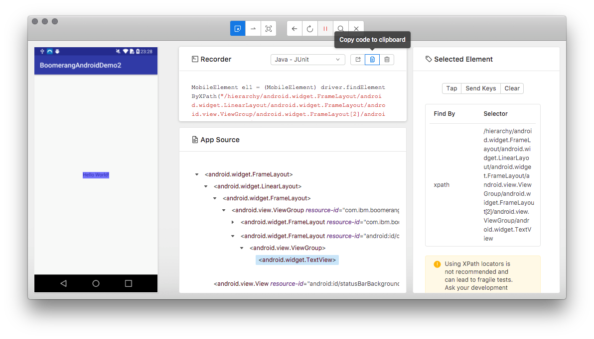

# Mobile Device Testing

The chosen provider for Boomerang@IBM is SauceLabs Device Cloud

## SauceLabs

### First time application registration

As part of using SauceLabs you need to upload your application the first time so SauceLabs can generate a unique testing API key.  This API key will be used by Boomerang CI to execute the automated tests.

1. Navigate to SauceLabs via the tile on your team page on Boomerang Launchpad and logon with the credentials provided by the Boomerang support team.
2. Click on "+ New App"
3. Click on "Android/iOS App"
4. Drag and drop your APK or IPA file or click on "Choose File"
5. Confirm "App Name" and "Version" and click "Save"
6. Confirm "Device Settings" and click "Save"
7. Hover over "Automated Testing" and select "Appium"
8. Click on "Setup Instructions"
9. Copy your `testobject_api_key`

### Live Testing

From the SauceLabs main "Apps" page you can select an application and a version to test interactively with SauceLabs.

1. Select the application you wish to live test.
2. Click on "Live Testing"
3. Select the device from the online catalog you wish to use and click on "Open Device"
4. Take note of the `Device Name`

From here your application will be installed on the device and started.

## Appium

Appium is the preferred tool to capture the test scripts and for automated playback via SauceLabs.  Testers will use a locally installed instance of Appium connected remotely to SauceLabs to capture test scripts by directly interacting with the application.

### Installation

1. Downloaad the appropriate Appium install for your platform. [Appium](http://appium.io/)
2. Install Appium

### Configuring an inspector session

1. Start Appium
2. From Appium Home menu select "New Session Window..."
3. Select "TestObject" from the list of servers
4. Paste in your `testobject_api_key` you captured earlier when performing first time registration of your application with SauceLabs
5. Select `US` in the "TestObject Data Center" drop down
6. Click on "Desired Capabilities"
7. Click the "+" button
8. Add "platformName" and either `Android` or `iOS`
9. Click the "+" button
10. Add "platformVersion" and either whatever version of `Android` or `iOS` you wish to use, eg. `8` for Android or `11.3` for iOS
11. Click the "+" button
12. Add "deviceName" and the `Device Name` you captured earlier when running a Live Test on your application
13. Click "Save"
14. Click "Start Session"

Appium will now connect to SauceLabs where your application will be installed and started on a device of the version and type you specified above.  Once the application starts Appium will connect to the running instance and display your application.  You can now interact with your application via Appium and record scripts.

### Recording a test script

The following steps will illustrate how to capture a test script which can be executed against SauceLabs as part of the automated Boomerang CI process.

1. Appium will load and display 3 panels from left to right: Simulator, App Source, and Selected Element 

2. Click on "Select Elements"

3. Click on "Start Recording" and ensure "Java - JUnit" is selected from the drop down menu in the newly opened Recorder panel

4. Select an element from the Simulator panel.  The App Source and Selected Element panels will update showing you the details of the selected element.

5. Click on "Tap" in the Selected Element panel.  You will see some JUnit Java code appear in the Recorder panel.  This is your test script.

6. Repeat steps 4 and 5 to compile your end-to-end test script.  Once you have captured your test click on "Copy code to clipboard" and then save this in a new file with a `.java` extension.

7. Repeat steps 1 through 6 for each test script you need.  Be sure to name each `.java` file in alphabetical sort order if your tests need to be executed in order.

## CI Configuration

The following section provides the instructions to configure your application to execute your catalog of device test scripts each time it is built through Boomerang CI

### Test Folder

The following steps require access to the application source code repository.  If you do not have access you will need to contact a developer in your team who does have access and ask them to execute these steps.

1. Clone the application source code repository to your local
2. Change directory to the cloned repository
3. Create a new folder for storing the `.java` test script files created earlier.  Take a note of the new `Folder Name`.
4. Copy all the captured `.java` files to `Folder Name`
5. Commit changes and push

### Test properties

As per the previous step this requires access to the application source code repository.

1. Change directory to the `_boomerang` folder
2. Edit `.boomerang.properties` and add the following properties:

As a starting point use the values your captured as part of your Appium test script capture.

```
scheme.folder.test=<your folder name>
testobject.api.key=<your API key>
testobject.upload.user=<your SauceLabs user name>
testobject.device.name=<deviceName>
testobject.device.platform=<platformName>
testobject.device.platform.version=<platformVersion>
```

3. Commit changes and push

### Enabling Device Testing on your pipeline

Contact your Boomerang Support team via your team Slack channel and ask for "Device Testing" to be enabled on your pipeline.  This task is quick and is effective immediately, ie. on next build push or tag Boomerang CI will automatically upload the new application APK or API to SauceLabs and execute each of your test scripts.  You can log into SauceLabs and watch a replay of the test executions.