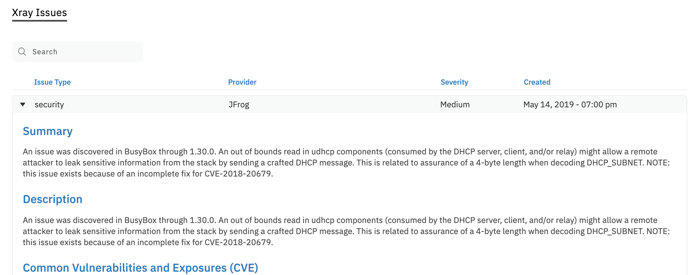

# Security Scanning with Data Theorem

TBA

# Security Scanning with Artifactory X Ray

Every docker image that is built through Boomerang CI is automatically scanned by Artifactory X Ray. This will scan your built artifacts for any known vulnerabilities and CVE present in your Docker image artifact which includes your application code and any inherited docker layers. This has been enabled for all ci components and is accessible through on Scorecard on the detail component view under the XRay Issues tab.

