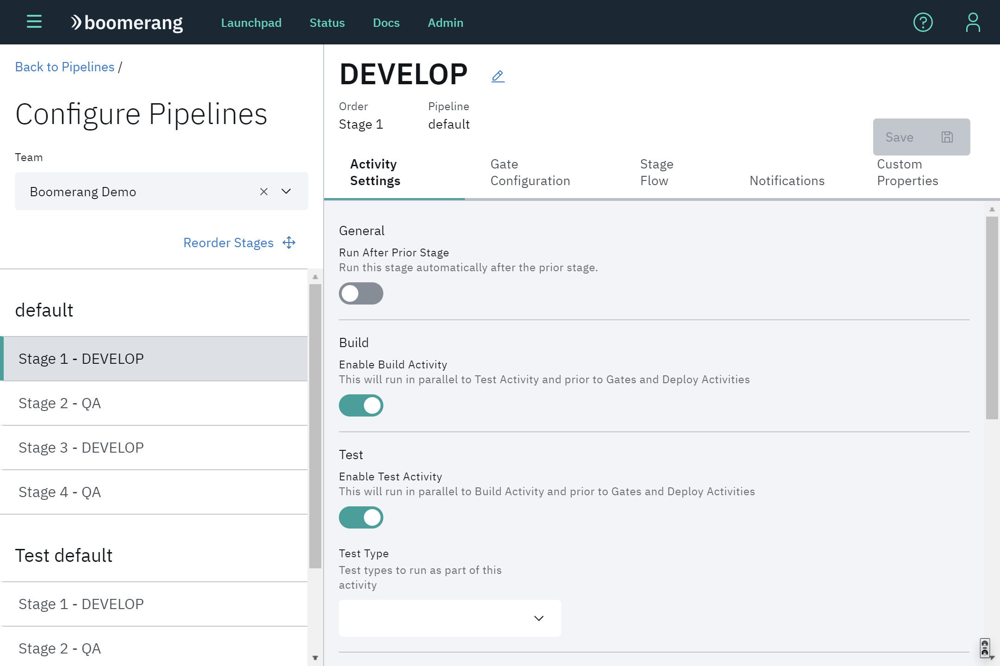
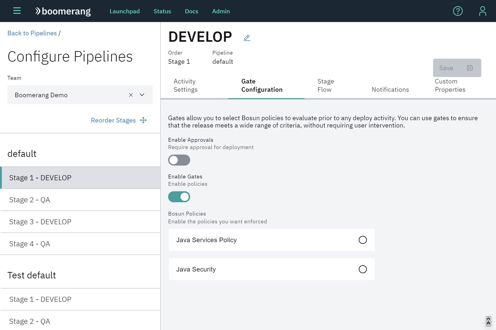

# Pipelines

The other key engine room of Boomerang CICD. Pipelines wire together Stages, and in turn, Stages dictate what and how an activity is run. Without pipelines and stages, components do not do anything.

## Stage Actions

You can view and perform actions on any stage which are visible at the bottom of each stage card. Actions currently include:
- _run activity_ - Platform admins and operators are able to run a one or all activities for a specific component and version.
- _retry last activity_ - The enabled activities for the current component and version will be re-executed.

You can also duplicate stages. CICD will automatically name the new stage and replicate all the stage configuration from the parent stage.

## Stage Approvals

Users with appropriate access can approve or reject deployments.

## Stage Configuration

You can configure the individual stages in your pipeline. Configurable settings include general settings like the name of the stage and the ability enable/disable build and test activity. This gives you control of what happens on what stage without having to go through a DevOps representative.

Selecting the ⋮ icon on the top right of the stage card will bring up the stage options menu, select "Configure...".

You will be redirected to configuration page where you'll be able to set notifications and what happens for build, test, and deploy activities. Also you can configure the gates activity, set custom properties and check how the stage flow will behave. These essentially set Stage level properties.

## Activity Settings

Configure activities for build, deploy and test.

## Notifications

Configure notifications that will be sent when running activities at this stage.

## Stage Gates

Allows you to select what Bosun Policies you want to enable and validate against.

## Stage Flow

Shows what activities and which order they are executed at this stage.

## Custom Properties

Create custom properties that can be used in this stage. They can be a normal text or secured values.

