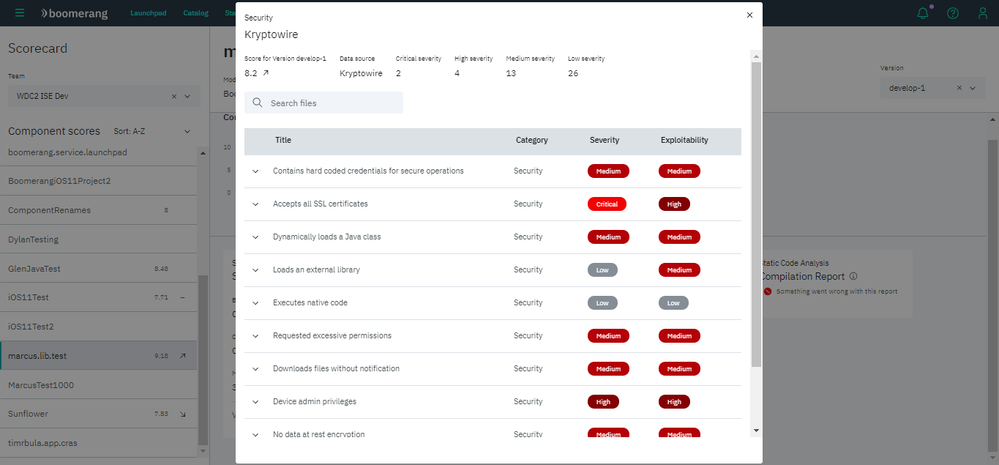
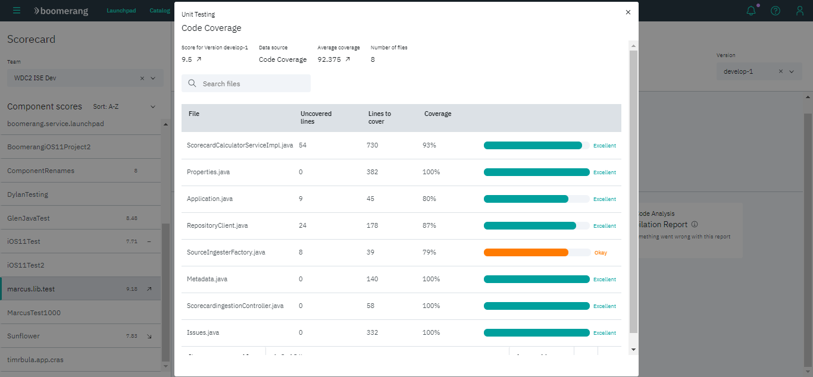

# Scorecard

Provides a point in time, per application version based quality scoring and metrics.
You can select a team and component in the sidenav in order to check the component's details.

## Component Details

The component details screen highlights:
- trends from the previous versions
- the latest scoring
- reports and details about them

If available, you can view more details about a report or check the full report in an external link.

## Security Report

Shows all security, hardware or privacy issues, ranking their severity and exploitabily from low to critical.
You can expand a row to check a more detailed description of the issue and some recommendations.

## Code Coverage Report

Shows how much of the source code is being tested. A code coverage above 80% is excellent and above 40% is okay, otherwise is poor.

