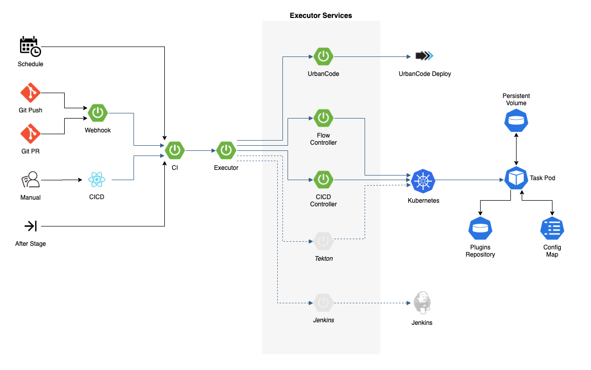

# Worker and executor architecture

Following on from the worker infrastructure dependencies mentioned in _Infrastructure Architecture_, the following describes the interaction from CICD to the executor architecture and the related workers.

## Executors

Executors allow for a dynamic range of orchestration engines to be used to execute on the activity. This is defined with the Boomerang CICD Mode.

- Extensibility through multiple orchestration tools or systems, based on mode
- Swappable implementations
- Three current executors: Kubernetes® native, IBM® UrbanCode® Deploy, and Boomerang Flow
- Source code driven automation enhancing collaboration

## Workers

There are currently three generations of workers implemented as part of Boomerang CICD

| Generation | Description | State |
| --- | --- | --- |
| Gen 1 | This worker ran as part of UrbanCode Deploy and extended the product where UrbanCode Deploy Agents ran inside a container and executed the commands from the centralized server. | This is the legacy approach and no longer used for Cloud Native. |
| Gen 2 | A single worker with defined tasks, mapped to each activity of build, test, and deploy. The structure is rigid and tightly coupled to Boomerang CICD activities. | This is the *current* main implementation used by default |
| Gen 3 | A dynamic worker system, allowing users to wire together the CICD tasks they want, based on a Boomerang Flow DAG | This is in *beta* using the Flow executor. |

### Design guidelines

The current worker design abstracts the complexities of the automation away from the end user. Two out of our three user types are not tailored to use the system to write automation.

We design the implementation so that overrides can be provided by the end user, as necessary, to allow some flexibility or customization in the automation. To achieve this, we tend to use the following hierarchy:

- Global overrides that can be passed into the tool, package, or module script being used, usually as CLI flags. A good example is a `debug` type flag that can be passed in to increase the verbosity, or Proxy variables.
- Known Overrides that can be passed in by an end user and are default across the spectrum of tools
- The top two or three supported tools and their overrides. A great example is Node.js testing, as there are a number of industry tools, but we choose to support the main industry methods (we dont "boil the ocean"). From there we can add, as required.
- Last fallback is to implement based on a PoV (Proof of Value), with no overrides, and document the dependency that is required.

Additionally, when implementing a mode or peice of functionality, the default approach should be to:

- Auto Detect or Default. A good example is `build.tool`, which is now defaulting for most modes.
- Ask for user input to drive some customization, or
- Make an assumption based on industry best practice or PoV.