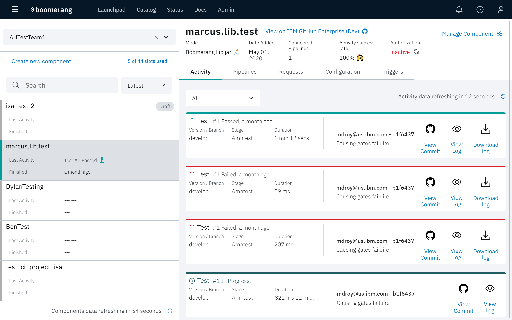

# Components

This page is the key engine room of Boomerang CICD. This is where you see all the repositories as component objects that have been onboarded by team. The majority of the configuration is driven from this area.

Additionally you can manage additional actions from the **Manage Component** dropdown menu, such as changing the mode or recreating the webhook.

Components have these key concepts:
- Mode: every component has a mapped mode that tells Boomerang CICD how to process it and which orchestrator to run against
- Authorization

## Sidenav

Navigation is driven by your Boomerang teams. If you have a team on Launchpad that has access to the Boomerang CICD Catalog service, then you will see your team populated in the teams dropdown in the top of the left panel.

Select a team. The components for that team are loaded. The latest activity for each component are displayed.

## Create Component Wizard

You are able to self-onboard repositories as components through the Create Component wizard. Click **Create new component**. Once you have commenced the creation of a component, it will be placed into draft status and be available to continue at any time.

See the [getting started](/boomerang-cicd/introduction/getting-started/) guide.

## Activity

Click the **Activity** tab in the details pane. The Activity view presents tiles for each activity that has been executed againt the selected repository. Each Activity can be identified by:

- _type_ - The type of activity, for example, Build, Test, or Deploy. Adjacent to the activity type is the build number. For completed activities the final state and duration since completion is displayed.
- _version_ - The version of the branch or tag that triggered the execution of the activity.
- _stage_ - The target environment or stage the successfully built artifact will be deployed to. This target can range from MaaS360 and iTunes Connect to MobileFirst and Kubernetes.
- _duration_ - For activities in progress the time elapsed to date. For all completed activities the total time to execute.
- _commit details_ - Git Author and Id and Git Commit Message.

Each activity also has links to the related Git commit and links to appropriate logs (for example, build logs and deploy logs).

## Pipelines

Click the **Pipelines** tab. In the components pipeline view, you can view and perform actions on the connected pipelines. A connected pipeline is a pipeline that has been targeted from a components trigger.

Actions are visible as icons at the bottom of each stage card. Actions currently include:
- _run activity_ - Platform admins and operators are able to run a one or all activities for a specific component and version.
- _retry last activity_ - The enabled activities for the current component and version will be re-executed.
- _promote_ - Promote artifacts from one stage to another. In the case of mobile applications, when promoting to the next stage, Boomerang CI will recompile the artifact using the configuration for that stage.

See [Pipelines](/boomerang-cicd/getting-to-know/pipeliness) for a discussion of stage configuration and actions for pipelines.

## Approvals

In the component approvals view, users with appropriate access can approve or reject deployments.

## Requests

In this view, all the triggered activity on your component is displayed.

## Triggers

Triggers allow you to configure when a component should have activities run as part of a stage. There are currently four types of triggers:

- Manual - operators trigger a promotion or activity through the CI application
- Webhook - triggered automatically via webhook from the configured source code repository such as GitHub or GitLab.  Webhook triggers include Git Push and Git Pull Requests.
- Schedule - sets the day(s) and time you want your component activities to execute
- After Stage -occurs automatically after the previous stage has completed. This will run no matter the status returned from the activities on the previous stage.

## Signing certificate upload

For mobile components such as iOS and Android, any required signing certiifcates can be uploaded and securely stored for use when building mobile applications.

When viewing a mobile component, click **Manage Component** on top right corner of the the component page.

Here, the user can provide:
* Platform type (Android or iOS)
* Certificate files to be uploaded (distribution and/or development certificates)
* Certificate Passphrase

## Properties

Properties are an important aspect of Boomerang CICD and can be set at many different layers of the application. They are substituted at execution time.

Please see more in our [properties how to guide](/boomerang-cicd/how-to-guide/modes-and-properties).
