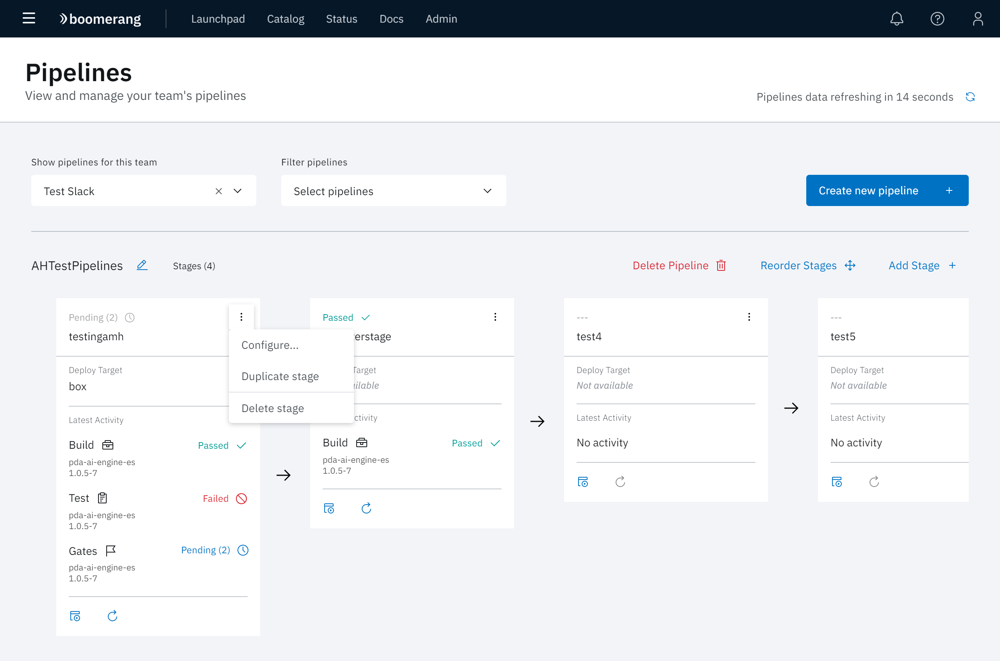
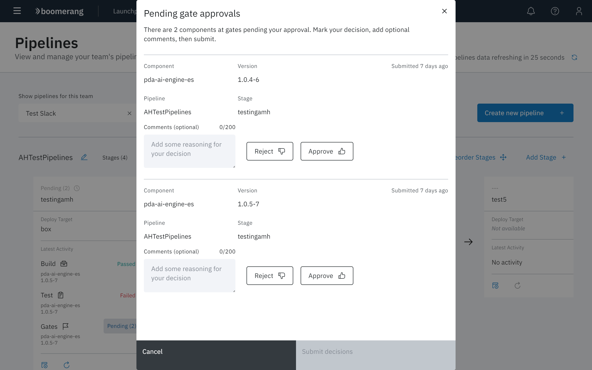
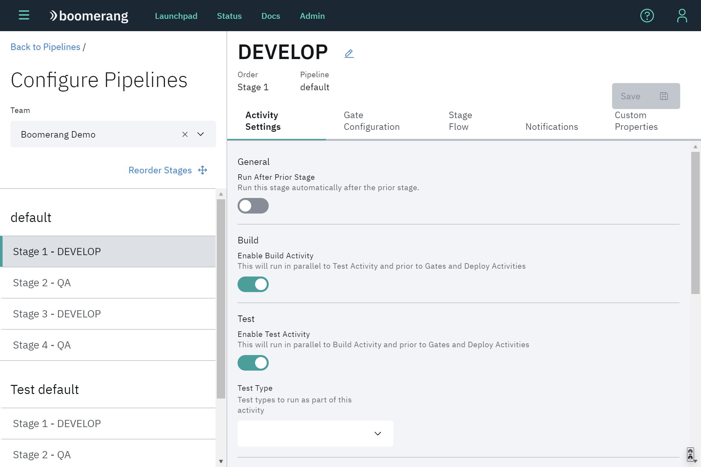
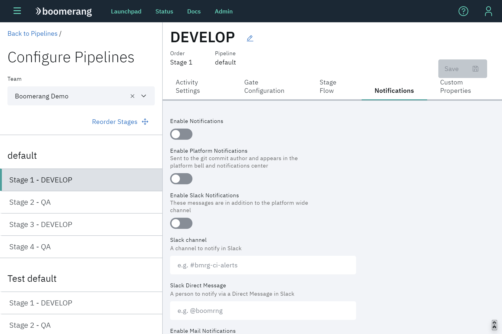
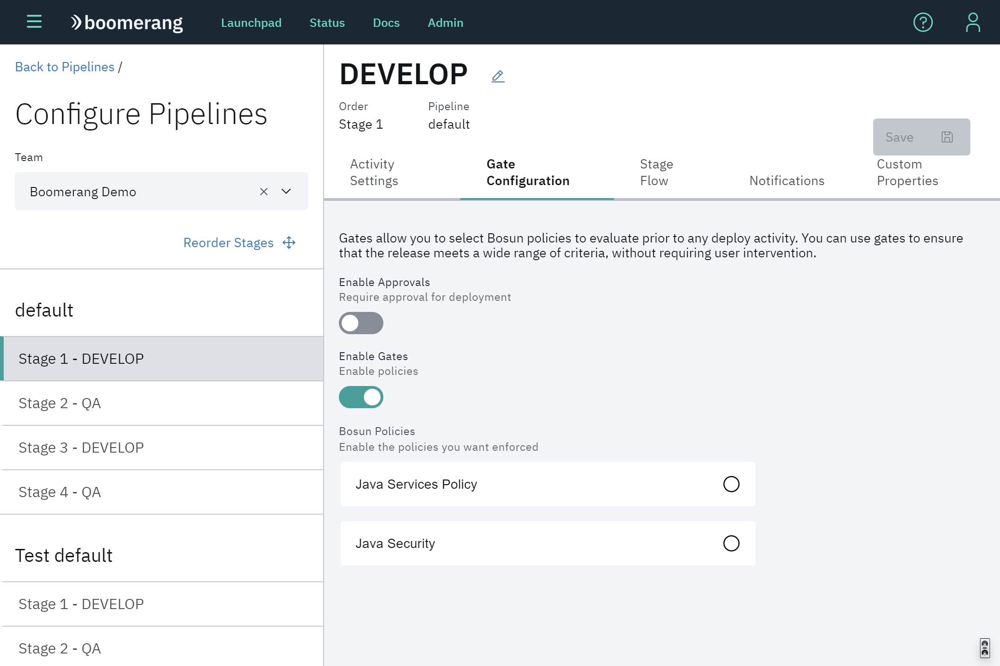
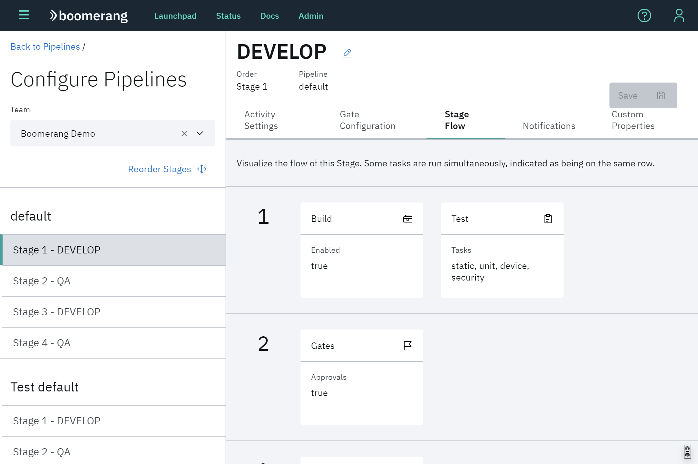
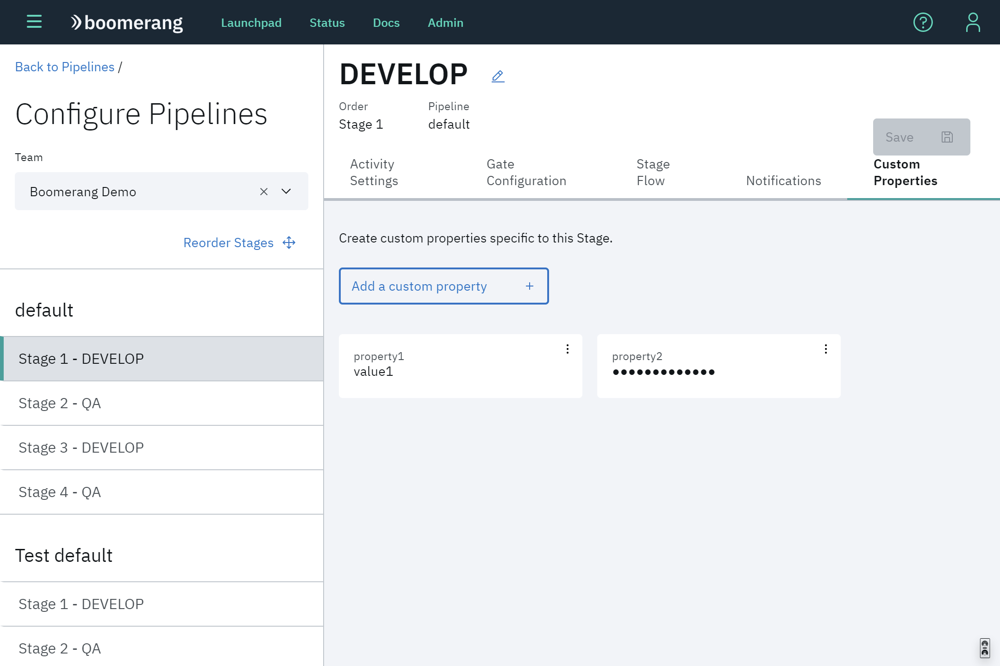

# Pipelines

Pipelines are the other key engine room of Boomerang CICD. Pipelines wire together stages, and in turn, stages dictate what and how an activity is run. Without pipelines and stages, components do nothing.

Use the **Show pipelines** for this team and **Filter pipelines** to display the pipeline of interest.

## Pipeline actions

At a pipeline level, these actions are provided at the top of the displayed stages:

- **Create new pipeline** - adds a new pipeline to the team.
- **Delete Pipeline**- removes a pipeline from the team.
- **Reorder Stages** - provides drag-and-drop functionality for reordering of the stages.
- **Add Stage** - adds a new stage at the end of the pipeline. By default, Build, Test, and Deploy activities are turned off.

## Stage actions

Actions that affect a stage include actionable status indicators, run and retry icons, and dropdown menu items for configuring, duplicating and deleting a stage.

### Execute a Stage

The icons at the bottom of each stage card include:
- **Run activity** - Allows platform Administrators and operators to run one or all activities for a specific component and version.
- **Retry latest activity** - Re-executes the enabled activities for the current component and version.

### Decision a stage

You can view the current status of any existing stage, and perform actions on any of those stages. Each card indicates the current status of the stage as **Passed**, **Failed**. or **Pending**.

#### Approve or reject a deployment

Gate approvals are indicated when additional information is indicated for a **Pending** stage (for example, **Pending (2)**), Click **Pending**. 

The Pending gate approvals modal displays the components that require approval. **Approve** or **Reject** a component, then click **Submit decisions**.

## Configure a stage

You can configure the individual stages in your pipeline. Configurable settings include general settings like the name of the stage and the ability to enable or disable build and test activity. This gives you control of what happens on a stage, without having to go through a DevOps representative.

Select **Configure** at the ⋮ icon on the top right of the stage card to display the Configure Pipelines page.

Here, you can set notifications and what happens for build, test, and deploy activities. Also you can configure gate activity, set custom properties and check how the stage flow will behave. These essentially set stage level properties.

### Activity Settings

Configure activities for build, deploy and test.

### Notifications

Configure notifications that will be sent when running activities at this stage.

### Stage Gates

Allows you to select what Bosun Policies you want to enable and validate against.

### Stage Flow

Shows what activities and which order they are executed at this stage.

### Custom Properties

Create custom properties that can be used in this stage. They can be a normal text or secured values.

## Duplicate a stage

You can also duplicate stages. CICD will automatically name the new stage and replicate all the stage configuration from the parent stage.

## Delete a stage

Deleting a stage removes it from the selected pipelline, but doesn't delete deployments that have occurred for that stage. For example, if the stage is deploying the built artifact out to some other service, that will not be affected.