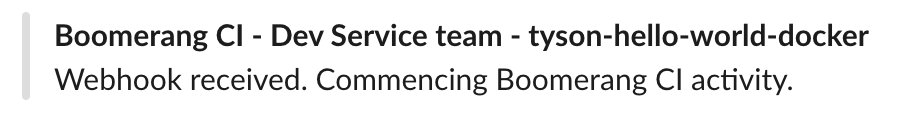

# Notifications

Notifications are created for every major request or event that occurs in CI processing. Notifications work slightly differently, depending on where in the flow the event occurs.

The events that these are created for are webhook requests and activity events.

Currently supported notification types are:
- Slack®
- Platform notifications (accessed through the bell) _alpha functionality_
- Email _future_

## Webhook requests

Webhook notifications are useful to let the user know what is occuring between their Git repository and the CI system. This is the middle ground.

If you do not see a Webhook Received or Error notification about your repository, then the error may be occuring on the Git repository side. For example, this can occur if the webhooks are backed up on their side and not yet triggered.

**How to enable**

There are a few unique characteristics for enabling webhook notifications:

- Notifications will only occur if Slack is enabled in the platform settings
- Notifications only get sent to the main CI alerts channel, for example, `#bmrg-ci-alerts`.
- Notifications for errors won't always include the details of the CI team or CI component, as these are not always known, depending where the error occurs.

**Examples**

- Webhook received

- Webhook error due to missing property

## Activity events

Notifications for CI activities will output the event and can be split into four unique types:
- Received
- Initialized
- Commenced / Started
- Finished

At any part in that cycle, an error could occur. The system will try its best to notify the user of the error, however, sometimes this is impossible.

**How to enable**

1. If Slack notifications are enabled at the platform level, notifications will go to the platform CI alerts channel, #bmrg-ci-alerts.
2. If notifications are enabled at the stage level AND Slack is enabled at either the stage or component level (via `.boomerang.properties`), then events will go out to the designated channel or dm.

The component level will overwrite the stage level. For example, you could disable Slack notifications at the stage level but enable them at the component level `notifications.slack.enable=true` and notifications will be sent to the channel or DM.

**Examples**

## Notifications types

### Slack

Slack is a fully implemented notification type for the platform, supporting both request and activity events.

### Platform

Platform notifications appear in the bell icon in the header. These notifications are currently only implemented for successful and failed deploy activities.

### Email

This allows the CI system to send email messages.