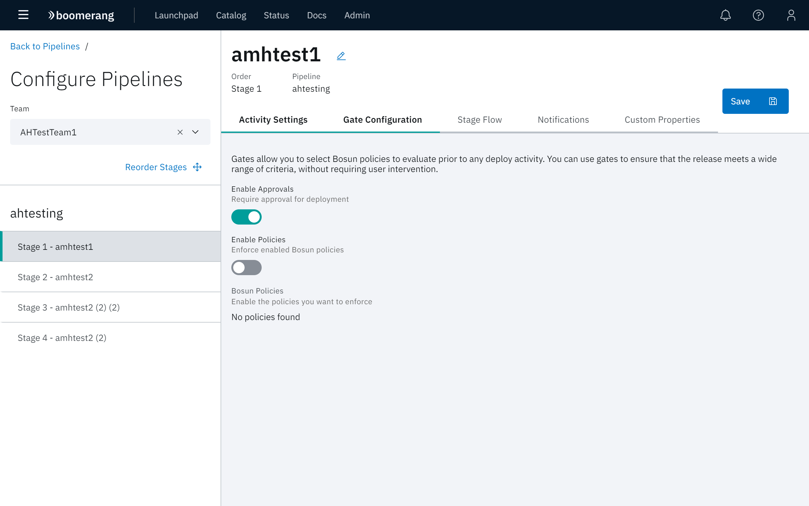
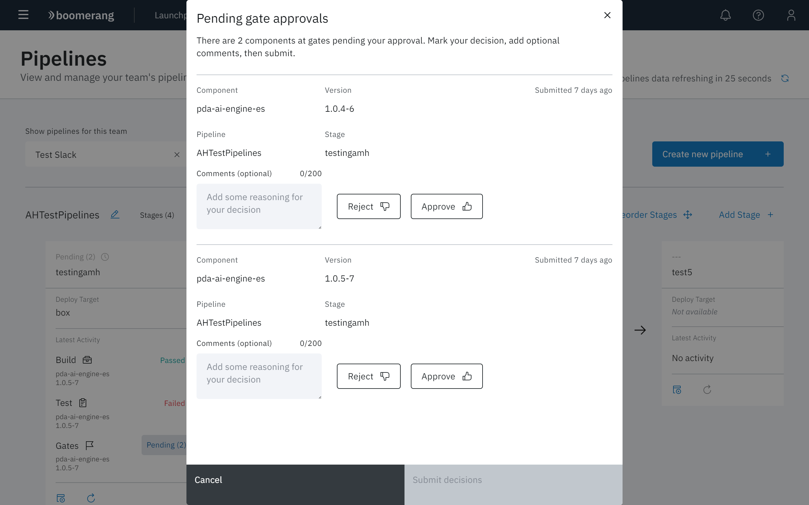

# Approvals

Approvals give you additional control over the deployment activity in your pipelines. Approvals leverage the gating capabilities of CICD that wait for users to manually approve or reject deployments to a stage. Users with the Approver role are able to approve or deny approvals.

## Enabling approvals

Approvals are configured in the Pipelines feature.

1. Navigate to the Pipelines feature.
2. Locate the stage that you want to configure.
3. Select ⋮ at the top right of a stage tile. At the dropdown menu, select **Configure gates**.
4. You will be presented with a modal and a toggle to **Enable Approvals**. Toggle this to on and then select **Save Stage**.

The next time that a deployment activity is triggered for the stage, it will trigger an approval gate and wait for the response.

## Action pending approval

Approvers can action pending approvals from both the Pipelines and Components pipelines features.

1. Click `Pending (n)` in the gate's activity on the stage tile.
2. **Approve** or **Reject** the pending gates. Optionally, provide a reason for your decision.
3. Select **Submit decisions**.

The gate activity will change from a pending state to a completed one. Gates that you approved will start a deployment activity for the associated component and version.

## Approver role

The Approver role can be assigned in Launchpad with the Teams member management feature.

> Approvers have restricted access to functionality in CICD. If a user needs more access, review the security documentation and assign additional roles, as required.
