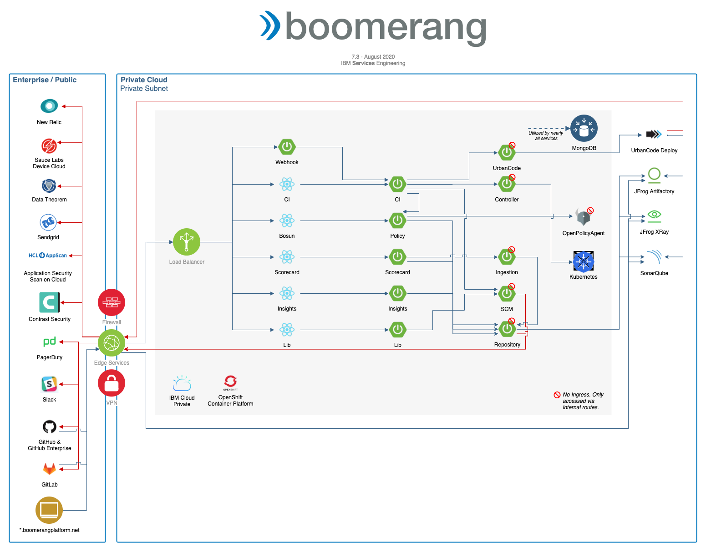

# Application architecture

**Platform dependencies**

The following platform-wide dependencies are prior to, and in addition to, any dependencies for the additional components such as Core.

| Dependency | Implementation | Version | Notes |
| --- | --- | --- | --- |
| Core Services | Boomerang Core | 7.3.0+ | |
| Kubernetes®                | IBM Cloud Private® (3.2.1+) or Red Hat® OpenShift® Container Platform (4.2+) | 1.13.9+ |                                                                                                              |
| Application Load Balancer | NGINX                                                                     | 0.23.0  |                                                                                                              |
| Certificate Manager       | Jetstack Cert Manager                                                     | 0.7.0   | If using IBM ICP 3.1.1 or higher, we can use IBM Cert Manager, which is a forked implementation. |
| Logs                      | Elasticsearch®                                                             | 5.5.1   |                                                                                                              |
| Monitoring                | New Relic® Infrastructure, New Relic Kubernetes®, New Relic APM Agent       | 4.10.0  | _if enabled_                                                                                                 |
| Tracing                   | Jaeger                                                                    |         | _if enabled_                                                                                                 |

## CICD

CICD is the continuous integration and continuous delivery solution for the platform.

| Component       | Type           | Technology                         | Internal to Internal                                     | External Ingress | Internal Dependency           | External Dependency | Optional Sidecars |
| --------------- | -------------- | ---------------------------------- | -------------------------------------------------------- | ---------------- | ----------------------------- | ------------------- | ------------------ |
| CICD            | Front End      | React + Node.js                    | Launchpad MS, CI MS, Scorecard MS, Insights MS, Bosun MS | true             |                               | GitHub®, GitLab®      |                    |
| Lib             | Front End      | React + Node.js                    | Launchpad MS, Lib MS                                     | true             |                               |                     |                    |
| CI              | Microservice   | Spring Boot (Java)                 | UrbanCode® MS, SCM MS, Controller MS                      | true             | MongoDB                       |                     | New Relic APM      |
| Webhook         | Microservice   | Spring Boot (Java)                 | CI MS, SCM MS                                            | true             | MongoDB                       |                     | New Relic APM      |
| Scorecard       | Microservice   | Spring Boot (Java)                 | Repository MS                                            | true             | MongoDB                       |                     | New Relic APM      |
| Ingestion       | Microservice   | Spring Boot (Java)                 | Repository MS                                            | false             | MongoDB                       |                     | New Relic APM      |
| Insights        | Microservice   | Spring Boot (Java)                 | Repository MS                                            | true             | MongoDB                       |                     | New Relic APM      |
| Lib             | Microservice   | Spring Boot (Java) + Embedded SOLR |                                                          | true             | MongoDB, JFrog Artifactory®    | Repository MS       | New Relic APM      |
| UrbanCode       | Microservice   | Spring Boot (Java)                 |                                                          | false            | MongoDB, IBM UrbanCode Deploy |                     | New Relic APM      |
| SCM             | Microservice   | Spring Boot (Java)                 |                                                          | false            | MongoDB                       | GitHub, GitLab      | New Relic APM      |
| Repository      | Microservice   | Spring Boot (Java)                 |                                                          | false            | MongoDB, JFrog Artifactory    |                     | New Relic APM      |
| Controller       | Microservice   | Spring Boot (Java)                 |                                                          | false            | Kubernetes |                     | New Relic APM      |
| Worker          | Kubernetes Job | Node.js CLI                        |                                                          | false            | Kubernetes                    |                     |                    |

_Notes:_

1. Optional sidecars are what is known at the Application layer. This does not include any DaemonSets defined at the Infrastructure or Orchestrator layer.
2. Executors are a concept that allow CI to be extended to work with multiple different orchestration tools to executor the build, test, and deploy activities. There are now three such executors: IBM UrbanCode Deploy, Kubernetes native, and Boomerang Flow (_alpha integration_).
3. The workers have implemented, and are bound to, specific RBAC privileges in Kubernetes.
4. The worker is a fork of the open source Boomerang-io Flow worker.
5. The controller is the same controller as the open source Boomerang-io Flow controller microservice with a separate profile for CICD and some customizations. However, in future releases we will be looking to feature parity.

**Dependencies:**

| Dependency       | Implementation    | Version |
| ---------------- | ----------------- | ------- |
| Artifact Storage | JFrog Artifactory | 6.17.0  |

**Dependencies for UrbanCode Executor**

| Dependency | Implementation       | Version |
| ---------- | -------------------- | ------- |
| Automation | IBM UrbanCode Deploy | 7.0.1.2 |

**Dependencies for mobile CI**

| Dependency       | Implementation    | Version |
| ---------------- | ----------------- | ------- |
| Mac OSX Hardware | iMac®, Mac mini® |         |

**Integrations to enable functionality**

| Dependency         | Implementation               | Version | Description                                                             |
| ------------------ | ---------------------------- | ------- | ----------------------------------------------------------------------- |
| Package Scanning   | JFrog Xray®                   | 2.11.7  | For Scorecard, Citdal Package Whitelist and Xray Vulnerabilities        |
| Static Analysis    | SonarQube                    | 7.9.2   | For Scorecard static code analysis results                              |
| Security Scanning  | ASoC, Contrast, Data Theorem |         | For security testing results in Scorecard and Citadal Policy Validation |
| Functional Testing | Sauce Labs                   |         | For functional testing                                                  |

## Bosun

For the policy functionality, CICD relies on the Open Source Boomerang-io Bosun project. This can be enabled at installation time in the Helm® chart.

| Component | Type | Technology | Internal to Internal | External Ingress | Internal Dependency | External Dependency | Optional Sidecars |
| --- | --- | --- | --- | --- | --- | --- | --- |
| Bosun | Front End | React + Node.js | Bosun MS | true | | | |
| Policy | Microservice | Spring Boot (Java) | Repository MS | true | MongoDB, OpenPolicyAgent | | New Relic APM |
| Repository | Microservice | Spring Boot (Java) | | false | SonarQube, JFrog XRay | | New Relic APM |
| OpenPolicyAgent | Middleware | Go | | false | | | |

_Notes:_

1. Optional sidecars are what is known at the application layer. This does not include any DaemonSets defined at the Infrastructure and Orchestrator layer.
2. Repository microservice is not required to be integrated to the dependencies. This is required only if you used the predefined integrations, as opposed to passing in an already retrieved payload.
3. [OpenPolicyAgent](https://openpolicyagent.org/) is a third-party open source component that Bosun wraps.