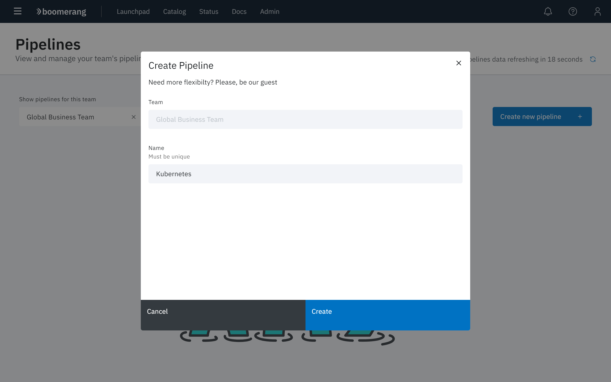
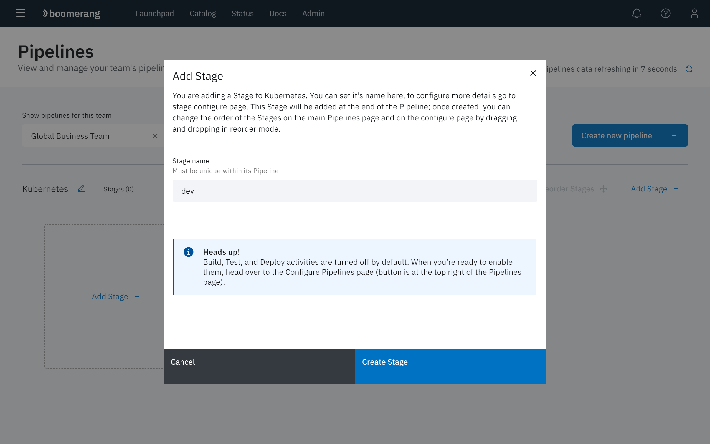
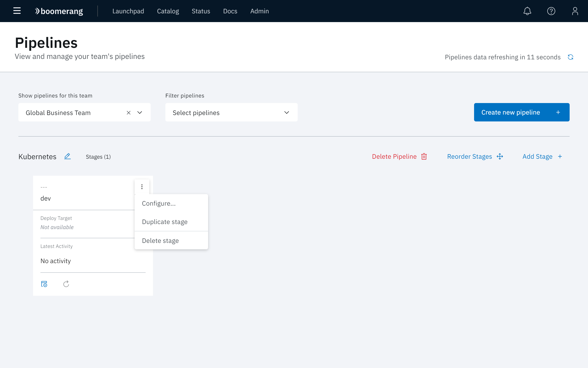
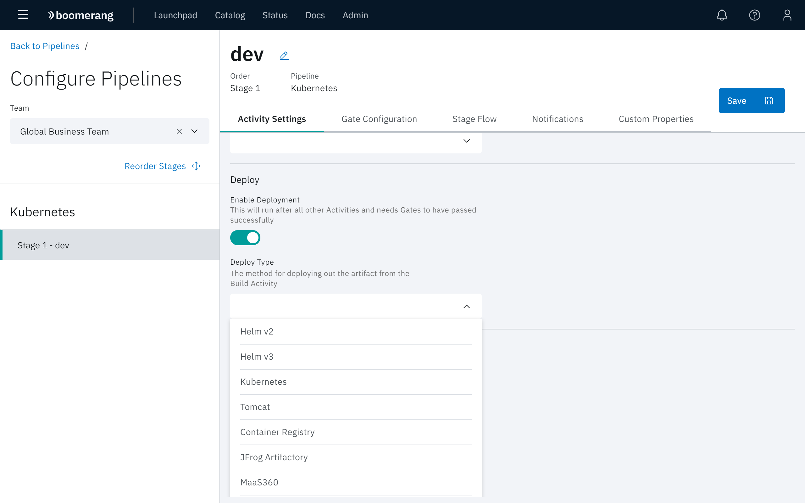
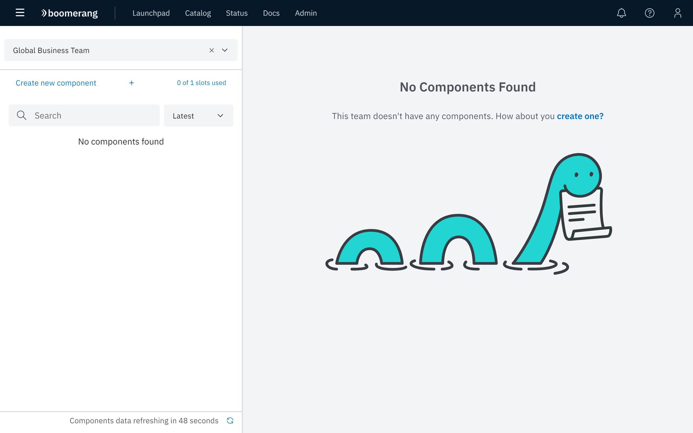
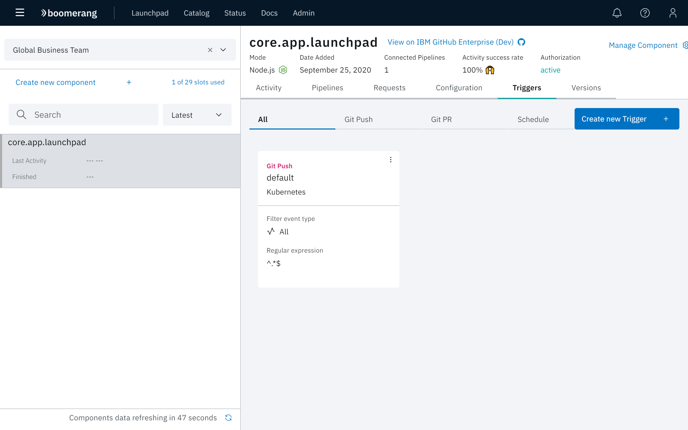

# Kubernetes pipelines

The following tutorial will run through the steps for creating a Kubernetes<sup>®</sup> deployment pipeline.

## Create a Kubernetes namespace

1. Log into your Kubernetes cluster.
2. Create a namespace.

```shell
kubectl create ns bmrg-tutorial-1
```

3. Download this [Kubernetes YAML file](./assets/yaml/bmrg-rbac-cluster-admin.yaml). 

4. Apply the service account. This creates a service account mapped to the namespace Admin role for IBM Cloud<sup>®</sup> Private. We recommended that you create a service account with a role, binding restricted to the required subset of abilities.

```shell
kubectl apply -n bmrg-tutorial-1 -f <file>
```

5. Issue a command to copy token.

```shell
kubectl get secrets -n bmrg-tutorial-1 -o jsonpath={.data.token} `kubectl get serviceaccount -n bmrg-tutorial-1 bmrg-cicd-rbac-deployer -o jsonpath={.secrets[0].name}` | base64 -D | pbcopy
```

## Configure your pipeline

First, lets focus on setting up the pipeline and relevant stages.

1. Navigate to [Boomerang CICD Pipelines](https://launch.boomerangplatform.net/cicd/apps/pipelines).
2. Select the appropriate team from the Teams menu.
3. Create a pipeline. Click **Create new pipeline** in the top right-hand corner of the page.
4. When the Create Pipeline modal appears, name the pipeline 'Kubernetes` and click **Create**.



5. Click **Add Stage +** in the pipeline to create a `dev` stage. 
6. When the Add Stage modal appears, name the stage `dev` then click **Create Stage**. By default, notifications and build≤ are enabled and we want to enable Kubernetes deployments. 



7. Select **Configure** from the Stage dropdown.



8. Select the **Activity Settings** tab and then enable the **Deploy** toggle. Enter `Kubernetes` for **Deploy Type**, then scroll down and complete the following fields:

- Kubernetes Namespaces
- Connectivity Information
- Token - paste the token from the earlier steps



9. Click **Save**.

_Notes:_
- For each stage, you would have a one to one mapping to Kubernetes namespaces.

## Configure components and triggers

1. Navigate to [Boomerang CICD Components](https://launch.boomerangplatform.net/cicd/apps/components).
2. Select the appropriate team from the Teams menu.
3. If needed, click **Create Component** to onboard a component.



4. Supply settings for the component that include: Host, Repository, Mode, Repository Access Key and Webhook. When all settings are configured, click **Take me to it**.
5. Select the specific component and switch to the Triggers tab.
6. Create or adjust the trigger to target the newly-created pipeline.



## Ready? Set? Trigger!

Now cause the trigger to occur based on the criteria that was configured and you will end up with a deployed service in Kubernetes.