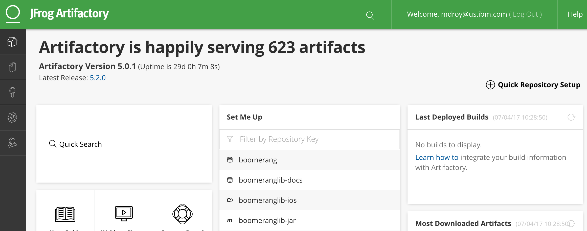

# Boomerang Lib

Boomerang Lib provides a platform to publish, discover and consume reusable components for a variety of platforms. Boomerang Lib currently supports:

* iOS Frameworks (CocoaPods)
* Java<sup>®</sup> Frameworks (Maven & Gradle)
* Node Packages (NPM)
* Docker<sup>®</sup> Images (Docker)

Boomerang Lib uses JFrog Artifactory<sup>®</sup> to store reusable artifacts and acts as a dependency management server.

> **Roadmap:** After much consideration, parts of Lib will be deprecated in coming releases.

## Authenticate with Artifactory

To authenticate with Artifactory on your local machine, you will need to generate an Artifactory API key from the Artifactory web page.

1. Logon to the Artifactory portal at [https://tools.boomerangplatform.net/artifactory](https://tools.boomerangplatform.net/artifactory)

2. Click your username in the top right corner, then select select **Edit Profile** to bring up the profile.


3. Click **Generate API key** and retrieve it. This API needs be saved onto your local machine.


## Authorization to libraries

One you have completed the authentication steps above, you need access to the particular areas of Boomerang Lib.

After first login to Artifactory, reach out to your DevOps administrator so that they may connect you to the required roles and repositories.

## Boomerang Lib versioning

For all Boomerang Lib components, the following versioning standards must be followed.

Versioning of your component can be automatically handled by Boomerang CICD, if needed. You can disable this using the `set.version.number=false` property. If this is setting is enabled, Boomerang CICD will use the Git tag version to override the version set in your framework.

The semantic versioning that needs to be followed for your application is **Major.Minor.Iteration** (for example, 1.1.0). Versioning follows regular software versioning conventions. Only update one digit based on the changes incurred per release.   

**Major versions**
Incrementing the major version indicates the addition of significant features and API changes.

**Minor versions**
Minor versions should be incremented if adding minor features or a significant amount of bug fixes. This is normally the scope of a single release or sprint.

**Iterations versions**
Incrementing the iteration indicates bug fixes on the features added to the current minor version.

## iOS frameworks

All custom iOS components that are built, compiled, or tested through the Boomerang CICD pipeline can be published to Artifactory for consumption. Artifactory offers a number of benefits over the traditional approach of hosting a CocoaPods, including faster pod installs.

### GitHub mirror

Boomerang Lib also offers a traditional CocoaPods Spec repository hosted on IBM<sup>®</sup> GitHub<sup>®</sup> Enterprise. This could be useful for mirroring existing frameworks hosted on slower infrastructure or the public internet. The following are notable frameworks that have been mirrored on IBM GitHub Enterprise for faster downloads for developers.

| **Framework** | **Latest Version** |
| :-----------: | :----------------: |
| NewRelicAgent |       6.2.0        |

These can be assumed by adding the following at the top of your Podfile.

```
source 'git@github.ibm.com:Boomerang-Lib/Specs.git'
```

### Artifactory

In order to use CocoaPods with Artifactory, you need the `cocoapods-art` plugin, which presents Artifactory repositories as Specs repos and pod sources.

#### Configuring CocoaPod Artifactory access

1.  Install the `cocoapods-art` plugin.

```
gem install cocoapods-art
```

2.  Setup `cocoapods-art` authentication credentials in your `.netrc` file placed under `~/`.

```
machine tools.boomerangplatform.net
login [INSERT W3 Intranet email address]
password [INSERT Artifactory API Key]
```

3.  Add Artifactory Specs repository.

```
pod repo-art add boomeranglib-pod "https://tools.boomerangplatform.net/artifactory/api/pods/boomeranglib-pod"
```

#### Downloading Boomerang Lib iOS dependencies for your application.

1.  Add the following snippet to your application Podfile.

```
plugin 'cocoapods-art', :sources => [
  'boomeranglib-pod'
]
```

2.  Run Pod install.

```
pod install
```

### Creating new Boomerang Lib iOS libraries

Use the following pod spec template as a guide on how to configure the s.source value correctly for a new iOS library in BoomrangLib.

This source HTTP URL references the Podspec name and version dynamically, so you can use s.source as listed here.

```
Pod::Spec.new do |s|

  s.name           = "AKNetworking"
  s.version        = "1.0.1"
  s.summary        = "Network library for iOS"
  s.homepage       = "http://www.ibm.com/mobilefirst/us/en/"

  s.platform       = :ios, "10.0"

  s.author         = { "Example Example" => "example@example" }

  s.source         = { :http => "http://<Artifactory Host Here>/artifactory/api/pods/mobilefactory.rml.pod/pod/git/rml/#{s.name}/#{s.version}", type: 'tgz'}

end
```

## Java frameworks

### Maven

#### Configuring Maven Artifactory access

Create or update your Maven `settings.xml` with the following content to store your Artifactory credentials.

Location of `settings.xml` for

* MacOS is `~/.m2`
* Windows is `c:\Users\[WindowUserName]\.m2`

```
<settings>
  <servers>
    <server>
      <id>boomeranglib-java</id>
      <username>[INSERT W3 Intranet email address]</username>
      <password>[INSERT Artifactory API Key]</password>
    </server>
  </servers>
</settings>
```

#### Downloading Boomerang Lib JAR dependencies

In your project `pom.xml` file, add the repositories xml snippet here to notify your Maven configuration to download additional JARs from Boomerang Lib.

```
<project>
  <repositories>
    <repository>
      <id>boomeranglib-java</id>
      <url>https://tools.boomerangplatform.net/artifactory/boomeranglib-java</url>
    </repository>
  </repositories>
</project>
```

Once the repositories have been added, you can add additional Boomerang Lib components like you would for regular Maven dependencies.  You can also navigate to the version of the JAR in Artifactory. Look in the `Dependency Declaration` section as this provides dependency blocks for all the common build tools, for example, Maven and Gradle.

```
<dependencies>
  <dependency>
    <groupId>[GroupIdHere]</groupId>
    <artifactId>[ProductNameHere]</artifactId>
    <version>[VersionHere]</version>
  </dependency>
</dependencies>
```

#### Creating a new Boomerang Lib JAR

This allows automatic builds and storage of Boomerang Lib JARs into Artifactory, so it can be shared across applications.

1.  Create a `_boomerang/.boomerang.yaml`, following the set up instructions on the Boomerang CICD documentation.

The chosen name value will need to match your `pom.xml` Artifact ID.

2.  Use the following `pom.xml` template for your Boomerang Lib JAR.

```
<project xmlns="http://maven.apache.org/POM/4.0.0" xmlns:xsi="http://www.w3.org/2001/XMLSchema-instance"
  xsi:schemaLocation="http://maven.apache.org/POM/4.0.0 http://maven.apache.org/maven-v4_0_0.xsd">
  <modelVersion>4.0.0</modelVersion>
  <groupId>com.ibm.boomeranglib</groupId>
  <artifactId>[ProductNameHere]</artifactId>
  <packaging>jar</packaging>
  <version>1.0.0</version>
  <name>[ProductNameHere]</name>
  <url>http://maven.apache.org</url>
  <dependencies>
    <dependency>
      <groupId>junit</groupId>
      <artifactId>junit</artifactId>
      <version>3.8.1</version>
      <scope>test</scope>
    </dependency>
  </dependencies>
</project>
```

3.  Configure your Git repository to use Boomerang CICD to automatically set up webhook.

### Gradle

#### Configuring Gradle Artifactory access

Create or update your local Gradle `gradle.properties` with the following properties to store your Artifactory credentials on the local machine.

Location of `gradle.properties` for:

* MacOS/Linux is `~/.gradle/gradle.properties`
* Windows is `c:\Users\[WindowUserName]\.gradle`

```
boomerangLibUser={W3ID Username}
boomerangLibPassword={Artifactory API Token}
```

#### Set up Gradle build file

In your project `build.gradle` file, add the repositories groovy snippet to point to Boomerang Lib. The authentication properties that were defined in your settings Gradle will be referenced here.

```
 repositories {
     mavenCentral()
      maven {
         url "https://tools.boomerangplatform.net/artifactory/boomeranglib-java"
         credentials {
             username = "$boomerangLibUser"
             password = "$boomerangLibPassword"
         }
     }
 }
```

Once the repositories have been added, you can add additional Boomerang Lib components like you would for regular Gradle dependencies.

```
dependencies {
     compile(group: 'net.boomerangplatform', name: 'boomerang-security-spring', version: '0.0.16')
}
```

## Docker images

All docker images produced by Boomerang CICD are stored in Artifactory, which it itself is a Docker Registry. You can visit Boomerang Lib to view the latest versions of each Docker image for project that have been built and deployed to Artifactory.

### Running Docker images locally

1.  Authenticate with Container Registry

When prompted, use your IBM Intranet ID and your Artifactory API token that was created in the _Authenticate with Artifactory_ section

```
docker login tools.boomerangplatform:8500
```

2.  Pull Docker image down

Use the docker pull command to download the Docker image to your local machine. Boomerang Lib displays the latest version of each Docker image that has been produced by Boomerang CICD for your reference.

```
docker pull tools.boomerangplatform.net:8500/<Team Name>/<Image Name>:<VersioM>
```

3. Run Docker Image

Use the Docker run command to run the image that was pulled down locally.

```
docker run <Image Namme>
```

### Other references

Please refer to official Docker reference manual for information on how to use the Docker command line locally.

[Docker Command Line Reference](https://docs.docker.com/engine/reference/commandline/docker/)

## NPM

NPM is a package manager for the JavaScript programming language. It is the default package manager for the JavaScript runtime environment Node.js. Artifactory is able to host reusable NPM components as part of Boomerang Lib as well as by providing a mirror.

We recommend npm or yarn as the dependency manager.

### Configuring NPM access scoped Boomerang NPM registry

1.  Download .npmrc configuration from Artifactory.

Use the Artifactory API Key generated in the Getting Started section to download your npmrc file. This will download a preconfigured npmrc file for you that needs be place in your home directory.

```
curl --user <W3ID Email Address>:<Artifactory Api Token> https://tools.boomerangplatform.net/artifactory/api/npm/boomeranglib-npm/auth/boomerang > .npmrc
```

2. Move or copy the contents of .npmrc.

The preconfigured npmrc file can be moved to the following locations or the contents copied into these files, if you already have a custom configuration.

```
Windows: %userprofile%\.npmrc

Linux: / macOS: ~/.npmrc
```

3. You will end up with the following lines in your `.npmrc` file with associated values.

```
@boomerang:registry=https://tools.boomerangplatform.net/artifactory/api/npm/boomeranglib-npm/
//tools.boomerangplatform.net/artifactory/api/npm/boomeranglib-npm/:_password=
//tools.boomerangplatform.net/artifactory/api/npm/boomeranglib-npm/:username=
//tools.boomerangplatform.net/artifactory/api/npm/boomeranglib-npm/:email=
//tools.boomerangplatform.net/artifactory/api/npm/boomeranglib-npm/:always-auth=true
```

**Please Note:**
 - You must log in to Artifactory and have retrieved and set up your API Token. 
 - As mentioned in the Getting Started section, your access to the NPM registry will only be available after the first login AND your user has been added to the correct groups by the Boomerang Administrator.

### Using the scoped packages

1. Reference `@boomerang` scope prefix in your package.json. for example, `@boomerang/boomerang-security-middleware`.

2. Reference `@boomerang` scope prefix in any require statements to these packages, for example, `require('@boomerang/boomerang-security-middleware')`.

**Reference:**
 - https://docs.npmjs.com/misc/scope
