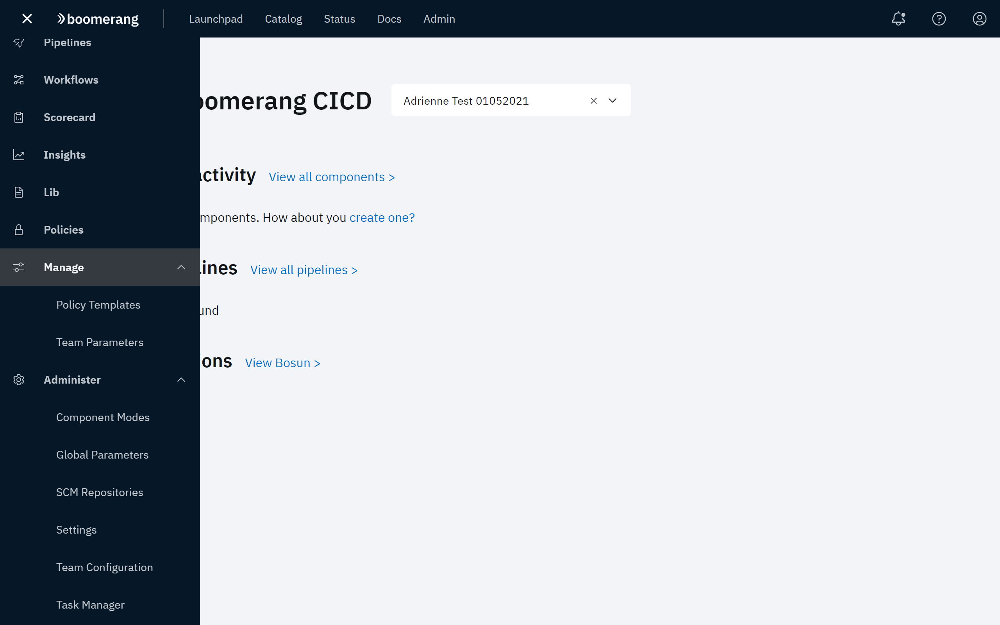

# Administration Overview

Boomerang CICD is supported by administrative features that allow you to define how data is accessed and presented in the application.

The following two categories of administrative features are available, depending on your role in the IBM Services Essentials platform.

**Manage** - Provides the following features for managing policy templates and team parameters that are available to all team members.

**Administer** - Provides features for managing data configuration and access that are available to Global Administrators and Global Operators.

