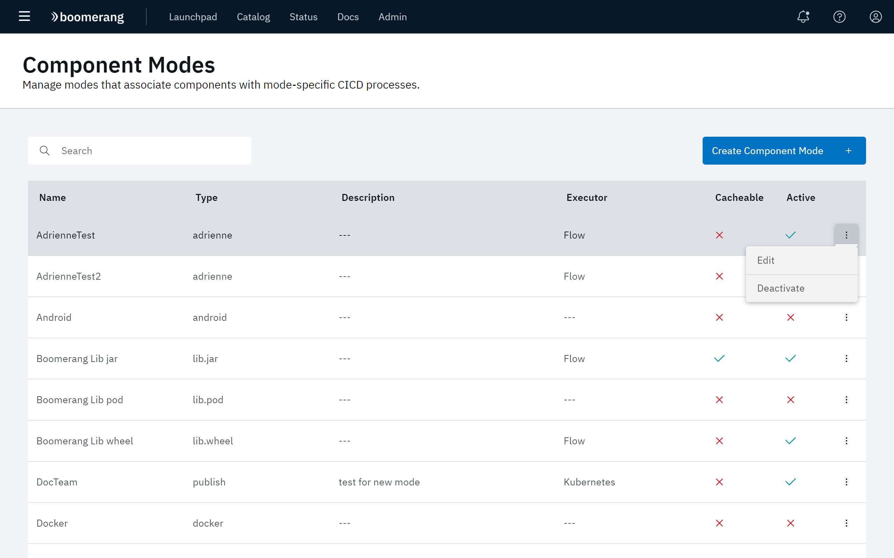
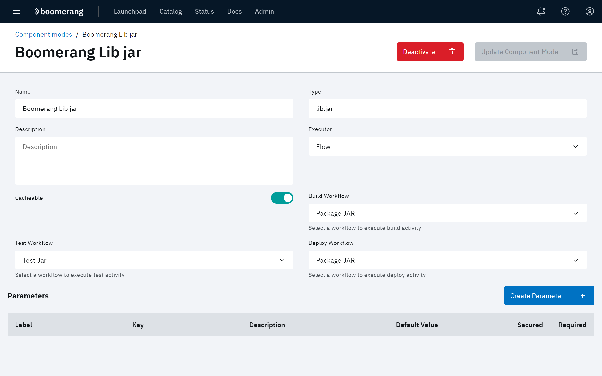

# Defining Component Modes

The functionality on the Component Modes page allows you to associate components with mode-specific CICD processes. 

Click **Administer** at the CICD hamburger menu, then click **Component Modes**.

The Component Modes page displays all of the component modes currently defined in the platform for Boomerang CICD, along with whether the mode is active or not, and whether its data is casheable or not.

## Creating a new component mode

To create a new association for a component with a CICD process:

1. Click **Create Component Mode** in the upper right of the page.
2. At the Create Component Mode page, configure the following fields:

| Field | Description |
| --- | --- |
| **Name** | The title given to the component mode that appears on the Component Mode page. |
| **Type** | The type of mode. Refer to [Modes and properties](/boomerang-cicd/supporting-functionality/modes-and-properties). |
| **Description** | A brief explanation of the component mode and its use. |
| **Executor** | The application in which the component mode will execute. Choices include: **Urbancode** and **Flow**. If **Flow** is selected, additional parameters for **Build Workflow**, **Test Workflow**, and **Deploy workflow** are required.|
| **Cacheable** | This toggle controls whether or not data is held in the cache.|
| **Active** | This toggle controls whether or not the component mode is active and available for use.|

3. Click **Parameters** to add a new parameter definition for the mode. Supply the following fields for each parameter:  

| Field | Description |
| --- | --- |
| **Label** | The title given to the parameter. |
| **Key** | |
| **Description** | A brief explanation of the field and its use. |
| **Default Value** | The value supplied for the parameter if one is not explicitly set.|
| **Secured** | Use the **Secured** toggle to set whether or not          |
| **Required** | Use the **Required** toggle to set Whether or not the parameters is required for the mode.|

4. Click **Create Component Mode**.

## Managing Component Modes

Component modes can be edited, activated, or deactivated at the Component Modes page.

At the overflow menu for a component mode, select **Activate** or **Deactivate** (depending on the component mode's current status).

To edit a component mode, select **Edit** at the overflow menu. The page associated with that component mode is displayed. Edit the fields, as required, then click **Update Component Mode**.

