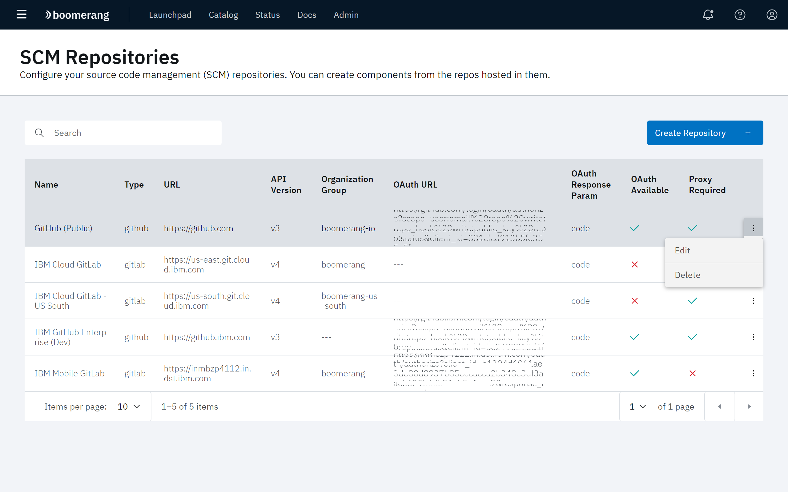

# Configuring SCM repositories

The SCM Repositories page allows you to create and manage source code management (SCM) repositories for your CICD applications. 

Click **Administer** at the CICD hamburger menu, then click **SCM Repositories**. All currently defined repositories are displayed. From here, you can create, edit, and delete repositories.

## Creating an SCM repository

1. At the SCM Repositories page, click **Create Repository**. 
2. The Create SCM Repository modal displays. Provide values in the fields provided and click **Create**.

| Field | Description |
| --- | --- |
| **Name** | The title given to the repository. |
| **Type** | The media type of repository storage as either **github** or **gitlab**. |
| **URL** | The location of the repository as a URL. |
| **API Version** | The version of the API used in the authorization of the service token. |
| **Organization Group** |     |
| **Service Token** | The token that provides authentication and access to the repository. |
| **Secret Key** | The encryption key used to validate access. |
| **OAuth Available** | This toggle enables or disables the use of OAuth. When enabled, provide values for **OAuth URL** and **OAuth Response Parma**.|
| **OAuth URL** | The URL of the service that provides the access token endpoint. |
| **OAuth Response Param** | The response expected from the the authorization service. |
| **Proxy Required** | This toggle enables or disables the use of a Proxy server in the authorization process. |

## Editing an SCM repository

To edit an existing repository, select **Edit** at that repository's overflow menu. The Edit modal appears. Edit the parameters as needed, then click **Save**.

## Deleting an SCM repository

To delete an existing repository, select **Delete** at that repository's overflow menu. Click **Yes** at the confirmation prompt.

