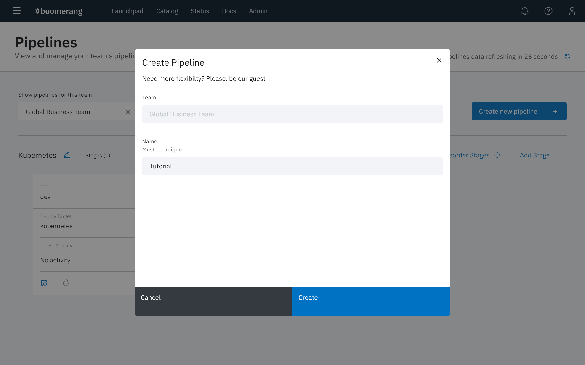
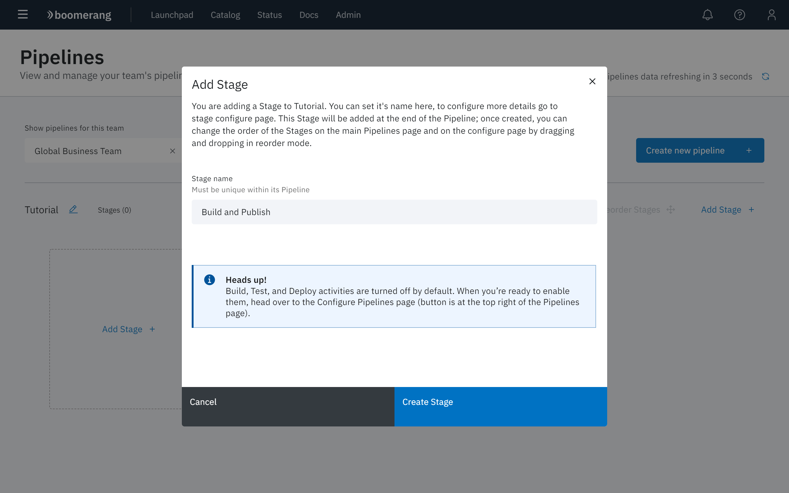
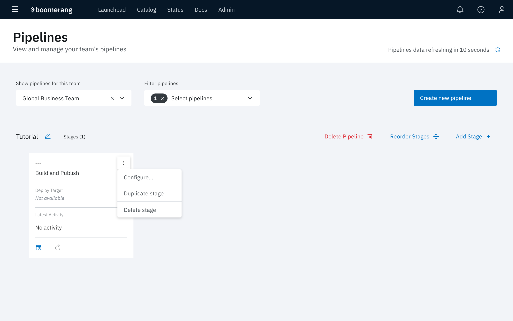
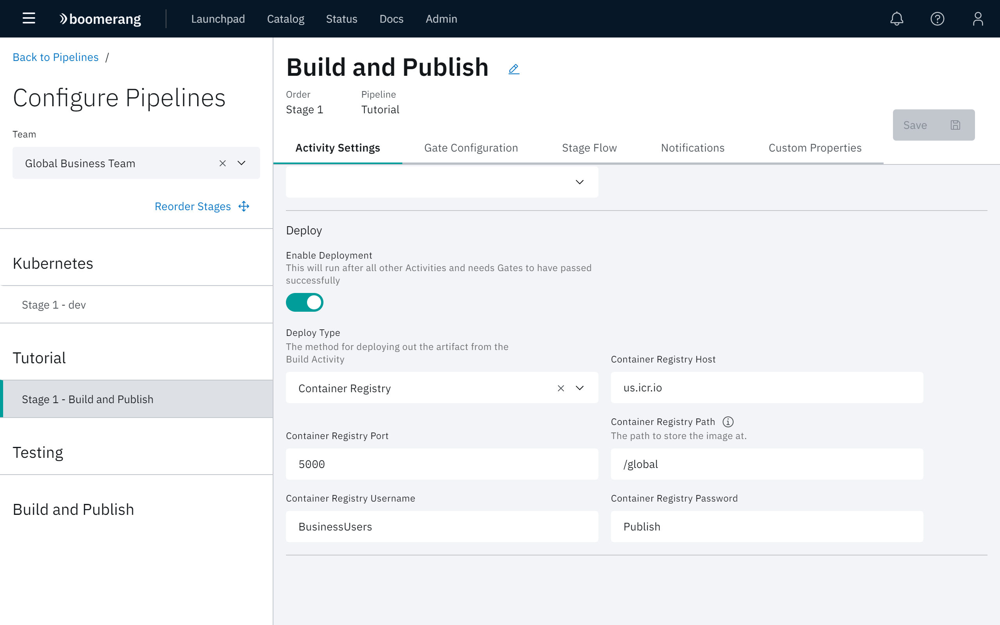

# Publish a container to an external registry

The following tutorial will demonstrate how to publish a container to an external registry.

## Configure your pipeline

First lets focus on setting up the pipeline and relevant stages.

1. Navigate to [Boomerang CICD Pipelines](https://launch.boomerangplatform.net/cicd/apps/pipelines).
2. Select the appropriate team from the Teams menu
3. Click **Create Pipeline**.
4. When the pipeline creation modal appears, name the pipeline `Tutorial` and click **Create**.

5. At the Pipelines page, click **Add Stage** to create a new stage for your Tutorial pipeline.

> Note: Ensure that the Tutorial pipeline is selected at the **Filter pipelines** dropdown.

6. When the Add Stage modal appears, enter `Build and Publish` as the Stage name. By default notifications and builds are enabled and we want to additionally enable deployments. 

7. Select **Configure** from the Build and Publish stage dropdown.

8. At the Configure Pipeline page for the Build and Publish container, select the **Activity Settings** tab and then enable the **Deploy** toggle. Select `Container Registry` for **Deploy Type**, then scroll down and complete the following fields:

- Container Registry Host
- Container Registry Port
- Container Registry Path
- Container Registry Username
- Container Registry Password

9. Click **Save**.

## Configure a Connected Component

1. Navigate to [Boomerang CICD Components](https://launch.boomerangplatform.net/cicd/apps/components). The Team already selected is maintained. 
2. Select a component in the left pane. Select **Configure**,
3. Navigate to the **Triggers** tab on the Component details page.
4. Adjust the default trigger to connect to your new Tutorial pipeline.
5. Trigger this component by the method chosen, for example, new Git Push or Git Tag.
6. Watch your component build a container and publish this to your new registry!

## Bonus

As a bonus, lets set up a stage to run automatically after the prior stage and deploy this container.

1. Navigate back to [Boomerang CICD Pipelines](https://launch.boomerangplatform.net/cicd/apps/pipelines) The team already selected is maintained.
2. In the Tutorial pipeline, click **Add Stage**. 
3. When the Add Stage modal appears, name the stage `Deploy` and enable the **Run After Prior Stage** toggle.
4. Select the 'Builds' tab and disable the toggle.
5. Select the **Deploy** tab, enable the **Deploy** toggle and select `Kubernetes` or `Helm` as the **Deploy Type**.
8. Scroll down and supply values for the requested fields. Click **Save**.

## Conclusion

You now have a pipeline that will publish the container to an external registry and run another deploy immediately after success to update an end deployment target to utilize this container.