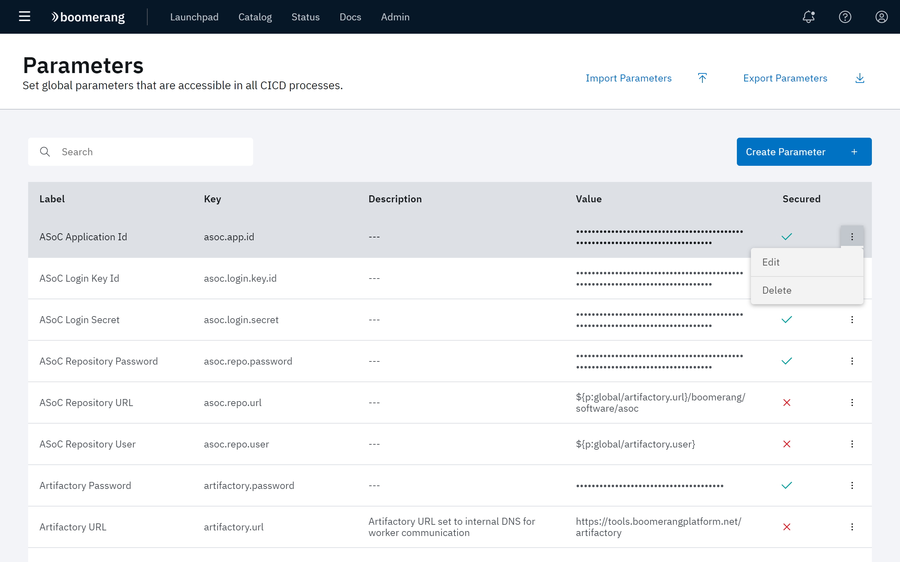
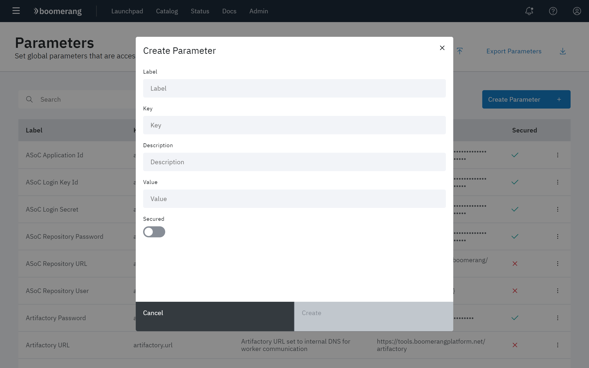
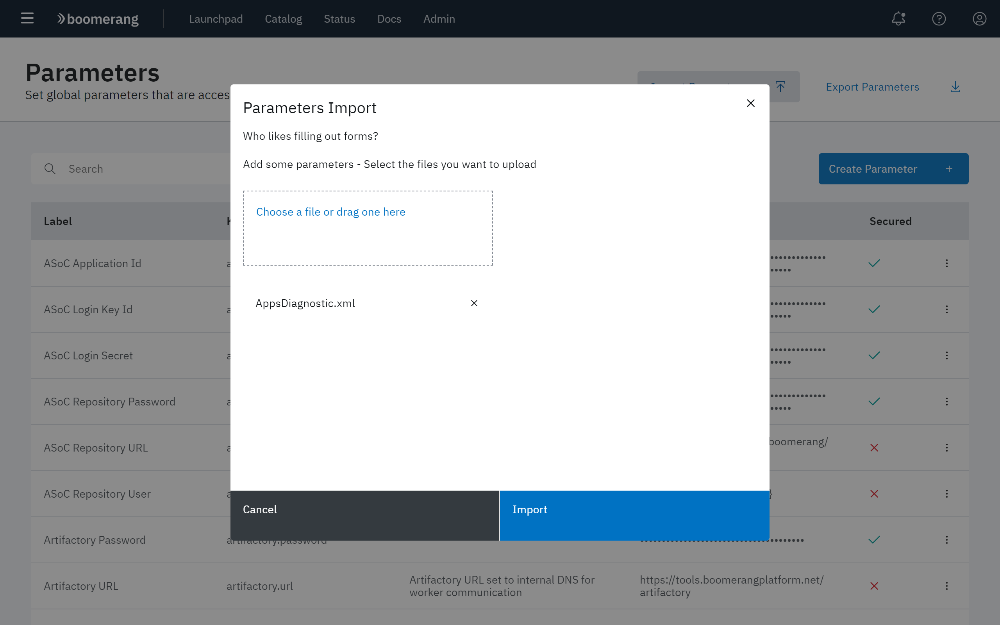
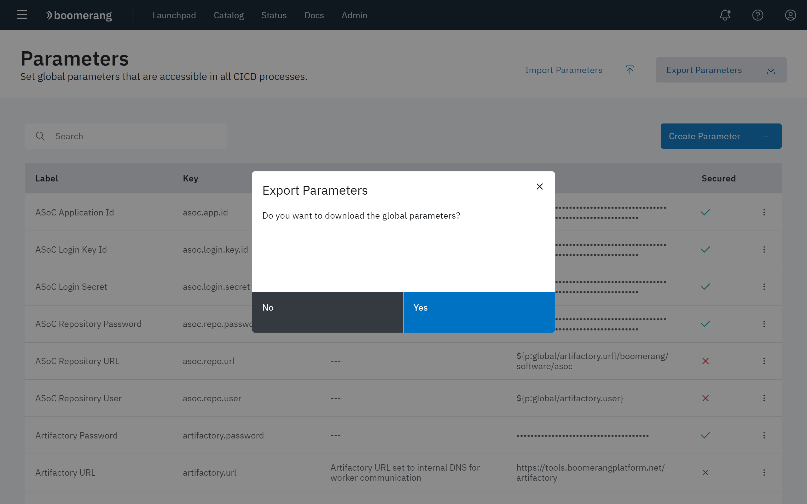

# Configuring Global Parameters

The functionality on the Parameters page allows you to create parameters that are available for all CICD processes. 

Additionally, the each parameter can be edited or deleted at its overflow menu.

> Note: This is only available if you have Boomerang CICD installed along with Essentials Core. 

Click **Administer** at the CICD hamburger menu, then click **Global Parameters**.

The Parameters page displays all of the parameters currently defined in the platform for Boomerang CICD, along with whether or not each is secured.

## Creating a new parameter

To create a new parameter for use in a CICD process:

1. Click **Create Parameter** in the upper right of the page.
2. At the Create Parameters modal, configure the following fields:

| Field | Description |
| --- | --- |
| **Label** | The title given to the parameter. |
| **Key** | |
| **Description** | A brief explanation of the field and its use. |
| **Default Value** | The value supplied for the parameter if one is not explicitly set.|
| **Secured** | Use the **Secured** toggle to set whether or not          |

3. Click **Create**.

## Managing existing parameters

To delete an existing parameter, click **Delete** at that parameter's overflow menu.

To edit an existing parameter, click **Edit** at that parameter's overflow menu. The associated modal for that parameter is displayed. Edit the desired fields and click **Save**.

## Importing parameters

To import parameters, click **Import Parameters** at the Parameters page. Then, drag-and-drop parameters into the Parameters Import modal. Click **Import** when done.

## Exporting parameters

To export parameters, click **Export Parameters** at the Parameters page. Then, click **Yes** at the Export Parameters modal.

A JSON file that contains the exported parameters is downloaded to your default download directory.

