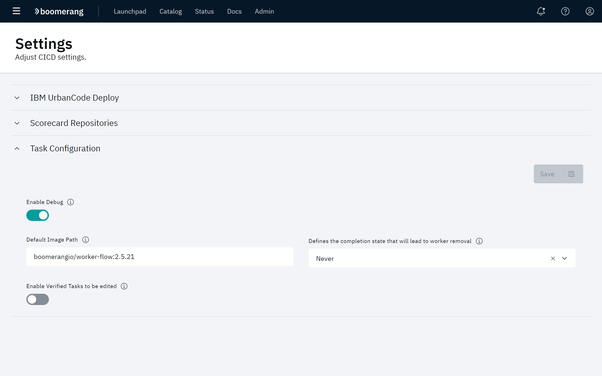

# Configuring CICD Settings

The Settings page allow you to configure system wide settings such as integrations for external services like Artifactory, SonarQube® and UrbanCode® Deploy. In addition to internal configuration controlling how the application functions such as the worker settings.

Click **Administer** at the CICD hamburger menu, the click **Settings**. The Settings page displays three groups of settings that you can configure: **Scorecard Repositories**, **Urbancode**, and **Task Configuration**.

## IBM UrbanCode Deploy

The UrbanCode settings allow you to specify the following parameters.

| Setting | Description |
| --- | --- |
| User | The username to use when connecting to the server |
| Password | The password to use when authenticating to the server |
| CLI REST URL | The connection URL to the CLI endpoint on the server |
| API REST URL | The base context of the connection URL to the API endpoints on the server |

## Scorecard Repositories

The Scorecard Repositories settings allow you to configure the required integrations to the systems we ingest content from.

| Setting | Description |
| --- | --- |
| Artifactory REST URL | The connection URL to the Artifactory server instance |
| Artifactory API Key | The secure API token to connection to the Artifactory instance |
| Xray API REST URL | The base URL to the Artifactory Xray API |
| Xray API Token | The secure API token to connection to the Artifactory Xray instance |
| Xray User | The user to connect to the Artifactory Xray instance with |
| SonarQube API Token | The secure API token to connection to the SonarQube instance |
| SonarQube API REST URL | The connection URL to the SonarQube API |

## Task Configuration 

The Task Configuration settings allow you to specify the following parameters.

| Setting | Description |
| --- | --- |
| Enable Debug | Whether to run the workers in debug mode and increase verbosity of logging |
| Default Image Path | The container image to use when no image is specified in the Task Template |
| Completion State | Defines the completion state that will lead to worker removal |
| Enable Verified Tasks to be edited | When enabled, verified tasks can be edited in the Task Manager |
