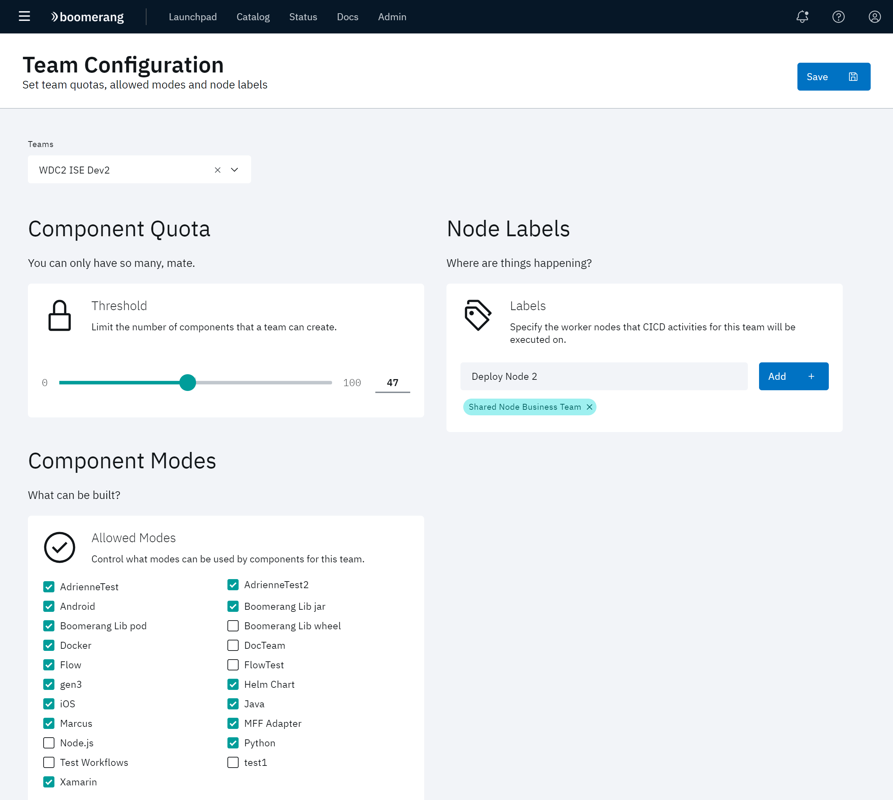

# Configuring team parameters

The SCM Repositories page allows you to create and manage the components available to your team. 

Click **Administer** at the CICD hamburger menu, then click **Team Configuration**. All currently defined components and nodes available to a team are displayed. From here, you can add, remove and set limits for the configuration.

Use the Teams pulldown at the top of the page to select the team whose configuration you are interested in viewing.

## Component Quota

This slider sets a limit for the number of components that a team can create on the IBM Services Essentials platform.

## Setting the allowed modes

1. At the Team Configuration page, identify the currently allowed modes in the Component Mode tile.
2. Enable or disable the desired checkboxes to control what modes can be used by components for the team.

## Creating nodes

1. At the Team Configuration page, identify the currently available modes in the Node Labels tile. 
2. Update the available nodes for your team.  
        a. To add a new node, by type a name in the field provided and click **Add**.  
        b. Any existing node can be removed by clicking the **x** on its label.