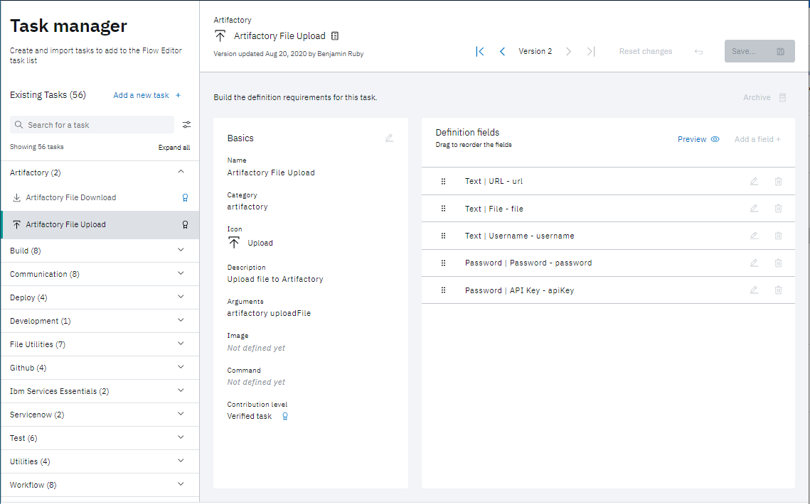
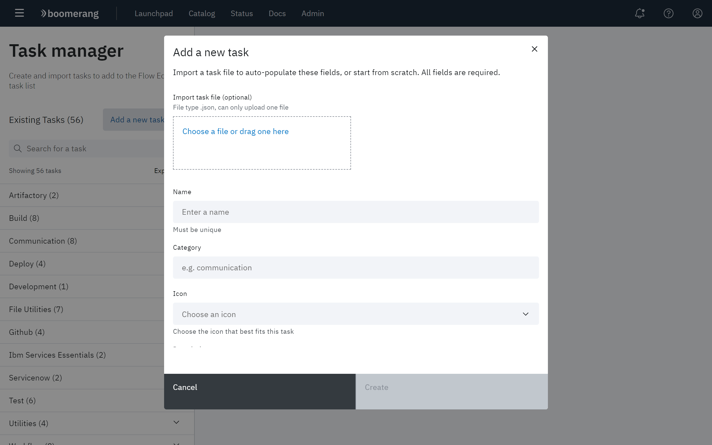

# Working with Task Manager

The Task Manager page displays all currently defined tasks in the IBM Services Essentials platform, and allows you to monitor their status, as well as edit, add, and delete tasks.
## Viewing tasks

The left panel displays the currently defined tasks by group. 

Expand each group to view its related tasks.  The parameters that are configured for each task in a group are displayed. Verified tasks are indicated by a ribbon icon.
### Task header

The top of each task definition presents task version control. The name of the task, along with the date the task was last updated is displayed.

The **Version** control in the task header allows you to cycle through past versions of the task. When viewing the current version, **Reset changes** can be used to reset any editing you have done. When viewing a previous version, the parameters from that version can be copied into a new version using **Copy to new version**.

### Task definition

Task definitions are presented in as: **Basics** and **Definition fields**

### Basics

The following fields are defined as **Basics**.

| Field | Description |
| --- | --- |
| **Name** | The identifier for task, used throughout the platform. |
| **Category** | The group in the left task panel that is identified with the task.|
| **Icon** | The icon associated with that task, used throughout the platform.|
| **Description** | A short narrative of the task. |
| **Arguments** | The list of values passed into the task parameters. |
| **Image** |   |
| **Command** |    |
| **Contribution level** |    |

### Definition fields

Definition fields vary according to the task. See [Parameters](/boomerang-cicd/getting-to-know/parameters).
The displayed fields can be dragged and dropped to change their order.

> **Note**: Click **Preview** in the top right corner of the page to view what the user sees for that task, when editing a task on the platform.

## Editing tasks

To edit a task, simply edit any of the parameters in the **Basics** and **Definition fields** and click **Save** in the top right corner of the page.

> **Note**: Verified tasks are not editable, unless the platform Administrator has enabled editing in the Global settings.

## Adding a task

Click **Add a new task** at the top of the left panel. A dialog requesting value for each of the **Basics** parameters is displayed.

Enter the desired values, then click **Create**.

