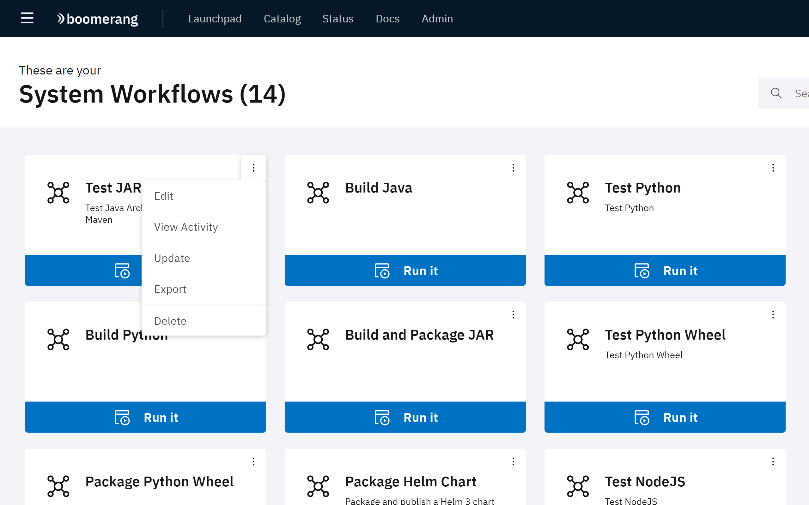
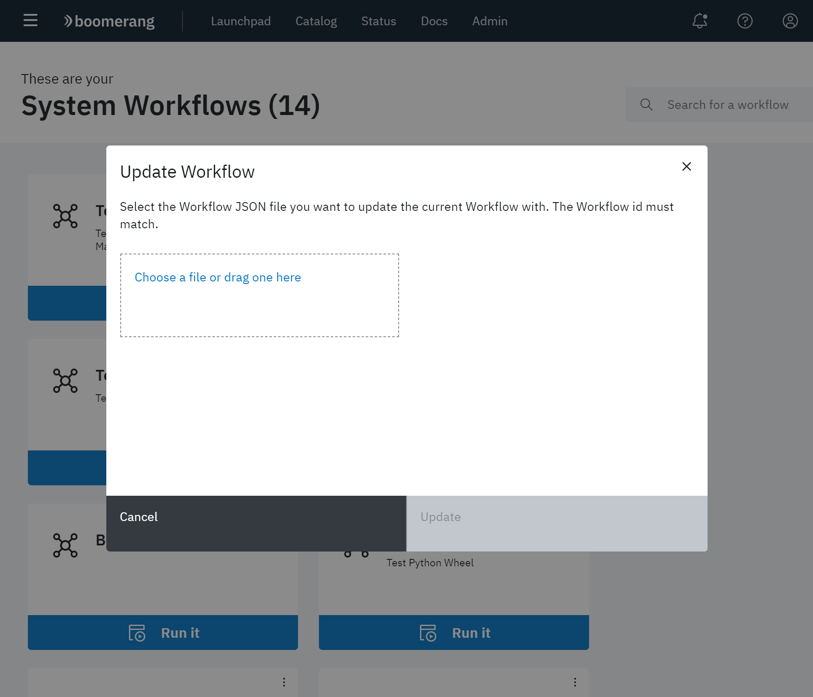

# Reviewing System Workflows

The System Workflows page displays the currently defined System workflows in the IBM Services Essentials platform.

The following items are available at the overflow menu for each workflow: **Edit**, **View Activity**, **Update**, **Export**, **Delete**.

## Editing a System workflow

Click **Edit** at the overflow menu. The Editor page for that workflow is displayed. The workflow can be editing using any of the functionality available with the Workflow Editor provided by the Boomerang Flow application. See [Workflow Editor](/boomerang-flow/getting-to-know/editor).

## Viewing System workflow activity

Click **View Activity** at the overflow menu. The Activity page is displayed. This information presented includes workflow status, workflow duration, task status, task duration, output properties, and logs.  See [Workflow Activity](/boomerang-flow/getting-to-know/activity).

## Updating a System workflow

Click **Update** at the overflow menu. The Update Workflow dialog box is presented. Drag and drop the desired JSON file that will update the workflow, or click **Choose a file or drag one here** to navigate to the JSON file.

Click **Update** when file selection is complete.

## Exporting a System workflow

Click **Export** at the overflow menu. The exported JSON file is downloaded to the default download directory.

## Deleting a System workflow

Click **Delete** at the overflow menu. Click **Delete** at the confirmation prompt to remove the System workflow from the platform.
