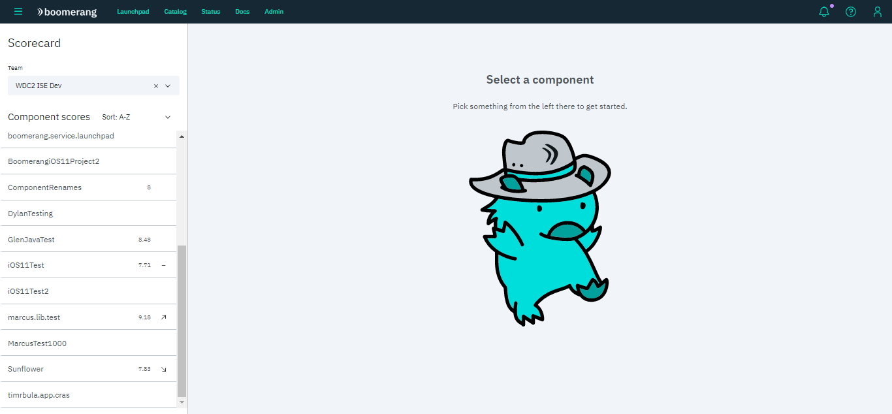
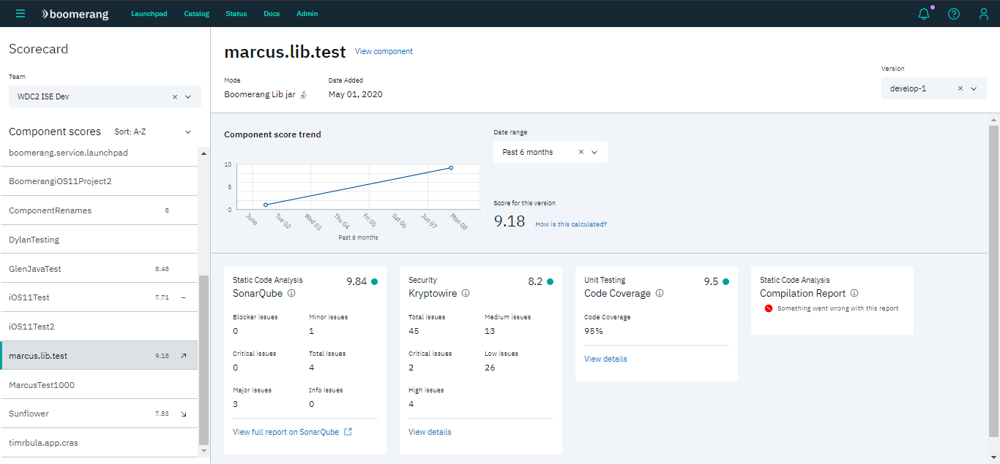
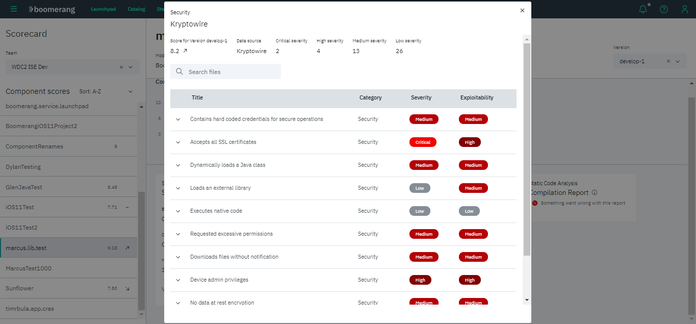

# Scorecard

Provides a point in time, per application, of version-based quality scoring and metrics.
To view these metrics, select a team and component in the left panel.

## Component details

The component details screen highlights:
- trends from the previous versions
- the latest scoring
- reports and details about them

If available, you can view more details about a report or check the full report in an external link.

## Security report

Shows all security, hardware or privacy issues, ranking their severity and exploitability from low to critical.
You can expand a row to check a more detailed description of the issue and some recommendations.

## Code Coverage report

Shows how much of the source code is being tested. A code coverage above 80% is excellent, and above 40% is okay. Otherwise, coverage is poor.

