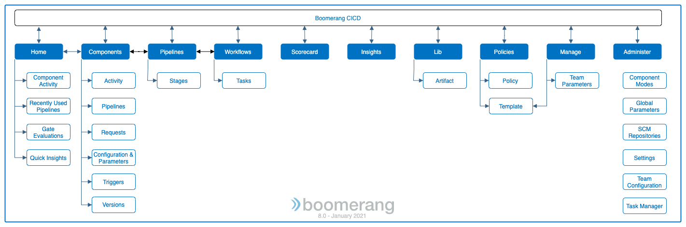
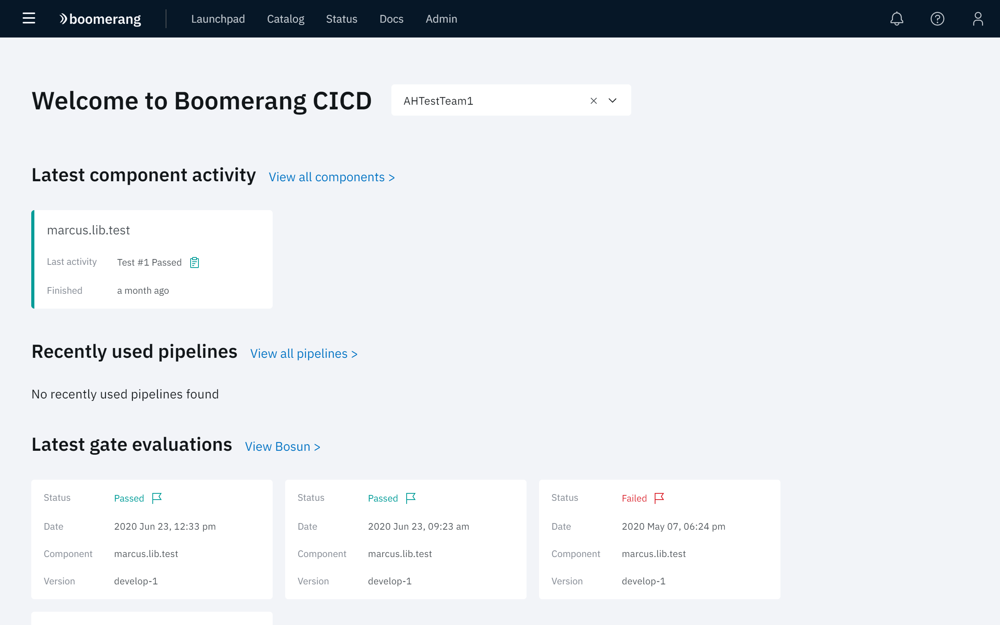
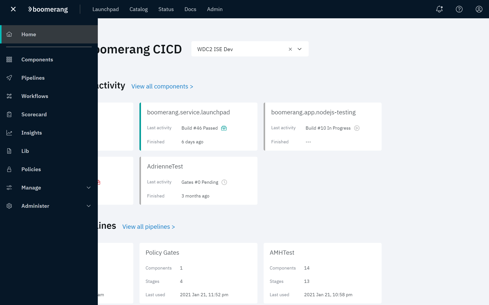

# Navigating

Boomerang CICD provides controls for rapidly building, testing, and deploying applications through pipelines and workflows. This involves the controls shown in the diagram with their corresponding access points in the user interface.

## Home page

Home is the centralized landing for Boomerang CICD with a summary of a number of the key data points including: components, pipelines, gates, and quick insights. From here, you create components, pipelines, gates, approvals, and notifications that move the components through the pipeline.

- **Latest component activity**    
This tile displays the latest activity, along with what the activity was and when it occurred. 

  Click **View all components** to display the [Components](/boomerang-cicd/getting-to-know/components) details page. Here, up to five components are displayed in order of latest activity.

- **Recently used pipelines**   
Pipeline information is a snapshot of detail on your team's pipelines. Information includes the number of connected components, stages, and when it was last used.

  Click **View all pipelines** to display the [Pipelines](/boomerang-cicd/getting-to-know/pipelines) details page. 

- **Latest gate evaluations**  
The evaluation activity for Boomerang Bosun policies is shown here providing a snapshot of what gates may have failed. Click **View Bosun** to view additional details for Bosun and policies.

- **Quick insights**  
  Provides a snapshot of insights based on the last 30 days in two easy graphs, focused on either Status or Activity trends.

  Status insights presents a split of the status of all the activity going on. Ideally, this will be with a high percentage of succeeded.

  Alternatively, you can focus on the activity rate graph which should depict the trends across the activities being similar, as well as identifying outliers. For example, if tests are not being run, then it will show that tests are not trending the same as builds and deploys. This is a key indicator of where to fix things. 
  
## Menu

The menu is the primary navigation tool for Boomerang CICD located to the top left in the header. In addition to providing a means to access the Home page, it presents the following features that support your solution.

- [Components]() - access the per repository components
- [Pipelines]() - access your pipelines and stages
- [Workflows](/boomerang-cicd/how-to-guide/workflows) - accesses your custom event driven workflows.
- [Scorecard](/boomerang-cicd/how-to-guide/scorecard) - provides quality scoring and metrics.
- [Insights](/boomerang-cicd/how-to-guide/insights) - provides a view of application activity and trends over time.
- [Lib](/boomerang-cicd/how-to-guide/lib) - provides a library of reusable components.
- [Policies](/boomerang-cicd/how-to-guide/policies) - accesses the Bosun policy-based gating system.
- **Manage** - provides ability for teams to set policy templates and team parameters.
- **Administer** - provides ability for Administrators to control component modes, global parameters, SCM repositories, team configuration, task manager and certain CICD settings.

## Supporting Functionality

The documentation for Boomerang CICD contains information for the usage of the following functionality that supports CICD development:

- [Modes and properties](/boomerang-cicd/supporting-functionality/modes-and-properties) - the modes and properties used to customize or extend and activity in the pipeline.
- [Advanced configuration for gates ](/boomerang-cicd/how-to-guide/deployment-types) - out-of-the-box integrations that can be used for deployment.
- Testing - instructions for testing mobile device and web, as well as security scanning.