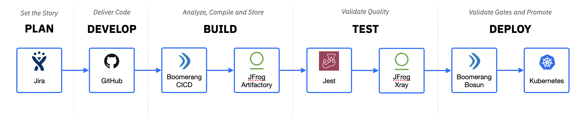

# Getting started

To get started using Boomerang CICD and the event driven workflows, we need to set up a Pipeline and then a Component that can be run through.

At a high level the steps are as follows:

1. Create the Pipeline
2. Create and configure a Stage in the Pipeline
3. Create and configure a Component

## Create a Pipeline

To start using a component, Boomerang CICD makes use of the concept of pipelines. These pipelines are independent of the components, but can act on any of all of the components you have configured.

Pipelines encapsulate Stages and define the order in which you can promote Versions of a Component between them.

Pipelines only start when triggered. You configure triggers on specific actins, like pushing branch or a tag in Git. Triggers can be further refined with approvals and can also trigger notifications when they occur.

1. Navigate to [Boomerang CICD Pipelines](https://launch.boomerangplatform.net/cicd/apps/ci/pipelines)
2. Select **Create new pipeline** in the top right
3. Provide a unique name for the pipeline

## Create and Configure a Pipeline Stage

Stages are the mechanism in which you define the activites that are executed and any parameters, gates, and notifications that are utilized during execution. There are two different types of Stages; Smart and Custom. To learn more about Stages go to the [How To Guide for Pipelines and Stages](/boomerang-cicd/how-to-guide/pipelines).

1. On the Pipelines page, under the newly created Pipeline, select **Add Stage +**
2. Provide a name and choose Smart for the type of stage. This will allow us to get started quickly with out of the box automation.
3. Click **Create Stage**
4. Select the Stages menu in the top right of the Stage card and select **Configure**
5. To start with enable the Build Activity, you can configure more later on.

## Create and Configure a Component

Boomerang CICD Components are created from Git® repositories. The following steps let you create a new component from a repository and map to the Pipeline and Stage created above.

1. Navigate to [Boomerang CICD Components](https://launch.boomerangplatform.net/cicd/apps/ci/components)
2. Select the appropriate team from the Teams dropdown in the top left of the page.
3. Select **Create new component** to launch the self-service onboarding wizard.
4. At the start of the wizard, you will be asked to **Select your source repository**. See the _Source Code Repository Usage_ scenarios in this topic.
5. Upon selecting a source repository for the first time, you may be promoted to sign in (authenticate) and approve Boomerang CICD integration with your chosen repository. Select the affirmative option and you will be redirected back to the wizard. [Why do we need access?](/boomerang-cicd/introduction/frequently-asked-questions)
6. A list of your repos will be shown in the format of `owner / name`. Select the repository you would like to add and click **Validate**, followed by **Next Step** to continue. You can personalize the component with a unique name. _Pro Tip: Use the search to narrow the results_ [Don't see any repos?](/boomerang-cicd/introduction/frequently-asked-questions)
7. You will be presented with the supported modes. Select the mode that matches the the use case and fill in any default component properties that appear. See [Modes and Properties](/boomerang-cicd/how-to-guide/modes-and-properties)
8. You can choose to let Boomerang CICD create a deploy key against your repository, or in some cases, you may want to supply a specific key, such as with iOS applications that have CocoaPod dependencies. These need to use the same key.
9. Next, you can configure the default trigger for the component. This tells Boomerang CICD when to trigger and what pipeline to target.
10. Lastly, you can create the webhook against your repository and complete the onboarding.
11. Upon successful creation, you will receive a confirmation message and can navigate back to your teams component list. [Get an error message?](/boomerang-cicd/introduction/frequently-asked-questions)

## Modes and quotas

When you first request your Boomerang CICD Catalog Service in IBM Services Essentials, it is by default created with only Cloud Native modes and the ability to create one (1) component. For additional modes and component quotas, contact your support representative.

If you choose specific modes such as Node.js or Java, they come with pre-integrated, pre-validated, and supported workflows to execute tasks. The following diagram shows an example of using the Node.js mode and the workflow you get out of the box.

## Prerequisites

- If you have a GitHub® team created or your project and are using a repository in `Boomerang-Delivery`, make sure you add the repository to your team so all members of your team have access. Directing user permissions on the repository in this case is not permitted nor required.
- Add a `.boomerang.yaml` file and other required files in the `_boomerang` folder, as mentioned in [Modes and Properties](/boomerang-cicd/how-to-guide/modes-and-properties)

## Source code repository support

| Repository            | Integration |
| --------------------- | ----------- |
| IBM® Mobile GitLab®     | Full        |
| IBM® GitHub® Enterprise | Full        |
| GitHub.com            | Full        |
| IBM Cloud® Git         | Partial     |

### Full Auth integration

Utilizes a user's personal access token to configure a deploy key and webhooks.

### Partial Auth integration

A private source repository in either an approved organization such as `boomerang` or `boomerang-delivery` (there's a tile on your launchpad), or a personal repository with `boomrng@us.ibm.com` added as a user with write access or above.

## Source code repository usage

Currently, we support IBM GitHub Enterprise, IBM Cloud Git, IBM Mobile GitLab, and GitHub.com out of the box. There are certain usage scenarios to be aware of when using these Git repositories.

| Repository            | Client IP | IBM IP | IBM Asset | IBM internal | PoC / Demo | OpenSource |
| --------------------- | --------- | ------ | --------- | ------------ | ---------- | ---------- |
| IBM Mobile GitLab     | x         | x      | x         | x            | x          |            |
| IBM Cloud Git         | x         |        |           |              | x          |            |
| IBM GitHub Enterprise |           | x      | x         | x            | x          |            |
| GitHub.com            |           |        |           |              |            | x          |

Also of note for custom repository locations, [Is your repository hosted somewhere else?](/boomerang-cicd/introduction/frequently-asked-questions)
