# Teams

Boomerang Launchpad provides functionality for Team Owners and members to view and manage their teams on the platform.

## Summary

The [Teams Overview](https://launch.boomerangplatform.net/admin/teams) provides a pageable and sortable tabular view of all the teams on the platform. Summary data for each team is displayed in the following columns:

- Team name
- Number of users
- Number of services
- Date created
- Status

> Note: Only the following columns are sortable: **Team Name**, **Date Created**,and **Status**. You can also search for a team by it's name.

Each row is selectable and navigates to a details page for the selected team.

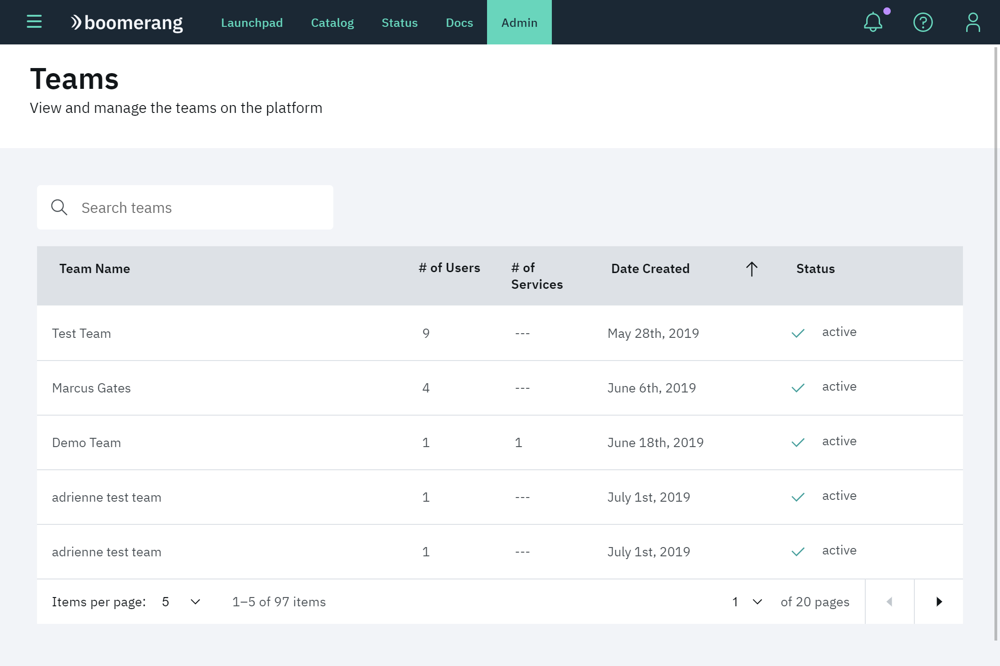

## Detail

The team detail view empowers Admin users to view and manage individual teams. Functionaliy includes:

- **Services**
- **Team Members**
- **Team Requests**
- **Catalog Requests**
- **Settings**
- **Closing the Team**

At a high level, the details page provides platform Administrators the ability to perform the same functionality as the Team Owner.

### Services

View and manage all of the services added to a team. Users can request to add new services and manage existing ones by editing their properties and removing them from the team.

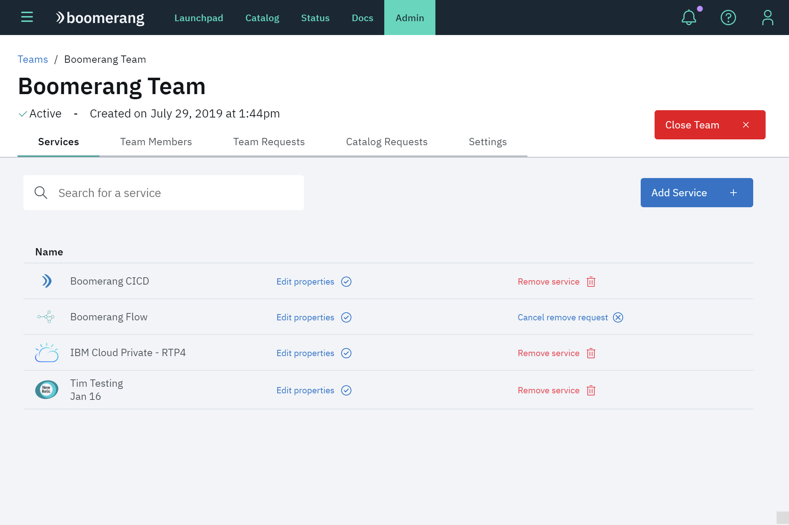

#### Add service

Request to add additional services to a team. A `Add a Service` request will be created. Once it is approved, a corresponding `Join a Service` request will be created for each user in the team. Once their service request has been approved, users have access to the service.

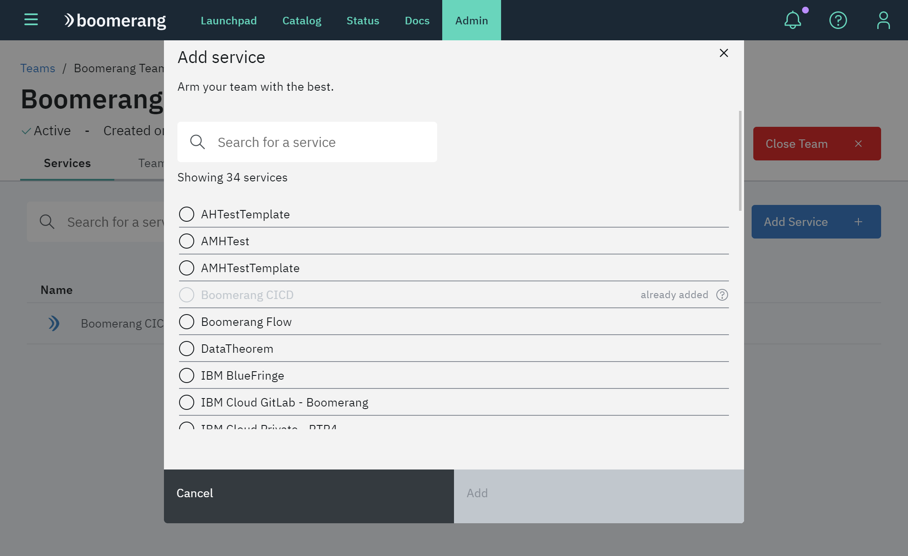

#### Edit properties

Use the [Catalog Template](/boomerang-core/admin/catalog), to edit and save settings for a service after it has been created. Learn more about [service settings](/boomerang-core/extending/settings)

> Not all settings are exposed on the Catalog template.

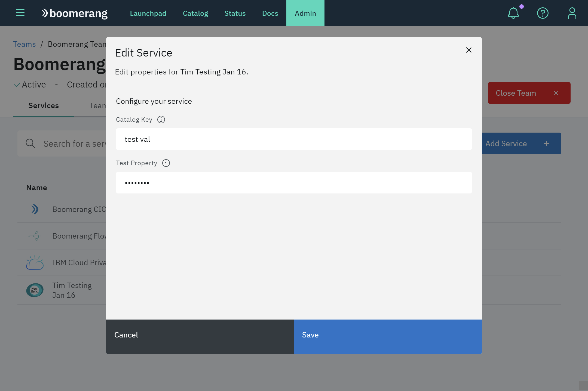

#### Remove service

Request to remove a service from a team. A `Remove a Service` request will be created. Once it is approved, corresponding `Leave a Service` request will created against the service for each user in the team.

> If you change your mind or made a mistake, you can cancel the remove request by selecting _Cancel removal request_ in the Services list.

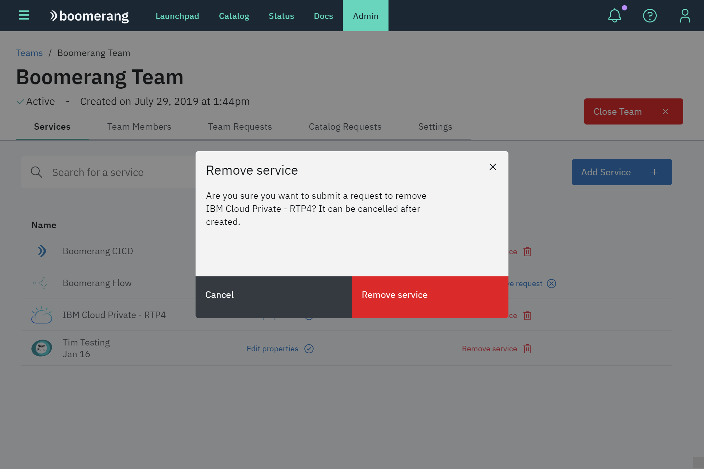

### Team members

View all members in a team. They are searchable by name and email. Users can manage members roles, update team ownership, request to remove remove users and view their detailed user page.

> Teams must have at least one Team Owner. If a team has only one Team Owner, you cannot make them a regular user. If you would like to change the Team Owner, you must first make another team member a Team Owner.

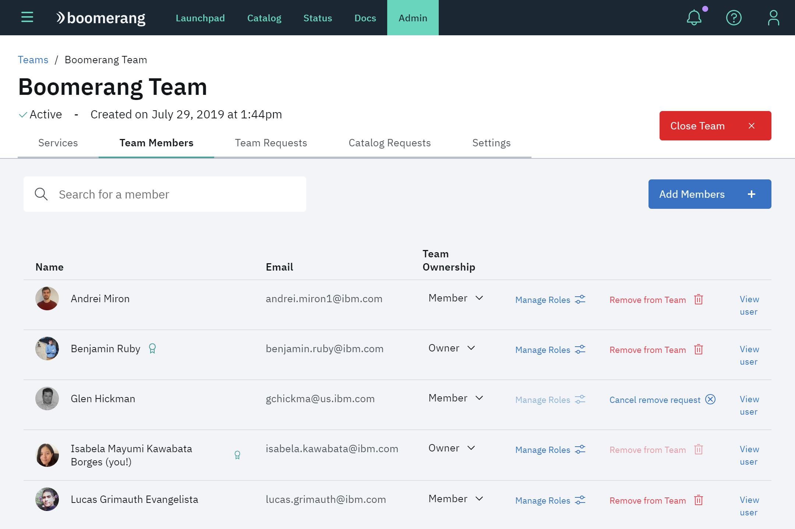

#### Add team members

Request to add one or more users to the team as members. You can search all platform users by name and email.

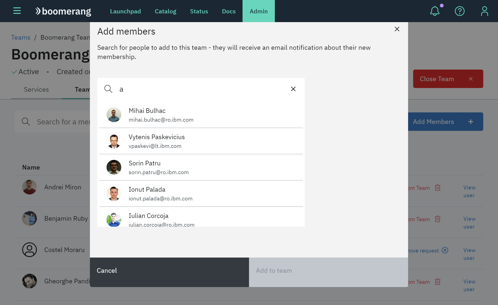

#### Manage roles

Update a member's roles per service. Learn more about [Service roles](/link/to/serviceroles/here).

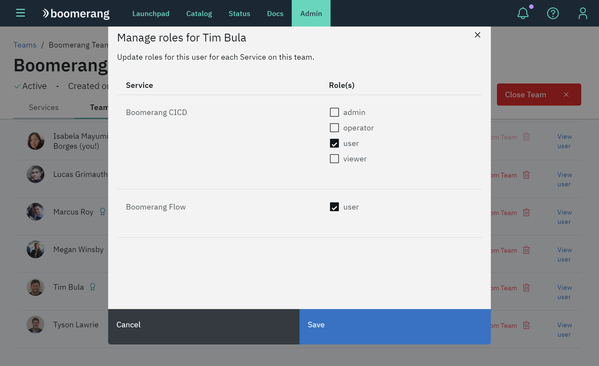

#### Remove team member

Request to remove a team member from a team. Requests to leave the team and all of the services will be created. Once they are approved, the user will lose all access to the team and its services.

> If you change your mind or made a mistake, you can cancel the remove request by selecting _Cancel removal request_ in the Members list.

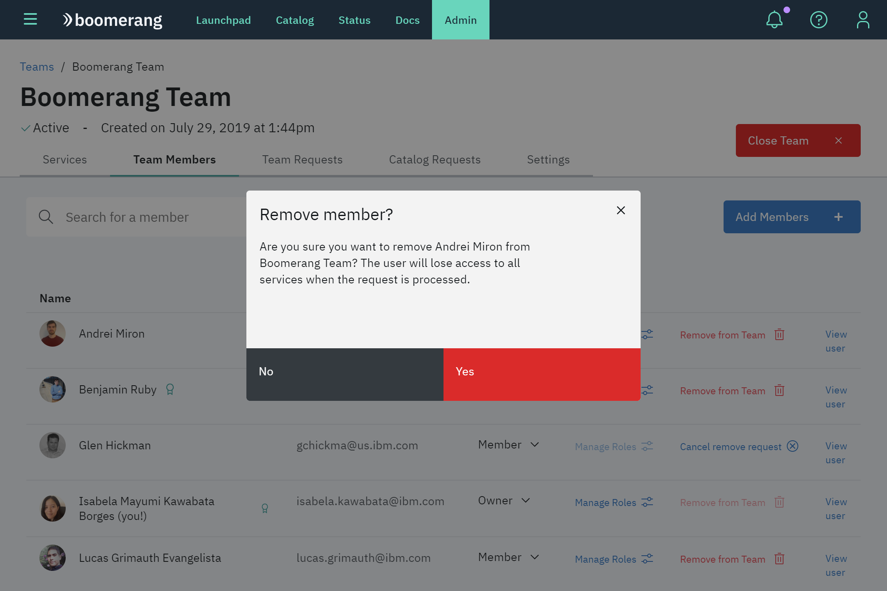

### Team requests

View and processing all of join requests for this team. Users can quickly approve or deny requests without need to navigate to the Requests feature.

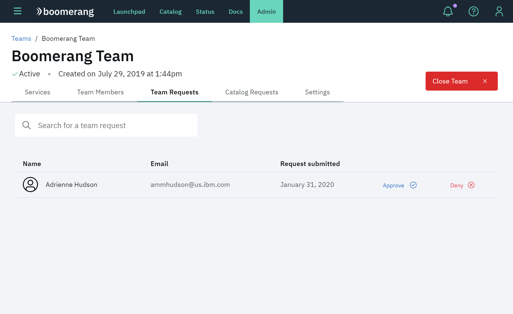

### Catalog requests

View all outstanding catalog requests for this team including `Add a Service`, `Join a Service`, `Remove a Service` and `Leave a Service`. _View request_ link will take you to the detailed view of the request for more information and prcoessing. View more about the different [Request types](/link/to/request/types)

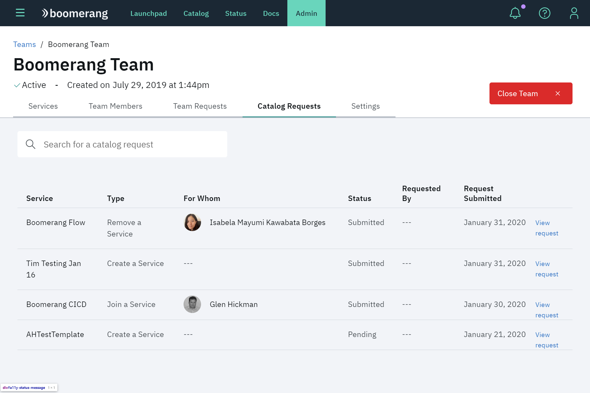

### Settings

Configure settings for the team, like enabling auto-approve for `Join a Team` requests and making the team public or private.

#### Private teams

Private teams won't appear in search results. Users must be invited to join by a Team Owner or Admin. A team can be made public or private in its settings.

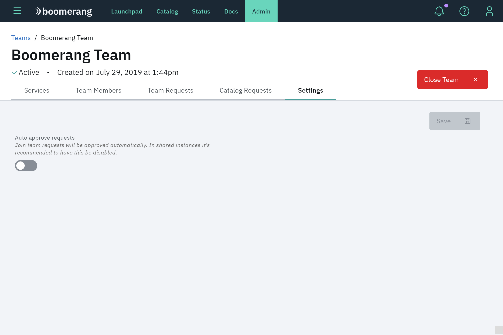

### Close team

Request to close a team. By closing a team, all members will lose access to the services and all functionality and this feature will de disabled.
