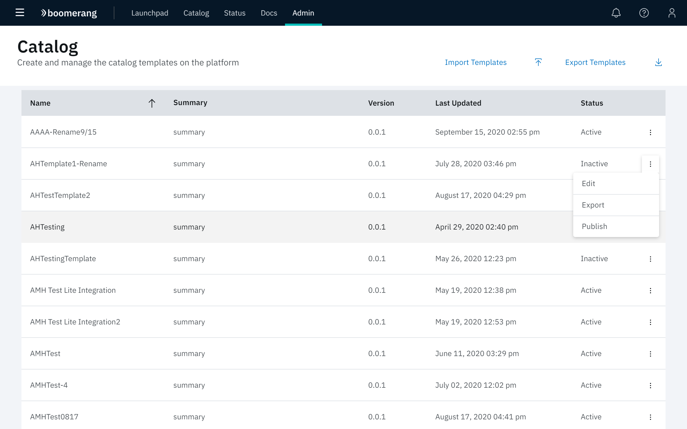
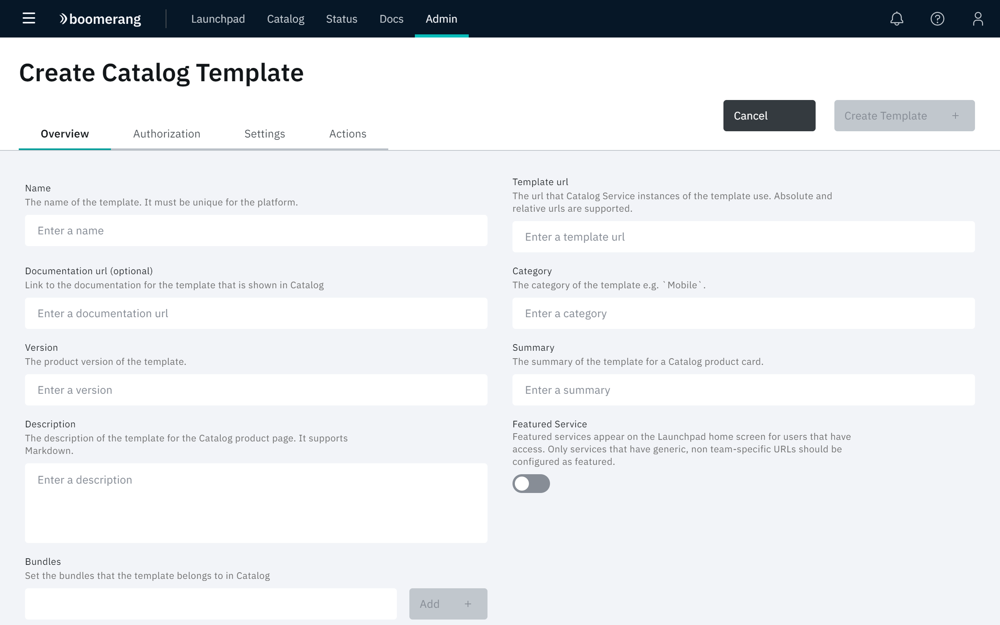
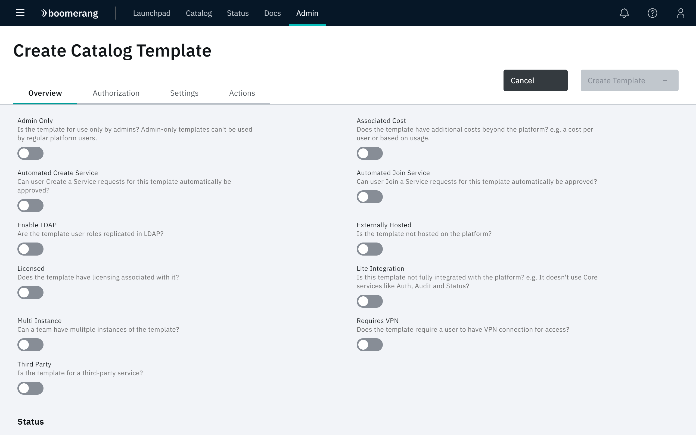
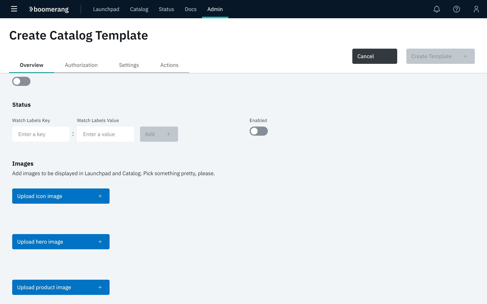
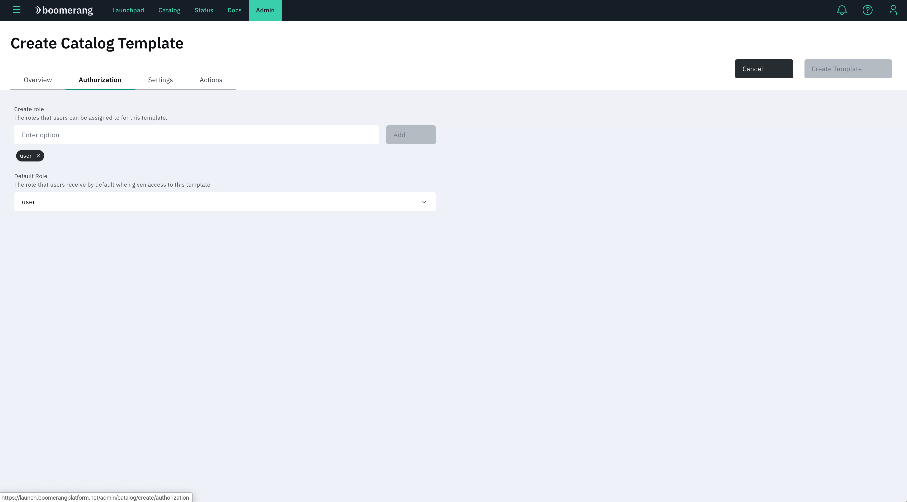
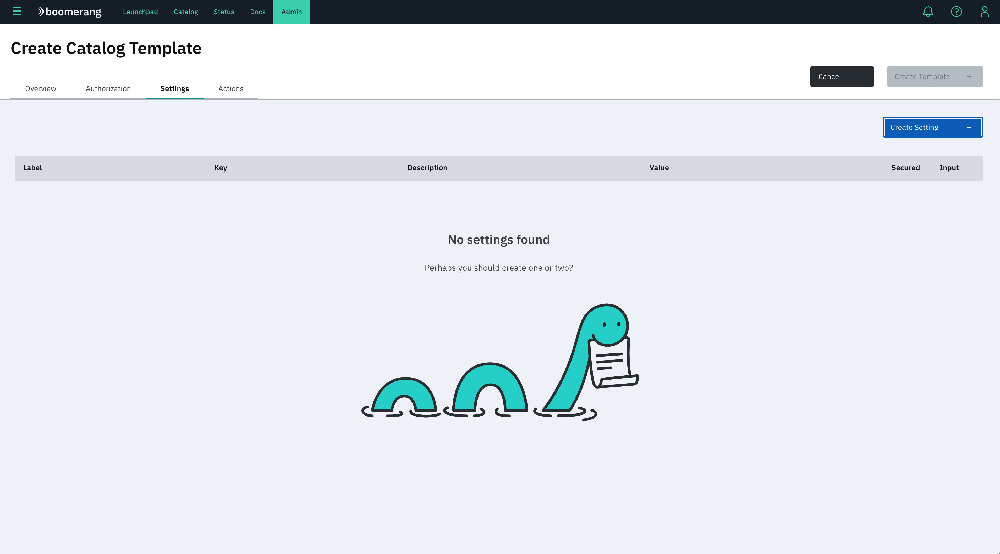
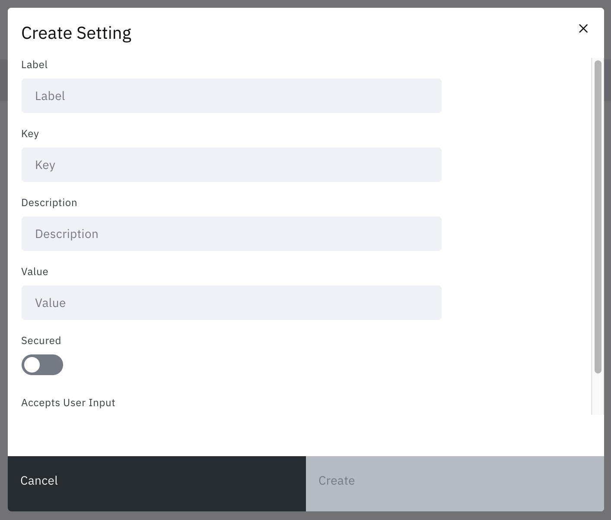
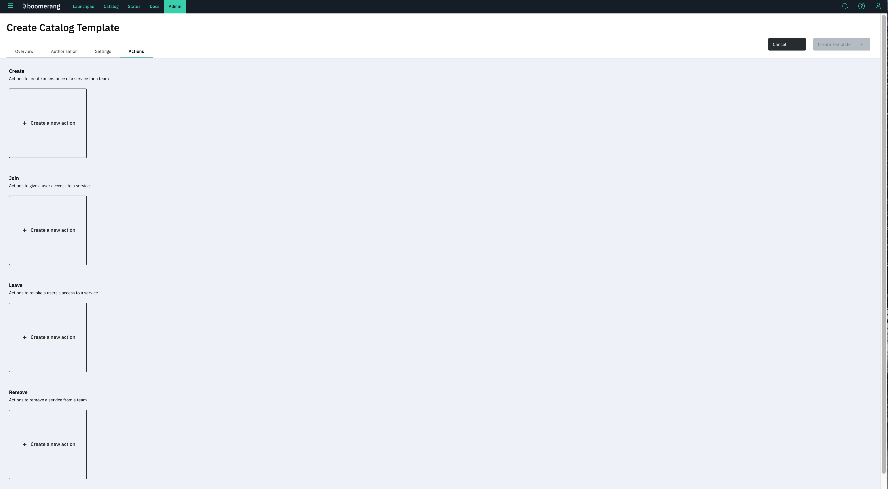
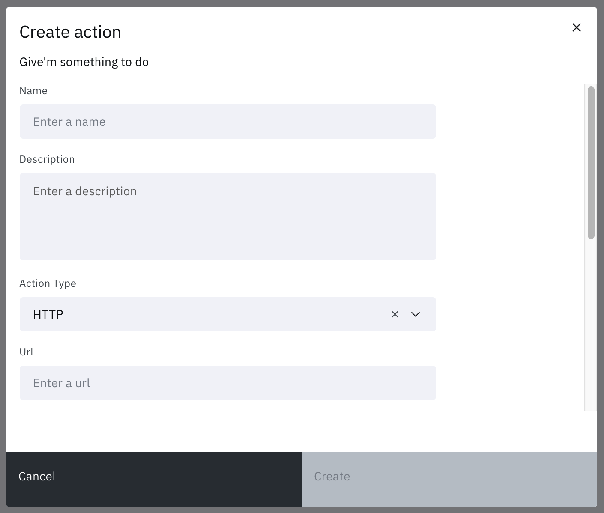
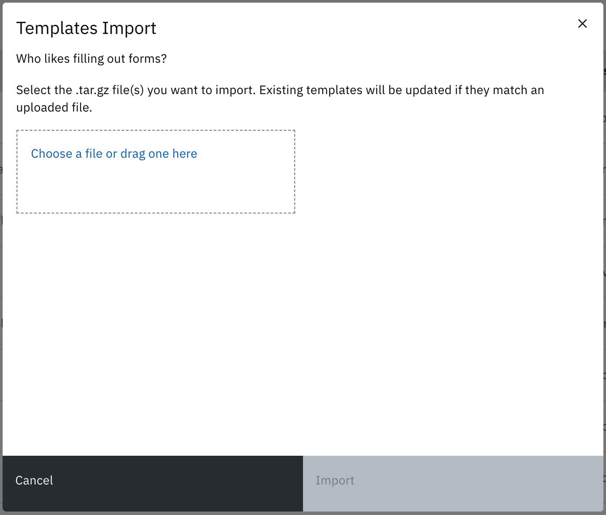

# Catalog templates

Catalog templates are the definition for a solution. They enable you to properly integrate your Catalog service into Boomerang Core. They denote the characteristics for a particular solution, how it interacts with the platform, and any requirements on that solution.

In particular, by defining appropriate user roles, settings, and request actions, your running Catalog service can be managed from the team's Settings page on Boomerang Launchpad.

> Settings and actions are optional and Catalog templates can simply be _links_ off to applications running externally to the platform. However, the full value of Catalog templates is harnessed when your Catalog service is running on the Boomerang platform.

The IBM Automation suite of applications all run on the Boomerang platform and have fully defined Catalog templates that allow teams to fully manage their applications from within the platform.

## Overview

The overview table shows the following information about the created templates:

- Name
- Summary
- Version
- Last Updated
- Status

Users can perform the following actions:

- Create template
- Edit template
- Publish and unpublish template
- Import templates
- Export templates

## Create template

Click **Create Template** in the upper right hand corner above the table and you will be redirected to the Create Catalog Template page, that is divided into four sections.

### Overview

When creating a template, there are six required fields:

- **Name**
- **Template URL**
- **Category**
- **Version**
- **Summary**
- **Description**

At the top of this page, you will need to populate a number of fields.

| Field             | Description                                                                                                                                                                                                                                                                                                            |
| ----------------- | ---------------------------------------------------------------------------------------------------------------------------------------------------------------------------------------------------------------------------------------------------------------------------------------------------------------------- |
| **Name**              | The name of the template. It must be unique for the platform.                                                                                                                                                                                                                                                          |
| **Template URL**      | The url that template instance use. Template URLs can be either a fully qualified URL such as `https://launch.boomerangplatform.net/cicd/apps` or a relative path can be specified like /apps/ci/teams for catalog templates that are hosted on the platform, allowing templates to be portable across environments. Property references are also supported.  |
| Documentation URL | The url for the template documentation. Optional.                                                                                                                                                                                                                                                                      |
| **Category**          | The category of the template, for example, "Development."                                                                                                                                                                                                                                                                       |
| **Version**           | The product version of the template.                                                                                                                                                                                                                                                                                   |
| **Status**            | The platform-wide status of the template. Inactive templates cannot be added to a team.                                                                                                                                                                                                                                  |
| **Summary**           | The summary of the template for a Catalog product card. Maximum 128 characters.                                                                                                                                                                                                                                        |
| **Description**       | The description of the template for the Catalog product page. Supports Markdown. Maximum 4,000 characters.                                                                                                                                                                                                             |
| **Featured Service**  | Featured services appear on the Launchpad Home screen for users that have access. Only services that have generic non-team specific URLs should be marked as featured.                                                                                                                                                 |

Directly under the fields, there are a number of attributes you need to set.

| Attribute               | Description                                                                                                                                                                                                                                                             |
| ----------------------- | ----------------------------------------------------------------------------------------------------------------------------------------------------------------------------------------------------------------------------------------------------------------------- |
| **Admin Only**              | This template is visible to Administrator only. Administrator-only template items can't be used by regular platform users.  
|**Automated Cost** | Whether the template will have additional costs beyond the platform (for example, cost per user or based on service). |
**Automated Create Service** | Set whether Create Service requests made by a user will be automatically approved.      
| **Automated Join Service**    | Set whether Join a Service requests for this template can be automatically approved.  
| **Enable LDAP**             | Set whether you need Catalog service entitlements replicated in the Boomerang Platform LDAP. Enabled only for services that will connect to the Boomerang Platform LDAP. For example, the Boomerang Jira instance connects to the Boomerang LDAP for team, user, and role information. |
| **Externally Hosted**       | Set whether the Catalog service is not hosted on the platform.                                                                                                                                   
| **Licensed**                | Set whether the template has licensing implications associated with it.                                                                                                                                                                                                 |
|**Lite Integration** | Set if the template is not fully integrated with the platform.
| **Multi Instance** | Set whether a team can have multiple instances of the template, since, for example, teams can have multiple instances of Jira.                                                                                                                                                          |
| **Associated Cost**        | Set whether the template has additional costs beyond the platform.                                                                                                                                                                                                      |
| **Requires VPN**            | Set whether the template requires a VPN connection for access.             
|**Third Party** | Whether the template is for a third party.
You can also elect to integrate the Catalog template with Boomerang's Status Watcher service:

Here you can specify the `Watch Labels` Boomerang will watch for. When Boomerang detects a specified label, it will automatically trigger a new event recorded on the Boomerang Status page.

At the bottom of the Create Catalog Template page, you can upload different images related to your Catalog template.

| Type          | Description                                                                                                                   |
| ------------- | ----------------------------------------------------------------------------------------------------------------------------- |
| Icon image    | The image that will be displayed as the Catalog template icon. Support for .svg files only.                                   |
| Hero image    | The image that will be displayed as the main banner on the Catalog template information page. Support for .png files only.  |
| Product image | The image that will displayed on the image carousel on the Catalog template information page. Support for .png files only. |

Once you have filled in the minimum required Catalog fields, the **Create Template** button will be enabled.

If you set the **Status** to **Active**, your Catalog template will be published to the Catalog screen and is now ready to be added as a service to teams.

### Authorization

Click the `Authorization` tab to display the Authorization page.

Here you can create different roles that can be assigned to users for your Catalog template. You can also specify the default role that will be assigned to users. Team Owners can assign one, many, or all of the created roles to a user on the Team Member's screen from Launchpad.

### Settings

Catalog template settings consist of user-defined key-value pairs, that can be accessed by applications running on the platform. This is accomplished using platform provided libraries. These key-value pairs are defined at the template level for the catalog item and are global properties that are shared across all teams.

Use Catalog template settings when there is a requirement to maintain settings at the global template level and team level. This reduces the number of installation parameters required and provides the ability to dynamically update settings in a central place, without application downtime and restarts.

Defining a setting key-value pair at the template level allows these values to be used at the team level. Team-based settings enable use cases such as multi-tenant management.

Click the **Settings** tab. The Settings screen is displayed:

Here you can create settings (or properties) that help with the operational management of your application.

To create a new setting, click **Create Setting**. This displays the following modal:

On this modal, define the settings and optionally enable some attributes:

| Field/Attribute    | Description                                                                                               |
| ------------------ | --------------------------------------------------------------------------------------------------------- |
| **Label**              | The displayed name for the setting.                                                           |
| **Key**                | The setting `key` referenced in the Catalog Actions.                                         |
| **Description**        | The description of the setting.                                                                           |
| **Value**              | The setting default or base `value`. Can be left blank.                                                   |
| **Secured**            | Toggle based on the sensitivity of the setting, for example, `on` for passwords or API keys.                  |
| **Accepts User Input** | Toggle based on whether the user needs to provide values when adding the Catalog service to their team. |

> Note: If a Catalog template has been previously configured with a setting and a new Create Tool request is submitted as part of the request processing flow, the platform operator or Administrator will be given opportunity to set the initial team settings. After the tool has been created, these initial settings can be changed at any time at the team management screen.

### Actions

Catalog actions are the mechanism to manage the lifecycle of your Catalog service. Catalog actions can be used to perform necessary steps before a Catalog service is available for use. Similarly, Catalog actions can be used to decommission a Catalog service.

To maximize the integration of a Catalog service with the Boomerang platform, teams will typically expose APIs in their services for Catalog actions to execute. Exposing APIs also increases the level of automation of the execution of Catalog actions.

Click the **Actions** tab. The Actions page is displayed.

Here you can create actions that will be executed when requests for your Catalog service are processed. There are four categories of actions:

| Category | Description                                            |
| -------- | ------------------------------------------------------ |
| **Create**   | Actions to create an instance of a service for a team. |
| **Join**     | Actions to give a user acccess to a service.           |
| **Leave**    | Actions to revoke a users's access to a service.       |
| **Remove**   | Actions to remove a service from a team.               |

To create a new action, click the **Create a new action** box for the appropriate action category. The Create action modal is displayed.

On this modal, define the **Action Type**, along these fields:

| Field/Attribute | Description                                                                                     |
| --------------- | ----------------------------------------------------------------------------------------------- |
| **Name**            | The name of the Action that will be displayed to the Admin processing the request.              |
| **Description**     | The description of the Action. For manual tasks this needs to be descriptive.                   |
| **Action Type**     | The type of Action to be executed. The values are `Flow`, `HTTP`, `Manual`, and `Set Property`. |

#### Flow

Flow actions enable a Flow workflow to be executed.

| Field/Attribute    | Description                                                                       |
| ------------------ | --------------------------------------------------------------------------------- |
| **Webhook Token**      | The API token used to identify the correct workflow to execute in Boomerang Flow. |
| **Property Key**, **Property Value** | Settings required by the workflow to execute.                                     |

### HTTP
These are HTTP requests to an internal platform server or an external server.

| Field/Attribute    | Description                                                                       |
| ------------------ | --------------------------------------------------------------------------------- |
| **URL**      | The Target URL for the HTTP request. |
| **Method** | The set of request methods that indicate the desired action to be performed for a given resource.   
**Internal**                              |
|**Content Type**  |   The Content-Type entity header is used to indicate the media type of the resource.
|**Payload** | The payload is an optional “body” to be sent with the request

#### Manual

Manual actions are used for actions that cannot be completed with an API. An Admiistrator might need to visit another URL to perform it. For example, creating a New Relic sub-account for a team must be done in the web application.

| Field/Attribute | Description                                        |
| --------------- | -------------------------------------------------- |
| **URL**             | (optional) The URL associated to the Manual action. |

#### Set Property

Set Property actions allow arbitrary values to be set and then referenced later in the processing of the template. For example, we use a Set Property action to set the New Relic sub-account id created in a previous manual action. An Administrator must supply the value during the processing. For example, if the property set is `newRelicSubAccountId` then it can be substituted in the `Template URL` property with `https://rpm.newrelic.com/accounts/${newRelicSubAccountId}`. You can also reference the property in a HTTP request with the same `${propertyName}` syntax.

| Field/Attribute | Description                                                                                                                                                         |
| --------------- | ------------------------------------------------------------------------------------------------------------------------------------------------------------------- |
| Property Key    | The key-value pair to be set by the Administrator processing the request. This property (setting) can be referenced on subsequent actions for the current category. |

There are also a number of properties automatically provided to the action.

| Property       | Description                                          |
| -------------- | ---------------------------------------------------- |
| `teamName`       | Name of the team the tool is being created for.      |
| `teamId`         | Unique identifier for team.                          |
| `requesterEmail` | User ID of user relating to request (if applicable). |

## Import templates

From the Catalog page, you can import Catalog templates from a file. Only .tar.gz files are supported. Use the file explore method or simply drag and drop a `.tar.gz` file into the modal and click `Import`:

## Export templates

From the Catalog page, you can export Catalog templates to a compressed `.tar.gz` file. Select the templates you wish to export and click **Export**.

## Deactivate templates

You can deactivate a Catalog template from the Catalog page. Simply click `Unpubllish` and confirm the operation in the modal.
