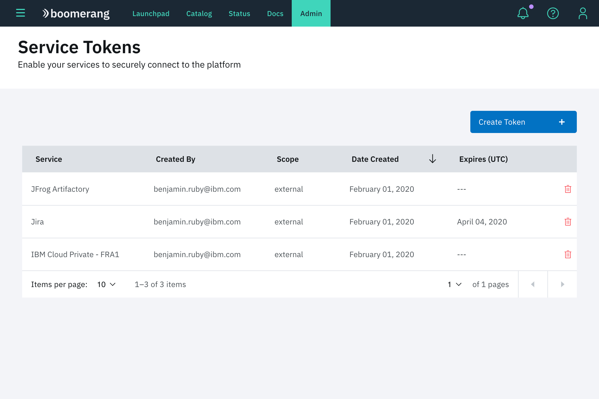
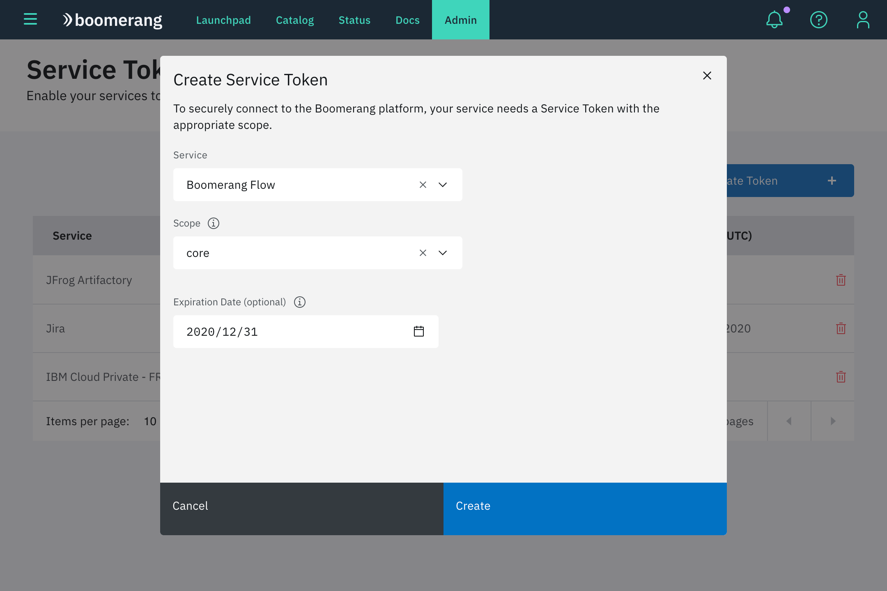
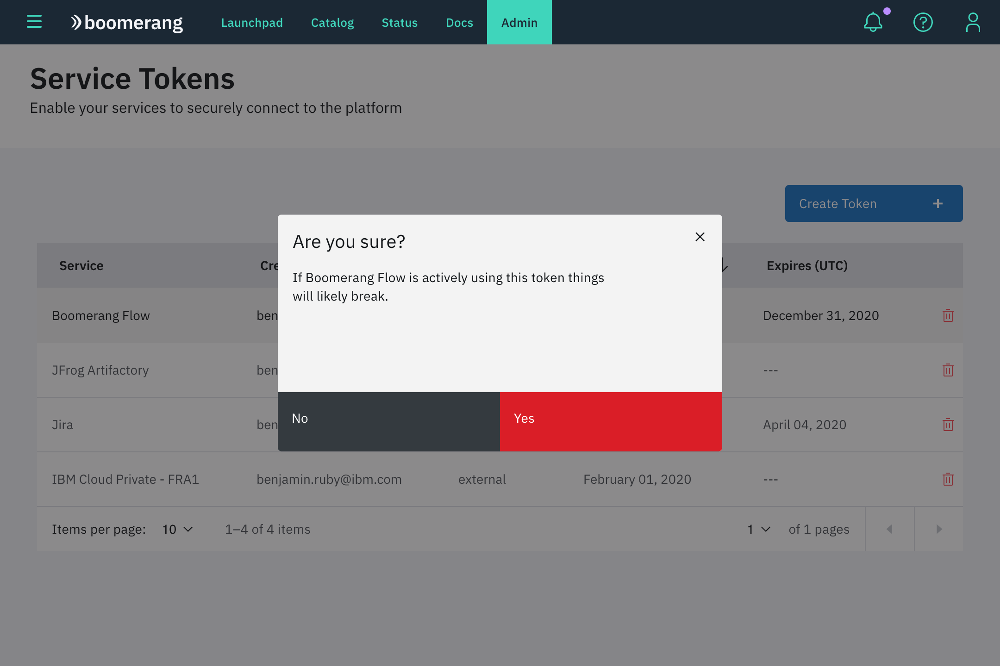

# Service tokens

Service tokens allow services on the platform to securely communicate with Boomerang Core services and external services.

## View tokens

The Service Tokens page provides a table view of all of the tokens that have been created on Boomerang. It shows the following information about the token:

- associated service
- creator
- creation date
- scope
- expiration date

## Create a Service token

Creating a Service token is easy to do.

1. Click **Create Token** to view the modal form.

2. Choose the service the token is to be associated with.

3. Select the scope for the token. The `core` scope is used to access Bomerang Core services (such as Authorization). To get access to the whole services, select the scope `platform`. The `external` scope is used to protect REST end points with a token rather than using a verified user identity. Learn more about service tokens in the [Security Architecture](/boomerang/architecture/security) documentation.

4. Enter an (optional) expiration date for the token. By default it will not expire if no date is entered.

Click **Create**. The token will **only** be displayed after creation. Once you close the modal it will not be shown again. We provide a **Copy** button on the creation result modal to make things easy for you.

## Using a Service token

View our sample applications for examples of using the service tokens in Java and Node.js microservices.

## Delete a Serivce token

If you would like to delete a token, select the delete icon associated with that token in the Service Tokens listing. A dialog will ask you to confirm your destructive action. Once deleted, the token will immediately become unusable and any services that use it will no longer work. You must create another token and update your services if you want them to continue to work on Boomerang Core.

