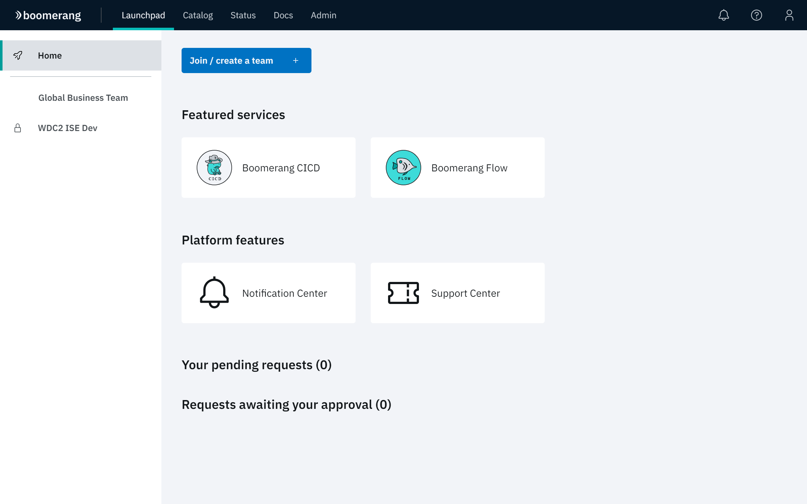
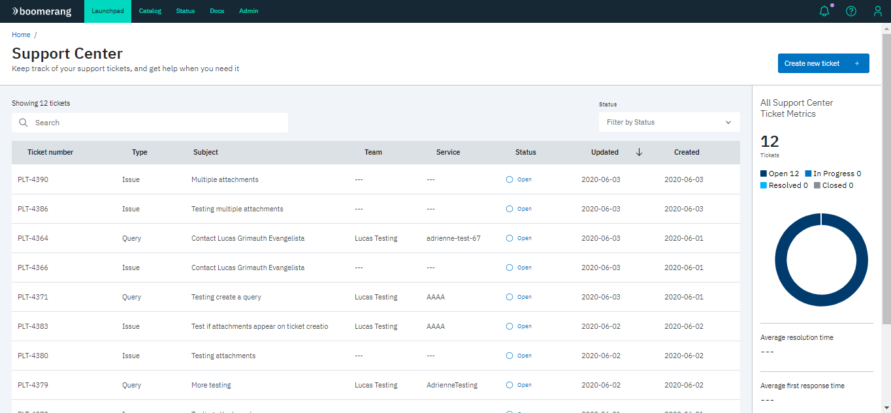
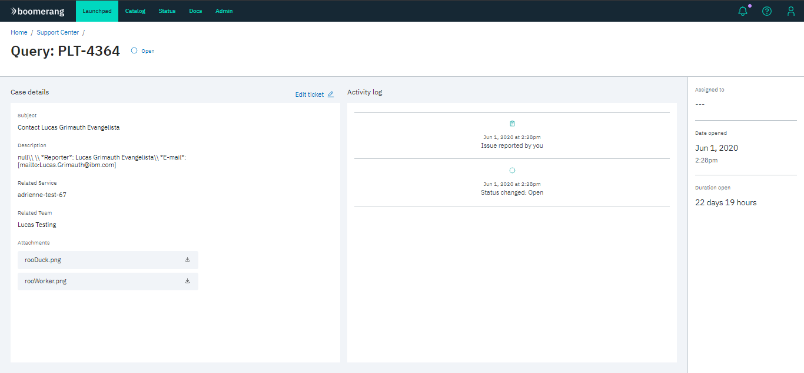
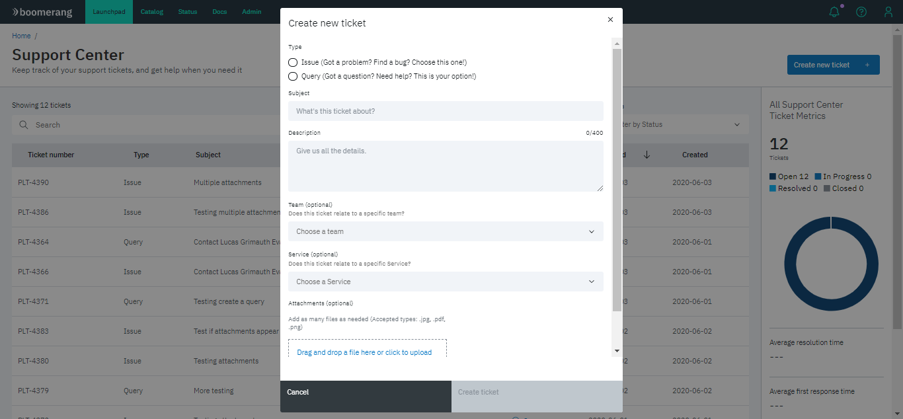

# Support Center

Sometimes you may find a problem while navigating the platform or want to contact us with a comment or concern. When you report an issue or query, a ticket is created. The platform provides the Support Center as a centralized place to view, create and edit these tickets.

Click the Support Center tile on the Boomerang Home page to view the Support Center.

## Tickets list

Keep track of your support tickets and check general metrics about them.

## View ticket

Click a specific ticket in the list to view its details.

## Create ticket

1. Click **Create new ticket**.
2. Type (bug or query), subject and description are required to create a ticket.

## Edit ticket

1. Click a specific ticket in the list you want to edit and navigate to its detailed view.
2. Click **Edit ticket**.