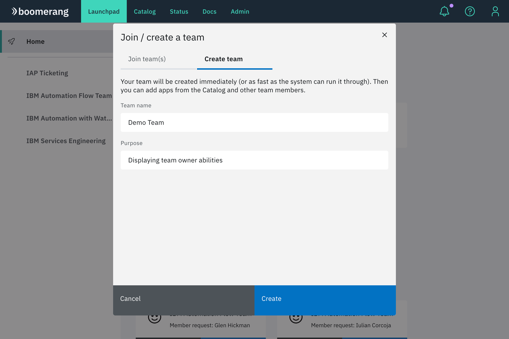

# Getting started

To get started with Boomerang, request to create or join a team.

The following actions are completed from [Launchpad](https://launch.boomerangplatform.net)

There are a number of ways to get started:
- navigate to Launchpad to join or create a team, or 
- select a unique shared link that provides you access directly to a team shared by a team Owner.

## Create a team

1. From the Launchpad desktop, click `Join / create a team`.
2. Select `Create team` and specify a representative team name, as well as the purpose for creation of the team.
3. Click `Create`. The team appears along with the existing teams in the left navigation panel.

> There is an admin platform-wide setting for automatic team creation. If that is enabled, then your team would be automatically created upon submitting the form. Otherwise, your form submission will generate a team creation request that will have to be approved by an administrator.

## Join a Team

1. From the Launchpad desktop, click `Join / create a team`.
2. Search for a team based on its name. Select your team in the search list and click `Request to join`.

> Only teams that are not private will show here.

## Share Link

If you have been provided a unique share link by your team owner, you will be navigated to Launchpad automatically with you request automatically processed to join the team.

> If you have not previously consented to the platform, you will be promoted to do so.