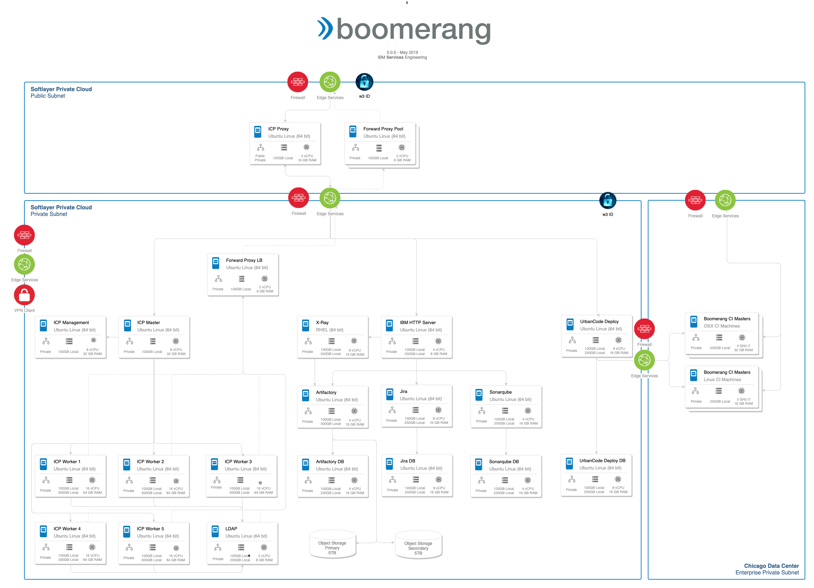

# Infrastructure Architecture

The core infrastructure requirements are:

- IBM Cloud® Private or similar Kubernetes cluster with NGINX-based ingress controller
- Public and Private VLANs
- Object storage or networked mass ctorage or SAN
- IBM WebSphere®Edge Services
- Firewalls
 
_If Required_

- DNS
- IBM WebSphere®Edge Load Balancer
- Reverse proxy
- Forward proxy

_Backups_

- Physically separate volumes (or network attached storage) for rsync-based backups (tactical)
- VELERO® for managed backups with SoftLayer® S3 Storage (strategic)
- Off site backups (if required)

_Failover_

- Secondary Kubernetes cluster

The following diagram depicts the infrastructure for a full implementation of Boomerang Private with accompanying tools and services. For reference this is Boomerang@IBM.

## Networks

All Physical Networking Infrastructure (PNI) are managed by the hosting provider, SoftLayer. Boomerang infrastructure administrators are responsible for creating the required VLANs and subnets within the hosting provider. These VLANs and subnets enable support for multiple tenants. Boomerang infrastructure administrators are also responsible for the creation of advanced virtual network topologies, including services such as firewalls, load balancers, and Virtual Private Networks (VPNs).

**Internal networks**

Internal (or private or tenant) networks are by default inherently secure. Internal networks provide internal network access for instances. The architecture isolates this type of network from other tenants. Inbound connections to internal networks from public clients can only be achieved through devices on the internal network that are also being connected to external networks or through VPN connectivity. 

With the case of devices on internal networks also being connected to external networks, these devices are typically separated out from devices on internal-only networks through zones. Devices connected to both internal and external networks are generally located in untrusted zones whereby devices on internal-only networks are located in semi-trusted or trusted zones. 

Devices in untrusted zones are commonly protected by firewalls whereby only required ports are open to the public. Devices in semi-trusted and trusted zones are protected from public access through security rules, allowing inbound traffic from devices in the untrusted zone (or in the case of devices in the trusted zones through security rules allowing inbound traffic from devices in semi-trusted zones).

Internal networks can be created and configured by Boomerang infrastructure administrators only.

**External networks**

The external or public network typically provides internet access for your instances. A publicly-accessible IP address will be assigned to each instance that is connected to a public network in SoftLayer. Instances connected to external networks are usually located in the untrusted zone only.

## VPN

Virtual private networking services are provided via a dedicated VPN server, typically called a bastion host, which establishes private connections with external VPN clients. Encrypted keys are shared between the server and the client to perform authentication and to provide a secure connection. The VPN server is hosted on a management network with access to each of the private networks in each of the tenants. VPN clients establish a single, authenticated, and secure connection with the VPN server that provides access to devices on each of the private networks.

**Point to point**

Point-to-point VPNs typically use either Point-to-Point Tunneling Protocol (PPTP) or Layer Two Tunneling Protocol/Internet Protocol Security (L2TP/IPSec) over an intermediate network, such as the internet. Point-to-point VPNs include advanced security technologies such as data encryption, authentication, and authorization. Users will require VPN client software and will need to be configured to connect to the remote VPN server.

**Site to site**

Site-to-site VPNs connect entire networks to each other, for example, connecting a branch office network to a company headquarters network. In a site-to-site VPN, hosts do not have VPN client software; they send and receive normal TCP/IP traffic through a VPN gateway. The VPN gateway is responsible for encapsulating and encrypting outbound traffic, sending it through a VPN tunnel over the Internet, to a peer VPN gateway at the target site. Upon receipt, the peer VPN gateway strips the headers, decrypts the content, and relays the packet towards the target host inside its private network.

## Access - machine accounts

- SSH access (VPN connection required)
- No root access provided
- Unique SSH keys for authenticated logon
- `su` access provided, as required, to wasadmin, dbuser, and ihsadmin accounts
- Contact MF4iOS DevOps administrators for SSH keys and passwords
- `mfiosops` is only applicable to StackOps administrators
