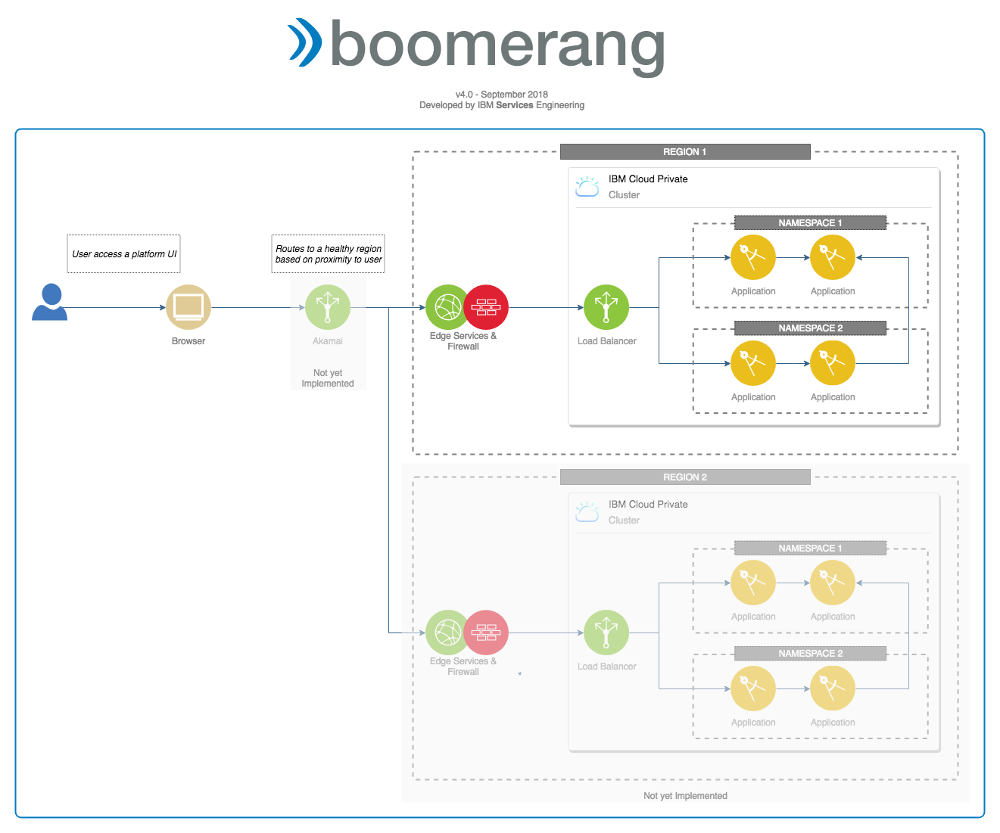
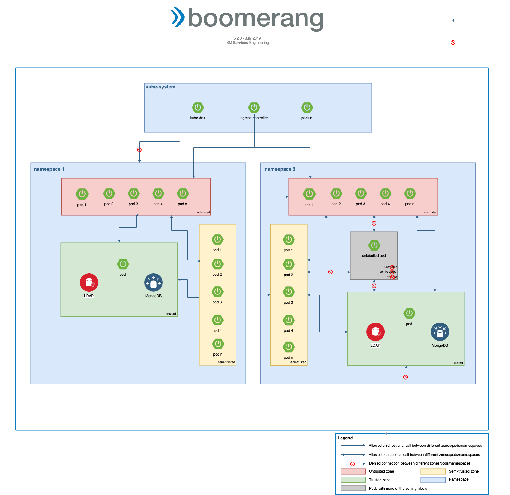

# Network architecture

The network architecture is across a number of the virtualization layers with networking at the Infrastructure, Virtual Machine, Kubernetes®, and Application layers all affected.

As shown in the diagram
- A user will be associated to a region. *not yet implemented*
- The request is handled by a region or cluster ingress which routes the request to one of the pods for the application or services.
- There are some applications or services that are not accessible via a route and can only be accessed by other applications or services.
- There are additional namespace-to-namespace Kubernetes network policies restricting internal routing.

## VLANs

The implementation requires a minimum of two VLANs: one public and one private VLAN.

The public VLAN is used for proxy-type machines that accept external traffic whereas the private VLAN is for hosting the computers.

## Firewalls

The implementation, like any enterprise, implements a highly available pair of physical firewalls to stop unwanted attacks from known and published sources. In addition, virtual firewalls are implemented in three layer zones overlayed with security groups to enforce port-level point-to-point mapping.

## Kubernetes network policies

A network policy is a set of network traffic rules applied to a given group of pods in a Kubernetes cluster. These are very similar to security groups in OpenStack®. This improves the clusters security by isolating the services running in pods from each other by applying network restrictions.

The implementation we have chosen in the Boomerang platform is based on 3 zones: trusted, semi-trusted and untrusted. The pods are part of one zone or another based on the value the pod's label `zone` has. This will allow us to implement grouping of pods into particular default zone classifications of trusted, semi-trusted and untrusted. The zones are defined as:
- **trusted** - The resources in this zone can not be consumed from any other namespace except from the one in which they reside. In addition, the pods from this zone can not access the internet.
- **semi-trusted** - The resources in this zone can be consumed from any other namespace within the cluster. They can not be accessed from outside the cluster.
- **untrusted** - The resources in this zone can be accessed from outside the cluster, through the ingress definitions and from within the cluster from other resources.

### Access matrix

The follosing access matrix shows the allowed and denied invocations between pods from different and same namespaces.

|                                 | NS_A trusted  | NS_A semi-trusted  | NS_A untrusted  |
|---------------------------------|---------------|--------------------|-----------------|
| NS_B trusted (initiator)        |       0       |          1         |        1        |
| NS_B semi-trusted (initiator)   |       0       |          1         |        1        |
| NS_B untrusted (initiator)      |       0       |          1         |        1        |
| NS_A trusted                    |       1       |          1         |        1        |
| NS_A semi-trusted               |       1       |          1         |        1        |
| NS_A untrusted                  |       1       |          1         |        1        |
| Ingress CTRL (system)           |       0       |          0         |        1        |
| NS_A NOLABL (initiator)         |       0       |          0         |        0        |
| NS_B NOLABL (target)            |       1       |          1         |        1        |

## Internal verse external access

All external routes require authentication and go via the chosen ingress controller (NGINX) and requires configuration if you need non-default settings such as payload size or timeouts.

We do not allow NodePorts outside of the dev cluster and recommend that these are not used at any time.

All internal routes go via different networking layers internal to Kubernetes and do not require the same level of control or configuration. Any route that is not from user to application should be going via the internal routes.

## Ingress

All ingress definitions for the cluster need to have authentication using either the IDP integration or service token.