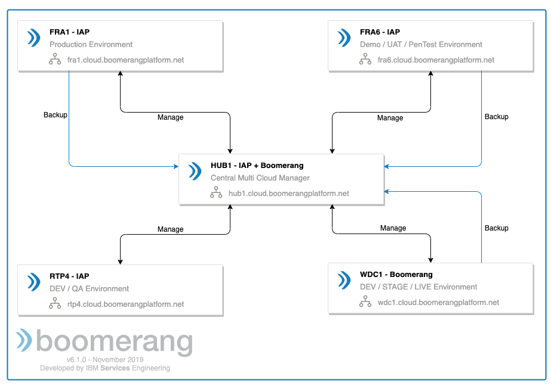

# Overview

The following section presents the architecture and cloud management operations for the IBM Automation® Platform and Boomerang Platform.

## Centralized hub

The primary concept revolves around a centralized hub as much as possible. We utilize IBM's Multi Cloud Manager (MCM) to control and manage the Kubernetes® clusters. At this time, we are only using this for read-based visibility, such as networking visibility. In the future, we will use this to centrally apply policies and ensure governance.

Additionally, the Hub is also the central storage for backups using NFS and Minio. See [Backups](/boomerang/operations/backups) for more detail.

## Monitoring and alerting

We have a huge number of tools for the Monitoring and Alerting in the platform. IBM Cloud® Private comes with Elasticsearch® and Prometheus®, however, in our implementation we have also instrumented New Relic at all layers.

| Purpose                   | Implementation         |
| ------------------------- | ---------------------- |
| Logging                   | Elasticsearch          |
| Kubernetes Monitoring     | Prometheus, New Relic  |
| Infrastructure Monitoring | New Relic              |
| Application Monitoring    | New Relic              |
| Alerting                  | PagerDuty              |
| Tracing                   | OpenTracing and Jaeger |
