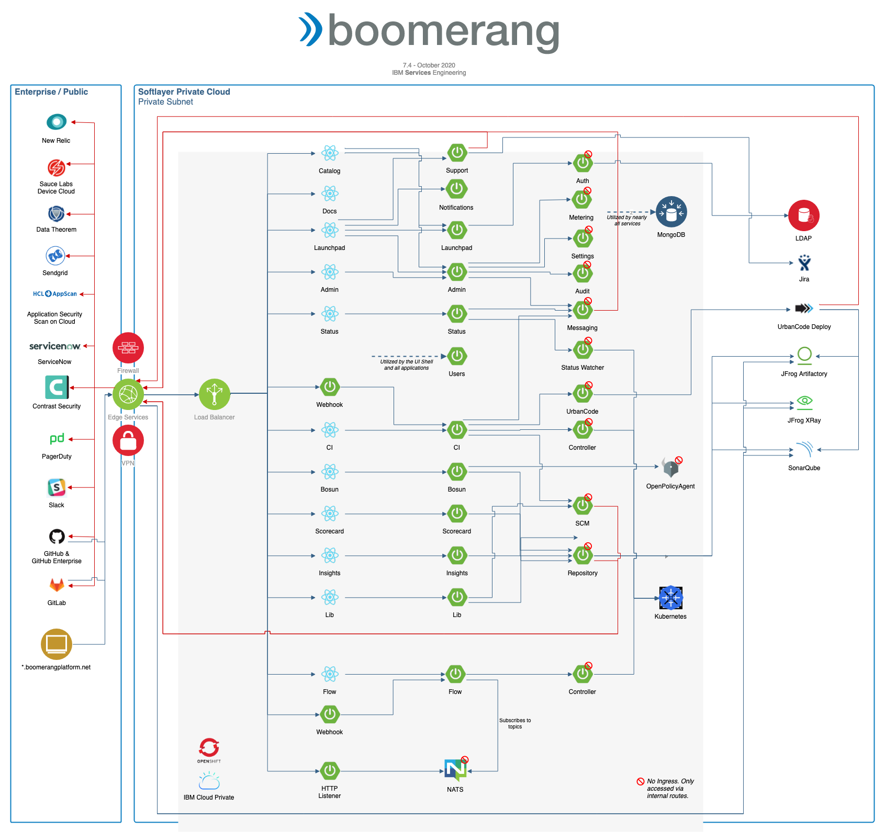

# Application architecture

**Platform dependencies**

The following platform-wide dependencies are prior to, and in addition to, any dependencies for the additional components such as Boomerang Core.

| Dependency                | Implementation                                                            | Version | Notes                                                                                                        |
| ------------------------- | ------------------------------------------------------------------------- | ------- | ------------------------------------------------------------------------------------------------------------ |
| Kubernetes®                | IBM Cloud® Private (3.2.1+) or Red Hat® OpenShift® Container Platform (4.2+) | 1.13.9+ |                                                                                                              |
| Application Load Balancer | NGINX                                                                     | 0.23.0  |                                                                                                              |
| Certificate Manager       | Jetstack Cert Manager                                                     | 0.7.0   | If using IBM ICP 3.1.1 or higher, use the provided IBM Cert Manager which is a forked implementation. |
| Logs                      | Elasticsearch®                                                             | 5.5.1   |                                                                                                              |
| Monitoring                | New Relic® Infrastructure, New Relic Kubernetes, New Relic APM Agent       | 4.10.0  | _if enabled_                                                                                                 |
| Tracing                   | Jaeger®                                                                    |         | _if enabled_                                                                                                 |

## Core

Read the [Essentials Core application architecture](/essentials-core/architecture/application-architecture).

## CICD

Read the [Boomerang CICD application architecture](/boomerang-cicd/architecture/application-architecture).

## Flow and Action Listener

Read the [Boomerang Flow and Action Listener application architecture](/boomerang-flow/architecture/application-architecture).
