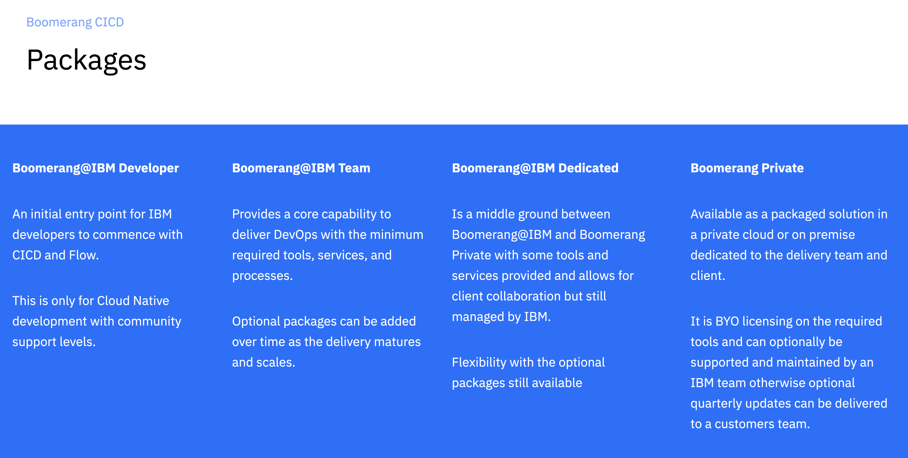

# Getting started

There are a number of ways to get started with the Boomerang Platform, depending on the use case. The most common place to get started is with Boomerang@IBM, a managed service available to all internal IBM employees.

There are also Boomerang Dedicated and Boomerang Private implementations available. To find out more, you can reach out to boomrng@us.ibm.com or on slack at #bmrg-users.

## Boomerang@IBM

To get started with Boomerang@IBM, navigate to [Boomerang@IBM Launchpad](https://launch.boomerangplatform.net) and get started with either creating a team or joining an existing team.

To learn more about creating a team, see [Boomerang Core Getting Started](/essentials-core/introduction/getting-started).

## Getting support

The standard support plans for this instance allow you to choose between Community, Standard, and Premium support plans. The level of support chosen determines the severity and service level agreements (SLAs) that are followed. 

Please note that not all support plans are supported by all Catalog services.

| | Community | Standard | Premium |
| --- | --- | --- | --- |
| Description | Provides the most basic level of support and is usually associated with community edition access to a service or solution. Typically used for proof of concepts or for workloads that don't require traditional severities and response times. | The default level of support for a Catalog service delivery team. Typically used by delivery teams with long-term time frames and no deadlines | The highest level of support for priority handling. Usually for teams that have strategic and critical delivery time frames. |
| Coverage | Based on best effort | North American business hours | North American and Romanian Business Hours |
| Channels / Routing | Community Slack Channel and Boomerang Support Center | Community Slack® Channel1, Boomerang Support Center, and Email | Email, Dedicated Slack Channel, Boomerang Support Center, and PagerDuty |

1 Community Slack is a shared internal IBM slack channel

### Severities and Target 2 Response and Resolution Times1

| Severity | Definition | Community | Standard | Premium |
| --- | --- | --- | --- | --- |
| 1 | Critical service is non-operational with severe impact. Highly complex tasks that require the global SMEs to be involved. | - | Response: 8 hours Resolution: 16 hours | Response: 4 hours Resolution: 8 hours |
| 2 | Significant impact to a service however still useable or a workaround can be identified to allow continued use. | - | Response: 16 hours Resolution: 32 days | Response: 8 days Resolution: 16 |
| 3 | A feature of a service is not working, but impacts to use are less than significant. | - | Response: 16 hours Resolution: - | Response: 8 hours Resolution: - |
| 4 | Query or issue with minimal to no impact. | - | 

1 Response and Resolution times are calculated based on support coverage locations business hours
2 Target is an average across the year and is not guaranteed

To learn more of the detail and how support operates go to [Boomerang Platform Operations Support](/boomerang/operations/support).