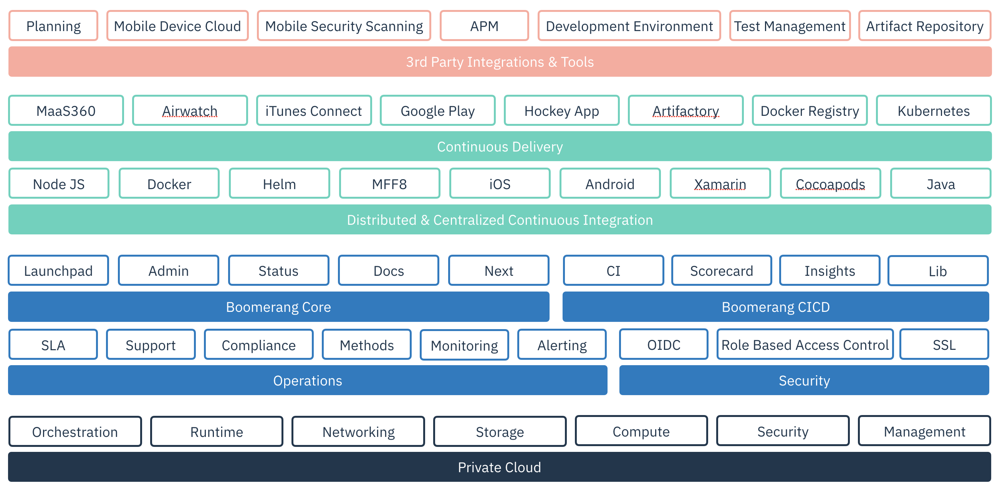

# Architecture

IBM Services Essentials utilizes a multi-cloud approach, underpinned by IBM Cloud® Private, or IBM Cloud® Kubernetes, with the components packaged as Helm® charts.

IBM Services Essentials can be delivered in two ways: IBM Service Essentials Dedicated and Boomerang@IBM.

**IBM Service Essentials Dedicated**  
Available as a packaged solution in a private cloud or on premise dedicated to the delivery team and client. Requires bring your own (BYO) tooling and licensing, optionally supported and maintained by an IBM team.

**Boomerang@IBM**  
An internally shared version available as the delivery platform to all IBM teams. Pre-integrated and readily available from day one with access to all tools, services, and support. Boomerang@IBM is the IBM-as-a-service implementation of Boomerang Private.

The IBM Services Essentials operations team is part of the IBM Services Engineering team and is a small squad of highly-skilled, highly-performing, software engineers. The team believes in aiming for 100% automation and strive to evaluate the standards and technology stack quarterly for innovation and upcoming industry standards to ensure continual evolution of the platform.

## What IBM Services Essentials provides

**Standardization**  
We ensure every application or service provides a consistent experience for the end user. We tend to favor an Australian theme, in particular the Kangaroo!

**Availability**  
Our platform provides a high-availability cluster of servers hosting the platforms tools, applications, and services. This is achieved through multiple private cloud zones and external third-party services.

**Security**  
We rely on IBM's w3ID and IBMID for authentication in different parts of the system. Our internal authorization model requires security at every layer for firewalls, tokens, and networking zones. We have a standard approach to authentication and authorization for every tool, application, and service.

**Value-Add**  
We believe the platform provides the delivery teams with a value-add as a standard to delivery for a top-tier technical delivery organization experience.

**Onboarding**  
We integrate a centralized automated approach to onboarding for all the services and core functions on the platform. Users can onboard easily, create projects linked to various tools and services, and then invite other users to join projects. This is followed up with self-service onboarding to continuous integration (CI).

**Common tools**  
A wide range of tools are provided to support each phase of development through to delivery. All tools are integrated, giving users seamless connectivity across the platform.

## What IBM Services Engineering provides

**Methods**  
A tailored methodology for development squads is followed to get from planning to operating an application or service hosted on the platform.

**Quality**  
We provide quality by ensuring what is built and delivered goes through a series of quality gates that ensure checks are performed. everything delivered meets the contract and its standards.

**Documentation**  
The documentation provided covers each and every aspect of the platform. Detailed documentation for developers includes how to integrate with various platform tools and services, the applicable standards, the service contract, among other topics.

**Continuous integration**  
Customized pipelines for building, testing, and deploying various types of applications across multiple platforms including iOS, Android, and web are provided.

**Infrastructure**  
IBM Services Essentials is a hybrid cloud platform that allows us to host applications in varying technologies across OpenStack® and Kubernetes®. This allows us to choose the best approach for the application.

**Operational support**  
Support includes monitoring and analytics tracked across all applications and services, defined service level agreements (SLA's), routine backups,among other basic operations. The platform also provides a centralized location for reporting, and tooling and services status, along with scheduled maintenance windows and outage notifications.

## The guiding principles

To ensure we continually integrate with the best innovative technologies, we revisit the tooling and integrations every quarter, following these guiding principles.

- Leverage IBM adopted tool sets where possible. For example, if a tool is offered by IBM Toolbox, with a solid implementation model such as GitHub® Enterprise, Travis CI® or Slack®, these are leveraged first.

- Adopt industry standard tools as appropriate, ensuring a balanced mix of OpenSource (speed) vs enterprise (stability). Selected tools must expose APIs, providing fully automated integration with Boomerang.

- Underpin implementation with a solid hybrid cloud foundation. In our case, we currently blend: OpenStack®, IBM Cloud Private (Kubernetes and Docker), and SaaS.

- Revisit tooling implementation on a quarterly basis to ensure innovation and adoption of new tooling, processes, and methods.

- Every implementation or solution should be designed and built to be deployable on-premise, on Bluemix, or on another cloud so that it is not locked into a cloud.
