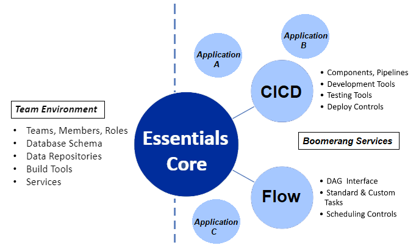
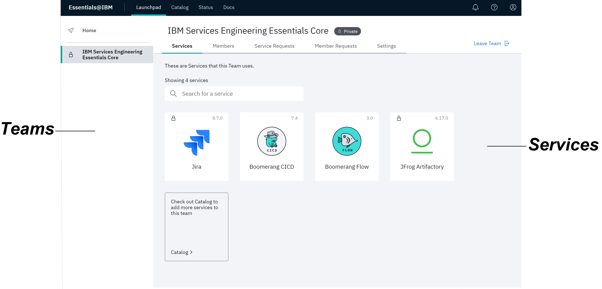
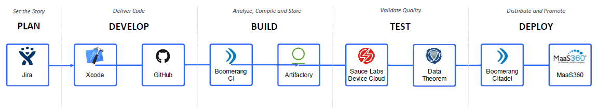
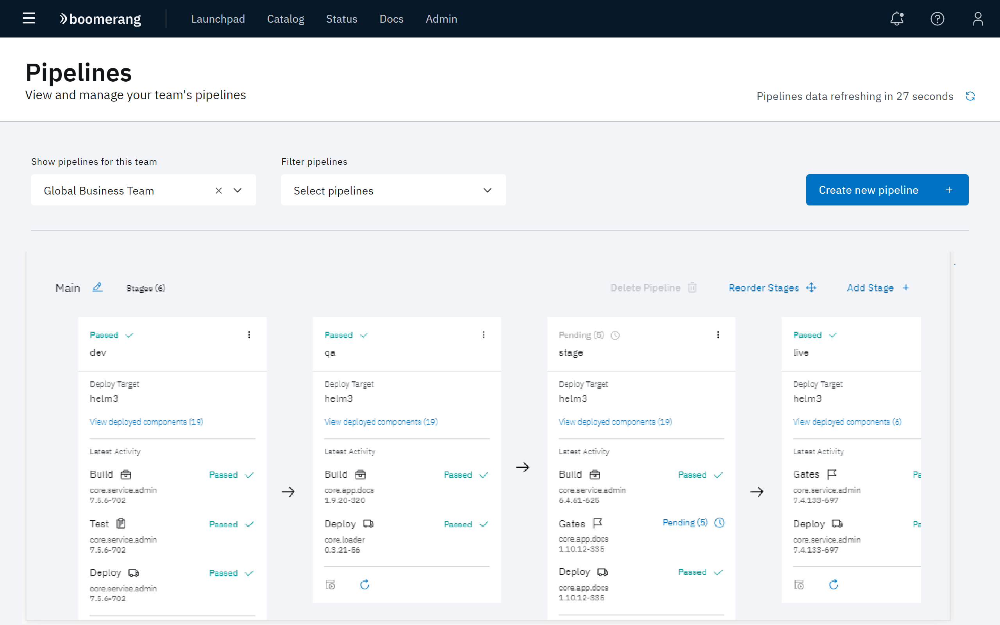
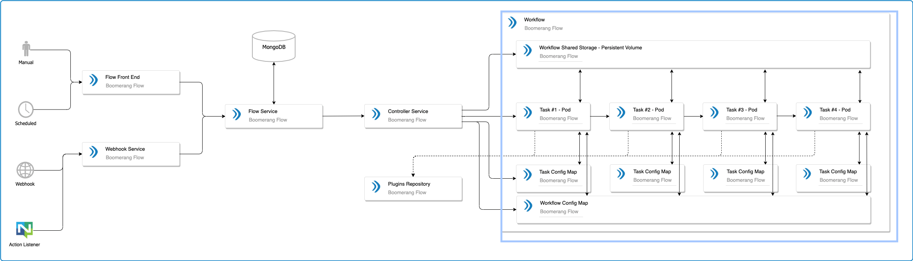
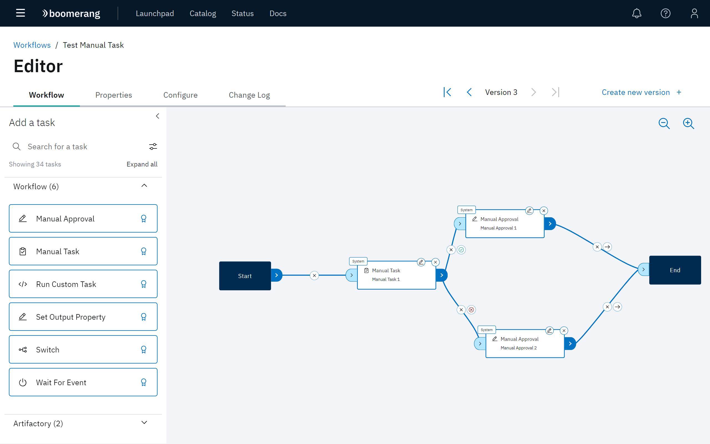

# Navigating IBM Services Essentials

The IBM Services Essentials platform leverages an intuitive user interface as a roadmap for building, testing and deploying your solution in a team environment. This is achieved first, with the functionally of the Essentials Core application that defines the members and services of the team developing the solution.

A variety of solutions can be built upon Essentials Core, with Boomerang CICD and Boomerang Flow being two of the primary services used.

## Essentials Core

Essentials Core defines how your team works within your solution. It is where you define your team and its members, member roles and the services available to your team. Refer to the [Overview](/essentials-core/introduction/overview) of Essentials Core.

The Launchpad Home page in the Essentials Core application is where you manage your team. Access the **Members** and **Member Requests** tab to create, delete, or manage team members and roles. Likewise, services are accessed on the Launchpad Home page. The **Services** tab displays the services currently available to your team. Refer to the [Catalog](/essentials-core/how-to-guide/catalog) for descriptions of all available services. 

Click the **Catalog** tile to add services to the Home page or click an available service tile at the Launchpad Home page to directly access that service for development. In this example, CICD and Flow have been added. 

## Boomerang CICD

Boomerang CICD is where you define the Continuous Integration Continuous Deployment process. In this application you configure and orchestrate the movement of components through a pipeline, along with the triggers and gates that control their execution.

>**Note**: The Plan and Develop phases of the solution are executed with third-party programs prior to entering the pipeline.

The pipelines in CICD support a variety of build tools and frameworks that will be used in the development, QA, and Deploy process. Each stage of the pipeline is configured on the Pipelines page. Refer to the [Overview](/boomerang-cicd/introduction/overview) of CICD.

## Boomerang Flow
Boomerang Flow is an standalone open-source application that allows you to enhance your solution by automating standard and customized tasks in a workflow. Flow consists of a back end microservice and front end application. The back end translates the requests from the front end user application. Refer to the [Overview](/boomerang-flow/introduction/overview) of Flow.

The front end application is presented as a visual DAG (Directed Acyclic Graph) interface for configuring the workflow and enabling no-code workflow building. Workflow configuration is performed on the Editor page in Boomerang Flow.

