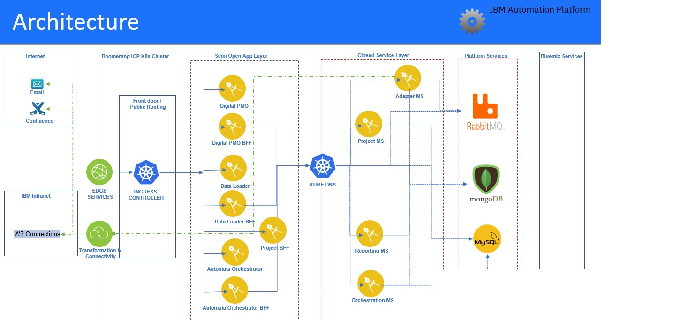
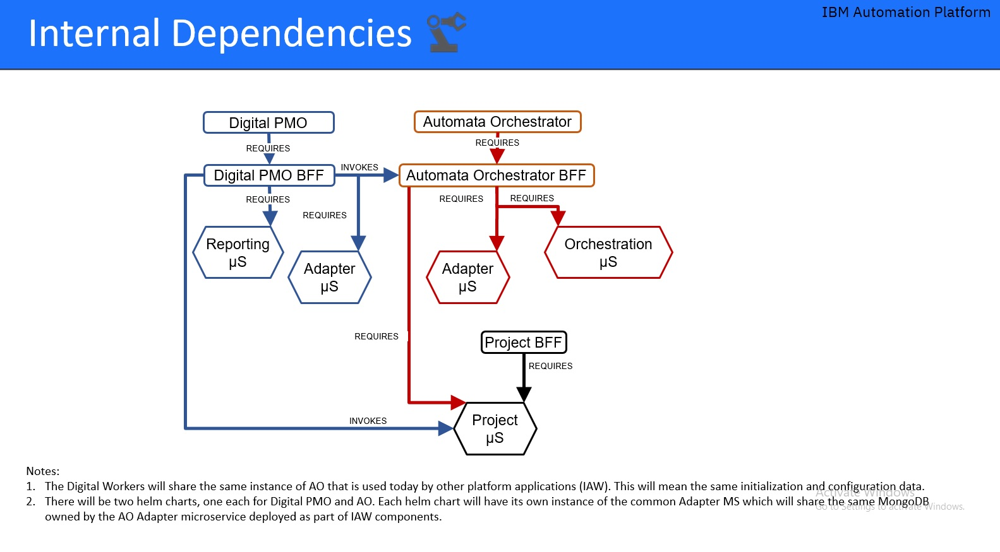

# DPMO Architecture Overview
The following diagram presents an overview of the ACC architecture:
 

DPMO is part of IBM IAP platform and as is deployed utilizing the IAP services as a multi-cloud cloud application on  Kubernetes with the components packaged as Helm charts. ACC uses IAP services in order to abstract the infrastructure and security protocols. The main IAP services used are:
- Security - Authentication and Authorization(RBAC)
- Audit
- Notifications 
- Support
- Docs

## DPMO Components
The following table describes main DPMO architectural components and their external dependencies:

| Component |  Description |
|---|---|
| DPMO Web | This web service built on Angular, hosts the web components for the Digital PMO application. | | 
| DPMO BFF| This backend-for-frontEnd service for DigitalPMO, is required by the DPMO WEB for interacting with the DB and various other dependent services.| | 
| Reporting MS | Microservice that implements the reporting generation process. | 
| MONGODB  | The database used for storing configuration related data for multiple projects and their reports/proceses.|

##DPMO Internal Dependencies
The following diagram presents DPMO Internal Dependencies:

 

## DPMO External Dependencies
DPMO is  integrated with Box as a file storage and which is shared with the stakeholders to get the processed file.
RTC  is for project management tool. DPMO will connect to RTC to get the real time data for the projects.

## DPMO Middleware 
The following middleware components must be available as a prerequisites in order to deploy ACC:

1)Rabit MQ
2)Camunda
3)Data Store(MongoDB,MySQL, Cloud ObjectStorage)
4)Process & Decision Management- Camunda

## Application Services
DPMO micro-services are deployed in Kubernetes using a Helm Chart. DPMO Chart definition is available at https://github.ibm.com/Boomerang-Delivery/dw.chart.digitalpmo

### Technology Components 
| Component | Type         | Technology               | Internal to Internal      | External Ingress | Internal Dependency | External Dependency | Optional Side Cars |
| --------- | ------------ | ------------------------ | ----------------------- | ---------------- | ------------------- | ------------------- | ------------------ |
| DPMO Web     | Front End    | ReactJS + Node.js          | Launchpad MS, Admin MS  | true             |    DPMO BFF               |                     |                        |
| DPMO BFF     | Microservice | Loopback framework (Node.js)       | Auth, Authentication, Audit               | false             | Postgres             |   ReportingMS, AdapterMS               |  |
| Reporting MS | Microservice | Spring Boot (Java)       | Notification, Audit              | false             |  |