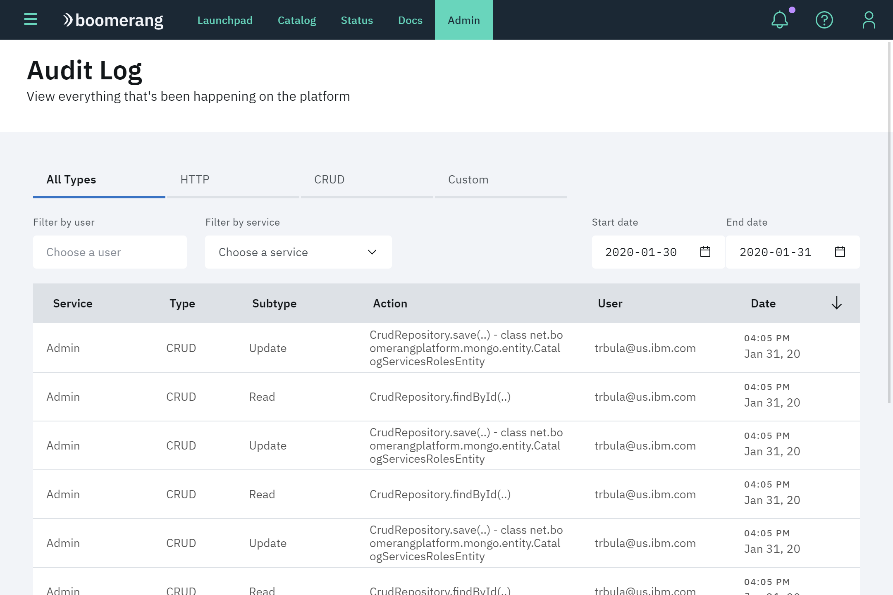
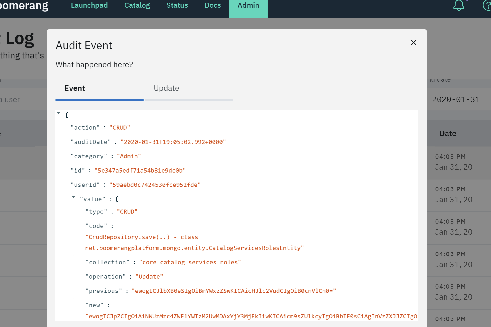

# Audit

The Audit Log page allows you to view all activity that happens on the platform, by HTTP, CRUD, or CUSTOM. Information is filterable by service, user, and date range. The table shows information about the activities, including:

- Service
- Type
- Subtype
- Action performed
- User email
- Date

## Audit event

Click an audit event in the table to see more details about that event.

