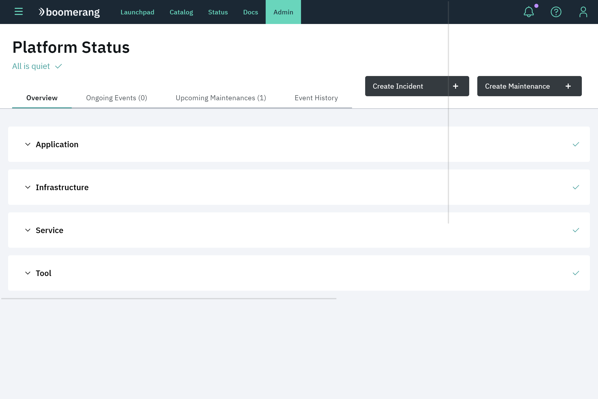
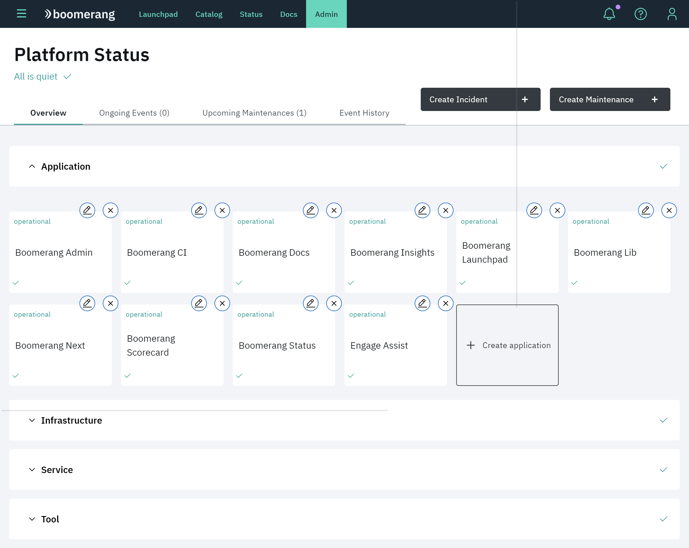
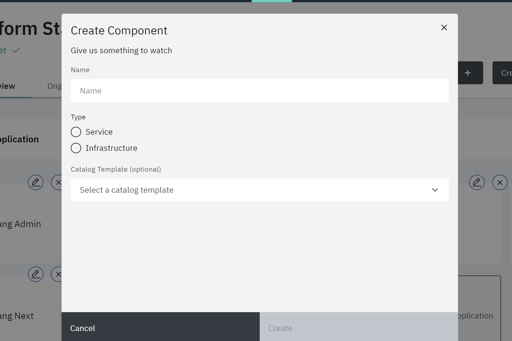
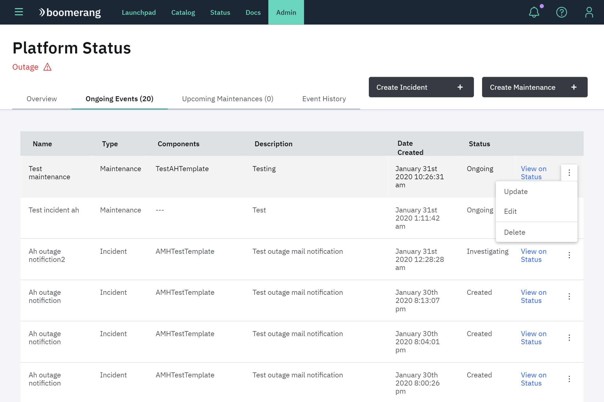
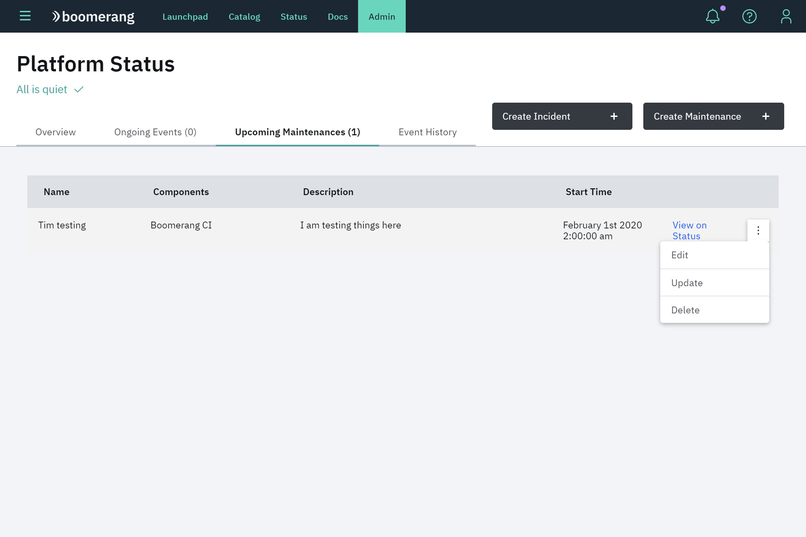
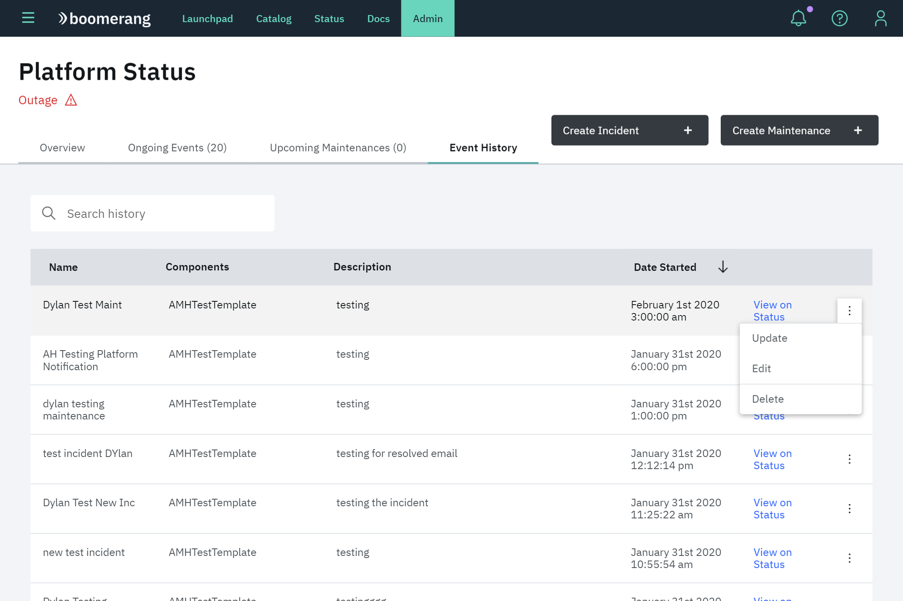

# Status

Platform status allows users to perform a number of platform status management tasks for:

- Status components
- Platform maintenances
- Platform incidents

## Key terms

**Component**  
Represents any part of the platform that is being monitored, including infrastructure and Catalog services.

**Event**  
Anything that happens to the platform that affects its availability or stability. Events include both `incidents` and `maintenances`.

**Incident**
Any form of an outage or disruption of service for a component that is unplanned. There are two types: Partial Outage and Outage that represent severity.

**Maintenance**  
Scheduled outages for servicing, upgrading or replacing Status components.

## Statuses

Status text, icon and color are used to communicate the status of the platform overall, a category of components and an individual component.

| Text           | Icon + Color     | Description                                       |
| -------------- | ---------------- | ------------------------------------------------- |
| All is quiet   | green checkmark  | Everything is fully operational                   |
| Maintenance    | black tool       | At least one ongoing maintenance                  |
| Partial outage | purple lightning | At least one component is having a partial outage |
| Outage         | red warning sign | At least one component is having an outage        |

## Create incident

To create an incident, click **Create Incident** and follow these steps in the modal:

1. Write a title and a description for your incident.
2. Select components affected by it.
3. Select the type of incident: `Partial Outage` or `Outage`.
4. Choose your notification preferences.
5. Confirm your submission details and create it.

## Schedule maintenance

To schedule a maintenance, click **Create Maintenance** and follow the steps in the modal:

1. Write a title and a description for your maintenance and select its date range.
2. Select components affected by it.
3. Choose your notification preferences.
4. Confirm your submission details and create it.

## Status overview

In this section users can check a component's status. They can also create, edit and delete components. Each component section organized by type contains stacked component cards with the name and status of that service.

### Create component

1. Click **Create Service** at the end of the components stack to view the modal form.
2. Enter a name. It is a required field and must be unique.
3. Select a Catalog template (optional) for the component to be associated with.

> **Note**: You don't have to select a component to associate with a Catalog template if you are monitoring something that is not hosted on the platform, for example, infrastructure.

### Edit and delete components

There are two icons above each component card. Click the pencil icon to edit the service, opening a similar modal to the create service. Click the **x** icon to delete the desired component.

## Status ongoing events

In this section you can see information of events that are `ongoing`, including:

- Name
- Type
- Affected components
- Description
- Created date
- Status

Click the **View on Status** link to check the event in the Status application and edit, update or delete the event in the overflow menu.

## Status upcoming maintenances

In this section you can see information for maintenance events that are `upcoming`, including:

- Name
- Affected components
- Description
- Start time

Click the **View on status** link to check the event in the Status application and edit, update or delete the event in the overflow menu.

## Status Event History

In this section you can see information of events that are `finished` or `resolved`, including:

- Name
- Affected components
- Description
- Date started

Click on the **View on status** link to check the event in the Status application and edit, update or delete the event in the overflow menu.

## Update, edit and delete incident

Open the event overflow menu for an event in the table.

To update an incident, click **Update** and update the information you desire.

1. Update the status: **Investigating**, **Identified**, **Monitoring** or **Resolved**.
2. Update the type.
3. Update the notification preferences.
4. Confirm updates.

To edit an incident, click **Edit** and edit the information you desire.

1. Edit the title and description.
2. Edit the affected components.
3. Confirm your changes.

To delete an incident, click **Delete** and confirm deletion.

## Update, edit and delete maintenance

Open the event overflow menu in the table it appears.

To update maintenance, click **Update** and update the information you desire.

1. Update the status: ongoing or finished and write a message if you want.
2. Update the notification preferences.
3. Confirm updates.

To edit maintenance, click **Edit** and edit the information you desire.

1. Edit the title, description and date range.
2. Edit the affected components.
3. Confirm your changes.

To delete maintenance, click **Delete** and confirm deletion.
